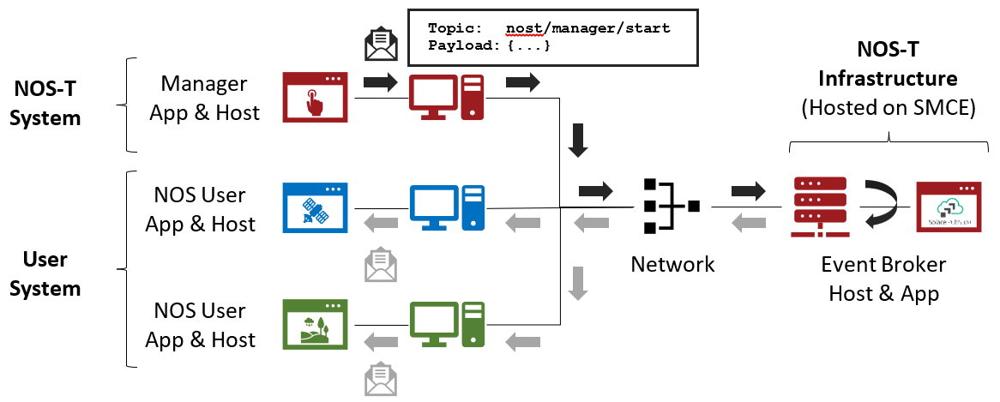

Technical Brief
===============

**Research Team:**

Paul Grogan (PI), Matthew LeVine, Brian Chell, Leigha Capra,
Theodore Sherman, Alex Castaneda

Project Alumni: Jerry Sellers, Matthew Brand, Hayden Daly

*Stevens Institute of Technology*

**Research Sponsor**:

Earth Science Technology Office
National Aeronautics and Space Administration

Copyright © 2021 Stevens Institute of Technology, Systems Engineering
Research Center

The Systems Engineering Research Center (SERC) is a federally funded
University Affiliated Research Center managed by Stevens Institute of
Technology.

This material is based upon work supported, in whole or in part, by the
U.S. Department of Defense through the Office of the Assistant Secretary
of Defense for Research and Engineering (ASD(R&E)) under Contract
W15QKN-18-D-0040, Task Order W15QKN-20-F-0051, sponsored by the National
Aeronautics and Space Administration's Earth Science Technology Office.

Any views, opinions, findings and conclusions or recommendations
expressed in this material are those of the author(s) and do not
necessarily reflect the views of the United States Department of
Defense, (ASD(R&E)), or National Aeronautics and Space Administration.

No Warranty.

This Stevens Institute of Technology and Systems Engineering Research
Center Material is furnished on an "as-is" basis. Stevens Institute of
Technology makes no warranties of any kind, either expressed or implied,
as to any matter including, but not limited to, warranty of fitness for
purpose or merchantability, exclusivity, or results obtained from use of
the material. Stevens Institute of Technology does not make any warranty
of any kind with respect to freedom from patent, trademark, or copyright
infringement.

This material has been approved for public release and unlimited
distribution.

Table of Contents
-----------------

`1 Introduction <#introduction>`__

`2 NOS-T Overview <#nos-t-overview>`__

`2.1 System Architecture <#system-architecture>`__

`2.2 Interface Protocol <#interface-protocol>`__

`2.3 Manager Events <#manager-events>`__

`3 User Application Requirements <#user-application-requirements>`__

`3.1 Example Test Case Context <#example-test-case-context>`__

`3.2 NOS-T Execution Requirements <#nos-t-execution-requirements>`__

`3.3 Test Case-Specific Execution
Requirements <#test-case-specific-execution-requirements>`__

`4 References <#references>`__

Introduction
------------

The New Observing Strategies (NOS) initiative within the NASA Earth
Science Technology Office (ESTO) Advanced Information Systems Technology
(AIST) program envisions future Earth science missions with distributed
sensors (nodes) interconnected by a communications fabric that enables
dynamic and intelligent operations [1]_. Some NOS concepts resemble
systems-of-systems or collaborative systems where operational authority
is distributed among multiple systems, necessitating new methods for
systems engineering and design to cope with more decentralized control
over constituent systems [2]_.

The New Observing Strategies Testbed (NOS-T) is a computational environment to
develop, test, mature, and socialize new operating concepts and technology for
NOS. NOS-T provides infrastructure to integrate and orchestrate user-contributed
applications for system-of-systems test cases with true distributed
control over constituent systems. The overall concept, illustrated in
Figure 1, interconnects individual user applications and a NOS-T manager
application via common information system infrastructure to coordinate
the execution of virtual Earth science missions. NOS-T enables principal
investigators to conduct test runs in the same environment,
systematically changing variables to assess the overall efficacy of the
proposed new observing strategies. Recorded data and outcomes provide
evidence to advance technology readiness level and improve or innovate
upon existing Earth science measurement techniques.

|image1|\

Figure 1. New Observing Strategies Testbed Comprised of User Systems and
the NOS-T System.

The NOS-T design and development follows several guiding principles:

-  *Geographic distribution*: user systems connect using a standard
   network interface (rather than integrating software at a centralized
   site) to allow remote participation from multiple sites.

-  *Multi-party participation*: user systems interact with other systems
   by sending and receiving information using standard network protocols
   (rather than software source code or compiled executables) to
   facilitate test cases across organizational or institutional
   boundaries.

-  *Security*: transport layer encryption and access control rules
   restrict information exchange and hosted NOS-T system components
   conform to required information system security policies.

-  *Modularity*: loose coupling provided by a well-defined application
   interface allows individual user systems to be replaced, tested, and
   validated without modifying the rest of the testbed.

-  *Extensibility*: new test cases with varying numbers or capabilities
   of individual user systems can be proposed, developed, and integrated
   using the generic NOS-T system capabilities.

-  *Usability*: members of the Earth science community can develop new
   test cases and user systems by leveraging existing software and
   knowledge without a substantial learning curve.

As a result of these guiding principles, NOS-T adopts a simpler software
architecture than existing distributed simulation standards like
Distributed Interactive Simulation (DIS, IEEE Std. 1278) [3]_ and High
Level Architecture (HLA, IEEE Std. 1516) [4]_. Most frequently used in
defense applications, DIS and HLA provide comprehensive distributed
simulation capabilities but also require substantial resources to learn,
develop, and execute compliant applications. Initial NOS-T capabilities
establish a simple event-driven protocol to support event-driven,
time-evoked, and scaled real-time execution modes using standard
computer networks.

This technical brief provides information about the NOS-T system
architecture, components, and key interfaces required for new
user-contributed components. It supports proposal development efforts to
exploit the NOS-T capability as part of the proposed research. While the
testbed interface is still under development, this brief describes the
features tested as of version 1.0-alpha in April 2021.

NOS-T Overview
--------------

System Architecture
-------------------

The NOS-T system architecture follows a loosely-coupled event-driven
architecture (EDA) where member applications communicate state changes
through *events* that are embodied as notification messages sent over a
network. EDA provides enhanced scalability and reliability over other
software architectures by replicating event handling functions across
infrastructure instances while maintaining modularity between
applications through a simple event-handling interface. NOS-T can also
be described as a service-oriented architecture (SOA) as applications
trigger services in response to events.

The NOS-T architecture relies on a centralized infrastructure component
called an *event broker* (synonymous with *message broker*) to exchange
event notifications between applications. A broker greatly simplifies
the communication structure because each member application (client)
only directly connects to the broker, rather than requiring each
application to directly connect to every other application. While there
are many alternative broker implementation options available, NOS-T
adopts the Solace PubSub+ Standard Edition event broker [5]_, a
proprietary but freely available commercial product supporting up to
1000 concurrent connections and 10,000 messages per second [1]_. NOS-T
hosts an instance of PubSub+ on a server in the Science Managed Cloud
Environment (SMCE), a managed cloud infrastructure for ESTO projects
[6]. PubSub+ uses a publish-subscribe messaging pattern which designates
applications (clients) as publishers (producers of events) and
subscribers (consumers of events). Each application can publish or
subscribe to multiple types of events.

The two top-level NOS-T system components include the *NOS-T System*
(fixed for all test cases) and the *User System* (tailored to each
unique test case). The NOS-T System, managed by an NOS-T operator,
includes the event broker infrastructure and a manager application which
orchestrates a test run. The test operator uses a browser-based
graphical user interface (GUI) to issue control commands (e.g.,
initialize, update, start, and stop) and control progression of a test
run. Figure 2 illustrates how the manager publishes events to other
applications through the event broker. The manager application publishes
messages following the topic and payload specifications in Section 2.3.

|image2|\

Figure 2. NOS-T System Architecture Illustrating the Route of a Message
from Publisher to Subscribers.

The User System consists of user applications developed and operated by
each test case participant. User applications run on separate hosts
controlled by each participant and can be variably scoped to model an
entire observing system or individual components such as sensors,
communication links, tasking or scheduling algorithms, forecasting
models, or environmental data (e.g., nature run data sets). Each user
application must meet the basic NOS-T interface requirements for
orchestration (namely, subscribing to and responding to manager
commands) plus any additional test case-specific interface requirements
agreed upon by the participants. There are no general restrictions on
software language, host platform, physical location, or other
implementation details for user applications.

Interface Protocol
------------------

The broker interconnects applications to allow distributed users to
participate in test run executions. The interface between the User
System and NOS-T System consists of a message protocol to send and
receive information units and a message format to structure their
contents.

Message Protocol
~~~~~~~~~~~~~~~~

All NOS-T events are communicated by sending or receiving messages using
standard network messaging protocols. The Solace PubSub+ event broker
supports and interoperates among several protocols including its own
Solace Message Format (SMF) [7]_ and several open protocols including
Message Queuing Telemetry Transport (MQTT), Advanced Message Queuing
Protocol (AMQP), and Representational State Transfer (REST) [8]_. All
protocols share similar messaging constructs but exhibit some minor
differences in implementation and library availability.

Each application identifies event topics to which it publishes and
subscribes messages. A topic is a hierarchical addressing scheme written
as forward slash (/) delimited labels (e.g., *nost/manager/start*). The
first topic level (e.g., *nost*) designates a NOS-T namespace (prefix)
unique to each a test case execution, allowing multiple test cases to
run simultaneously on the same broker without conflicts. The second
topic level (e.g., *manager*) designates an application namespace
controlled by a member application. Additional topic levels (e.g.,
*start*) refine the application namespace to differentiate event types,
with up to 128 total topic levels.

Topics need not be defined in advance; however, the NOS-T operator can
configure access control rules in the PubSub+ application to grant
permission for individual clients to publish or subscribe to specific
topics. Subscriptions can also use wildcard characters to receive
messages on multiple topics. For example, the # character in MQTT
represents a multi-level wildcard (e.g., *nost/manager/#*).

Overall message routing between publishers and subscribers can be
graphically depicted in several ways. Figure 3(A) depicts a physical
network diagram with topic-specific conduits between applications and
the broker. Application A publishes an event message (of type X) to
topic *nost/A/X* which is routed to two subscribers: B subscribes to the
same topic (*nost/A/X*) and application C subscribes to a wildcard topic
(*nost/A/#*). Figure 3(B) presents a more compact diagram showing at
application A publishes event type X which is consumed by (subscribed to
by) applications B and C. More complex system concepts introduce event
feedback loops between applications to indicate dynamic and responsive
operations.

|image3|\

Figure 3. Publish-Subscribe Messaging Pattern in (A) Physical Network
and (B) Event-oriented Diagrams.

Message Format
~~~~~~~~~~~~~~

Messages are defined by a topic and payload. Each message must be
published to exactly one topic (no wildcards). The message payload
(body) contains event data structured as either a string (text) or byte
array (raw). PubSub+ can be configured for message payload sizes up to
30 MB.

The NOS-T manager sends messages with payload strings encoded in
JavaScript Object Notation (JSON) which defines data structures that are
easily readable both by computers and humans. JSON encodes string,
numeric, and Boolean data types and list and dictionary data structures
in a text-based notation. Additional encoding allows representation of
more complex data types, like timestamps, using standards like ISO-8601.
For example, the manager-issued start event has the following JSON
structure:

.. code-block:: json

  {
    "taskingParameters": {
      "startTime": "2021-04-15T12:00:00+00:00",
      "simStartTime": "2019-03-15T00:00:00+00:00",
      "simStopTime": "2019-03-19T00:00:00+00:00",
      "timeScalingFactor": 60
      }
  }

Using JSON to encode payload strings is optional but recommended for
user-defined event messages because it allows for simple parsing and
semantically readable data. While the object schemas (specification of
required key names and expected value types) to structure JSON message
payloads for new events depend on each application case, the NOS-T
manager messages are loosely based on standardized object schemas for
the SensorThings Sensing [9]_ and Tasking [10]_ APIs. The start event
above is based on the SensorThings *Task* entity with task-specific
parameters (*startTime*, *simStartTime*, etc.) contained within the
*taskingParameters* dictionary.

Example MQTT Messaging Client
~~~~~~~~~~~~~~~~~~~~~~~~~~~~~

MQTT is a good messaging protocol choice for new user applications
because of its simplicity and broad support including high-quality
open-source libraries for most languages. For example, the Eclipse Paho
library (*paho-mqtt*) is publicly available under an open-source license
for the Python language [11]_.

A simple example below connects a client to the broker (using
placeholders for client username and password and the broker host
address and port), subscribes to the wildcard topic *nost/manager/#*,
sends a plain text message to the topic *nost/example/hello* every
second (receiving messages while calling the *loop()* function), and
prints out received messages to console using a callback function.

.. code-block:: python3

  #!/usr/bin/env python3

  import paho.mqtt.client as mqtt
  import time

  # callback to run when a message is received
  def on_message(client, userdata, msg):
    print(msg.topic + " " + str(msg.payload))

  # instantiate a new client and bind the callback
  client = mqtt.Client()
  client.on_message = on_message

  # connect to the broker and subscribe to a topic
  client.username_pw_set(CLIENT_USERNAME, CLIENT_PASSWORD)
  client.tls_set()
  client.connect(BROKER_ADDR, BROKER_PORT)
  client.subscribe("nost/manager/#")

  # main execution loop
  for i in range(10):
    # publish message to a topic
    client.publish("nost/example/hello", f"Hello {i}")
    # process message events for 1 second
    t = time.time()
    while time.time() - t < 1.0:
      client.loop()

Additional Eclipse Paho features described in the documentation [11]_
include background threads to process message events (rather than
calling the *loop()* function directly), per-topic callback functions to
simplify event handling, and additional configuration options to manage
the broker connection.

Manager Events
--------------

The NOS-T manager orchestrates user applications by progressing scenario
(simulated) time. During a test run execution, the manager application
publishes several types of events to issue commands (control events) and
communicate state changes (status events).

All manager events are published to the topic *$PREFIX/manager/TYPE*
where *$PREFIX* is the test run namespace and *TYPE* is the control
event type and use JSON for message payload encoding. This section
briefly describes the topic and payload for each type of manager event.

Control Events
~~~~~~~~~~~~~~

The manager issues control events to orchestrate a test run execution.
The test run execution lifecycle follows the activity diagram in Figure
4 with an initialization, start, optional updates, and a stop event.

|image4|\

Figure 4. Typical Test Run Execution Lifecycle.

The control event message payload builds on the *Task* entity object
schema in the Sensor Things Tasking API [10]_ with a top-level key
*taskingParameters* to group event-specific parameters. Table 1 lists
the four manager control event types described in the following
sections.

.. list-table:: Table 2. List of NOS-T Manager Control Events
  :widths: 25 25 50
  :header-rows: 1

  * - Event
    - Message Topic
    - Example Message Payload (JSON)
  * - Initialize
    - $PREFIX/manager/init
    - .. code-block:: json

        {
          "taskingParameters": {
            "simStartTime": "2019-03-15T00:00:00+00:00",
            "simStopTime": "2019-03-21T00:00:00+00:00"
            }
        }
  * - Start
    - $PREFIX/manager/start
    - .. code-block:: json

        {
          "taskingParameters": {
            "startTime": "2021-04-15T12:00:00+00:00",
            "simStartTime": "2019-03-15T00:00:00+00:00",
            "simStopTime": "2019-03-19T00:00:00+00:00",
            "timeScalingFactor": 60
            }
        }
  * - Update
    - $PREFIX/manager/update
    - .. code-:: json

        {
          "taskingParameters": {
            "simUpdateTime": "2019-03-17T00:00:00+00:00",
            "timeScalingFactor": 100
            }
        }
  * - Stop
    - $PREFIX/manager/Stop
    - .. code-block:: json

        {
          "taskingParameters": {
            "simStopTime": "2019-03-21T00:00:00+00:00"
            }
        }

Initialize Control Event
^^^^^^^^^^^^^^^^^^^^^^^^

The NOS-T manager publishes an initialize event to topic
*$PREFIX/manager/init* to specify the temporal context for an upcoming
test run execution. It provides bookended timestamps to allow member
applications to prepare requisite data and initialize components before
a test run starts.

.. table:: Table 2. Initialize Control Event Properties

  +-----------------+---------------------------+-----------------------------------------------------------------------------+
  | Property        | Type                      | Description                                                                 |
  +=================+===========================+=============================================================================+
  | *simStartTime*  | ISO-8601 datetime string  | The earliest possible scenario start time.                                  |
  +-----------------+---------------------------+-----------------------------------------------------------------------------+
  | *simStopTime*   | ISO-8601 datetime string  | The latest possible scenario end time (shall be later than simStartTime).   |
  +-----------------+---------------------------+-----------------------------------------------------------------------------+

Start Control Event
^^^^^^^^^^^^^^^^^^^

The manager publishes a start event to *$PREFIX/manager/start* to
schedule the start of a test run execution. To coordinate scheduled
times to a common timing source, the manager synchronizes its system
clock via a Network Time Protocol (NTP) request before each test run
execution.

.. list-table:: Table 3. Start Control Event Properties
  :widths: 15 15 70
  :header-rows: 1

  * - Property
    - Type
    - Description
  * - *startTime*
    - ISO-8601 datetime string
    - The earliest wallclock (real-world) time at which to start the test case execution. A test case execution shall start immediately if startTime is undefined or in the past.
  * - *simStartTime*
    - ISO-8601 datetime string
    - The scenario time at which to start the test case execution (shall be within the bounds specified in the initialization event).
  * - *simStopTime*
    - ISO-8601 datetime string
    - The scenario time at which to end the test case execution (shall be within the bounds specified in the initialization event and later than simStartTime).
  * - *timeScalingFactor*
    - Positive integer
    - The constant factor for units of scenario time per wallclock time.

Update Control Event
^^^^^^^^^^^^^^^^^^^^

The manager publishes an update event to *$PREFIX/manager/update* to
schedule a change in time scaling factor for a test run execution. The
manager only considers one pending update at a time such that subsequent
update events override the pending one.

.. list-table:: Table 5. Update Control Event Properties
  :widths: 15 15 70
  :header-rows: 1

  * - Property
    - Type
    - Description
  * - *simUpdateTime*
    - ISO-8601 datetime string
    - The earliest scenario (simulated) time at which to update the time scaling factor.
  * - *timeScalingFactor*
    - Positive integer
    - The scenario time at which to start the test case execution (shall be within the bounds specified in the initialization event).

Stop Control Event
^^^^^^^^^^^^^^^^^^

The manager publishes a stop event to *$PREFIX/manager/stop* to schedule
the end of a test run execution. The most recently published stop event
determines the end of the test run execution.

.. list-table:: Table 6. Stop Control Event Properties
  :widths: 15 15 70
  :header-rows: 1

  * - Property
    - Type
    - Description
  * - *simStopTime*
    - ISO-8601 datetime string
    - The earliest scenario time at which to end the test case execution (shall be within the bounds specified in the initialization event).

Status Events
~~~~~~~~~~~~~

The manager issues status events to communicate state changes in its
local model of the test run execution. The status event message payload
builds on the *Thing* entity object schema in the Sensor Things Sensing
API [9]_ with top-level keys for *name*, *description*, and *properties*
to group event-specific parameters. Table 6 lists the two manager status
event types described in the following sections.

.. list-table:: Table 7. List of NOS-T Manager Status Events
  :widths: 25 25 50
  :header-rows: 1

  * - Event
    - Message Topic
    - Example Message Payload (JSON)
  * - Time
    - $PREFIX/manager/time
    - .. code-block:: json

        {
          "name": "Manager",
          "description": "Manages a test case execution",
          "properties": {
            "simTime": "2019-03-15T00:00:00+00:00",
            "time": "2021-04-15T12:00:00+00:00"
          }
        }
  * - Mode
    - $PREFIX/manager/mode
    - .. code-block:: json

        {
          "name": "Manager",
          "description": "Manages a test case execution",
          "properties": {
            "mode": "EXECUTING"
          }
        }

Time Status Event
^^^^^^^^^^^^^^^^^

During a test run execution, the manager publishes a time status event
at topic *$PREFIX/manager/time* to periodically notify member
applications of the current scenario time. Time messages are sent at
fixed intervals during a test run execution. Member applications can use
time status events to trigger activities for time-evoked execution modes
or to synchronize scenario clocks more generally.

.. table:: Table 7. Time Status Event Properties

   +--------------+-----------+------------------------------------------+
   | **Property** | **Type**  | **Description**                          |
   +==============+===========+==========================================+
   | *simTime*    | ISO-8601  | The current scenario time.               |
   |              | datetime  |                                          |
   |              | string    |                                          |
   +--------------+-----------+------------------------------------------+
   | *time*       | ISO-8601  | The current wallclock time.              |
   |              | datetime  |                                          |
   |              | string    |                                          |
   +--------------+-----------+------------------------------------------+

Mode Status Event
^^^^^^^^^^^^^^^^^

The manager publishes a mode status event at topic
*$PREFIX/manager/mode* to notify member applications of changes in its
execution mode throughout the execution lifecycle. Mode events provide
an alternative to time events for member applications to trigger
activities. Manager modes include:

-  INITIALIZING: started a test run initialization procedure
-  INITIALIZED: completed a test run initialization procedure
-  EXECUTING: started a test run execution
-  TERMINATING: started a test run termination procedure
-  TERMINATED: completed a test run termination procedure

.. table:: Table 8. Mode Status Event Properties

  +--------------+-----------+------------------------------------------+
  | **Property** | **Type**  | **Description**                          |
  +==============+===========+==========================================+
  | *mode*       | String    | The current execution mode.              |
  +--------------+-----------+------------------------------------------+

User Application Requirements
-----------------------------

Example Test Case Context
-------------------------

As touched upon in Section 2.1, the User System consists of contributed
user applications as component models of an observing system to be
evaluated in a NOS-T test case. User applications must meet generic
NOS-T execution requirements as well as test case-specific requirements.
As an example, a FireSat application use case demonstrates how user
applications can model parts of a fire observation remote sensing system
[12]_. A simplified description includes interactions between three user
applications and the NOS-T manager application Figure 5.

1. **Environment application:** models fire ignition and growth.
   Periodically publishes fire status event messages to describe fire
   location and intensity.

2. **FireSat application:** models a remote sensing platform. Subscribes
   to fire status events to determine visibility based on propagated
   orbit location and instrument sensitivity. Publishes a fire detection
   event when in range of a ground station after observing a fire.

3. **Ground application:** models a communications ground station.
   Subscribes to fire detection events to receive and process satellite
   observations.

Figure 5. FireSat Test Case Event Publishers/Subscribers

Generic NOS-T requirements govern the interactions between the manager
and each user application to orchestrate the test case. Test
case-specific requirements govern the interactions between user
applications to model the integrated concept of operations. Following
EDA principles, requirements define an interface protocol (contract)
rather than other implementation details.

NOS-T Execution Requirements
----------------------------

NOS-T execution requirements describe how user applications respond to
manager events. Figure 6 illustrates the event-driven interface between
the manager and a user application. To support a diverse set of user
applications, NOS-T execution requirements support three levels of
execution with increasing capabilities but also complexity of
implementation for user applications:

-  **Event-driven**: user application responds to events from other user
   applications.
-  **Time-evoked**: user application responds to periodic manager time
   status events.
-  **Time-managed**: user application maintains a local scenario clock
   for event timing.

The following sections describe the execution requirements for each
level.

Figure 6. Event Interface between Manager and User Applications.

Event-driven Execution
~~~~~~~~~~~~~~~~~~~~~~

An event-driven user application does not maintain an internal
representation of time. Instead, it triggers behavior in response to
events published by other user applications. For example, the *Ground*
application in the FireSat case may not need an internal representation
of time if it only triggers in response to *Fire Detection* events
published by the *FireSat* application.

Event-driven applications must subscribe to the manager's initialize
command event to initialize and mode status event to enable/disable
behavior during a test run execution. Figure 7 illustrates how the
initialize command event triggers an initialization activity, the
EXECUTING mode status event triggers the start of a main execution loop,
and the TERMINATING mode status event ends an execution run.

Figure 7. Behavior of Event-driven User Applications.

Time-evoked Execution
~~~~~~~~~~~~~~~~~~~~~

A time-evoked user application relies on the manager application to
manage and communicate scenario time. Like an event-driven application,
a time-evoked application triggers behavior in response to events;
however, in this case, it responds to time status events published by
the manager application. For example, the *Environment* application in
the FireSat case may rely on periodic time status events (e.g.,
published every 6 hours) to pull and update fire state information using
the corresponding time stamp before publishing a new *Fire Status*
event.

Time-evoked applications must subscribe to the manager's initialize
command event to initialize, mode status event to enable/disable
behavior, and time status event to trigger temporal behaviors during a
test run execution. The choice of manager time status interval should be
coordinated in advance to align with a time-evoked application's concept
of operations. Figure 8 illustrates how the initialize event triggers an
initialization activity, the EXECUTING mode status event triggers the
start of a main execution loop, the time status event triggers response
behavior, and the TERMINATING mode status event ends an execution run.

Figure 8. Behavior of Time-evoked User Applications.

Time-managed Execution
~~~~~~~~~~~~~~~~~~~~~~

A time-managed user application maintains its own internal scenario
clock to customize behavior on an independent timeline. For example, the
*FireSat* application in the FireSat case may manage its own timeline to
handle orbit propagation (and subsequent detection events) on a faster
timescale than time status messages published by the manager. As test
run executions operate in scaled real-time, a time-managed application
must keep track of the relationship between wallclock time and scenario
time as influenced by the time scaling factor.

Time-managed applications must subscribe to the manager's initialize,
start, update, and stop command events to maintain time management. The
start event designates the initial wallclock and scenario time along
with the initial time scaling factor. Update events describe how and
when the time scaling factor changes in scenario time. Figure 9
illustrates how the initialize event triggers an initialization
activity, the start event triggers the start of a main execution loop,
the update event triggers a time update action, and the stop event ends
an execution run.

Figure 9. Behavior of Time-managed User Applications.

Test Case-Specific Execution Requirements
-----------------------------------------

In addition to generic NOS-T interface requirements, each test case
establishes specific requirements for its user applications. The test
case-specific requirements include, but are not limited to:

-  Event topics, including which applications are publishers or
   subscribers.

-  Event message payload syntax and semantics.

-  Application behavior, e.g., response to specific events.

All user applications must subscribe to the manager application
following their execution mode (event-driven, time-evoked, or
time-managed) but can freely subscribe and publish to other user
applications and topics subject to access control rules set by the NOS-T
operator. Publishing and subscribing to user applications should follow
the topic hierarchy outlined in the Section 2.2.

In general, user applications are recommended to use text message
payloads encoded in JSON. Some existing standards such as the
SensorThings API can provide guidance on object schema structure.
SensorThings data event entities include a *name* field, *description*
field, and *properties* sub-object in the JSON data. For example, the
payload for a *Fire Status* event in the FireSat application case
(published by the *Environment* application and subscribed to by the
*FireSat* application) can be structured as:

.. code-block:: JSON

  {
    "name": "fire",
    "description": "Models the spread of a fire.",
    "properties": {
      "timestamp": "2019-03-13T04:11:40+00:00",
        "intensity": 35398693.13517181,
        "latitude": 42.49602475523592,
        "longitude": -103.69767511612058,
        "windSpeed": 5,
        "growRate": 1.705270367448615,
        "fireStart": "2019-03-13T00:00:00+00:00"
    }
  }

Some test cases may require alternate communication protocols to
overcome broker limitations. For example, some test cases may consider
large data products that exceed the 30 MB maximum message payload. To
exchange large data products, applications may establish an alternate
hosting service (e.g., web server, repository, or network drive) and
simply send an URI to the data in the message payload.

References
----------

.. [1]
   Solace PubSub+ is used for large-scale real-time information systems
   including the Federal Aviation Administration's System-wide
   Information Management (SWIM) Cloud Distribution Service (SCDS).

.. [2]
   Jacqueline Le Moigne, Michael M. Little, Marjorie C. Cole (2019).
   "New Observing Strategy (NOS) for Future Earth Science Missions,"
   2019 IEEE Geoscience and Remote Sensing Symposium, Yokohama, Japan,
   July 28-August 2. doi: 10.1109/IGARSS.2019.8898096

.. [3]
   Mark W. Maier (1998). "Architecting Principles for
   Systems-of-Systems," *Systems Engineering* 1(4):267-284. doi:
   10.1002/(SICI)1520-6858(1998)1:4<267::AID-SYS3>3.0.CO;2-D

.. [4]
   IEEE (2012). “IEEE Standard for Distributed Interactive Simulation –
   Application Protocols. IEEE Std. 1278-2012.

.. [5]
   IEEE (2010). “IEEE Standard for Modeling and Simulation (M&S) High
   Level Architecture (HLA) – Framework and Rules. IEEE Std. 1516-2010.

.. [6]
   Solace Corporation (2021). " PubSub+ Event Broker: Software," URL:
   https://solace.com/products/event-broker/software/. Accessed
   2021-04-07.

.. [7]
   NASA Center for Climate Simulation, (2021). "SMCE System Overview."
   URL: https://www.nccs.nasa.gov/systems/SMCE. Accessed 2021-04-07.

.. [8]
   Solace Corporation (2021). "Solace Messaging APIs," URL:
   https://docs.solace.com/Solace-PubSub-Messaging-APIs/Solace-APIs-Overview.htm.
   Accessed 2021-04-07.

.. [9]
   Solace Corporation (2021). "Open APIs & Protocols," URL:
   https://docs.solace.com/Open-APIs-Protocols/Open-APIs-Protocols.htm.
   Accessed 2021-04-07.

.. [10]
   OGC (2016). "SensorThings API Part 1: Sensing," Version 1.0, Open
   Geospatial Consortium. URL:
   http://www.opengis.net/doc/is/sensorthings/1.0

.. [11]
   OGC (2019). "SensorThings API Part 2: Tasking Core," Version 1.0,
   Open Geospatial Consortium. URL:
   http://www.opengis.net/doc/IS/sensorthings-part2-TaskingCore/1.0

.. [12]
   Eclipse Foundation (2020). "Eclipse Pago MQTT Python client
   library," Version 1.5.1, Eclipse Foundation. URL:
   https://pypi.org/project/paho-mqtt

.. [13]
   Paul T. Grogan, Hayden C. Daly, Matthew S. Brand, and Jerry J.
   Sellers (2021). "New Observing Strategies Testbed (NOS-T)
   Architecture: Evaluating Dynamic Response to Emergent Events," *IEEE
   International Geoscience and Remote Sensing Symposium*, Virtual,
   Online. (Accepted)

.. |image1| image:: media/image1.png
   :width: 6.28333in
   :height: 2.40208in

.. |image4| image:: media/image4.png
