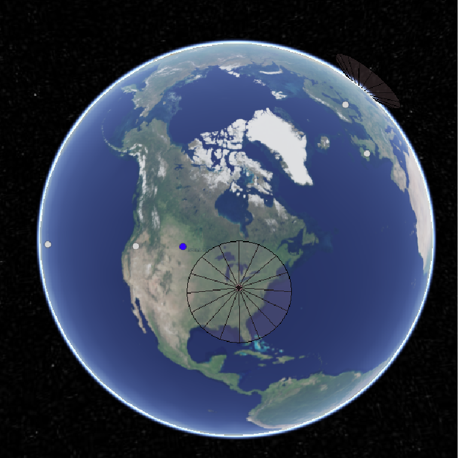
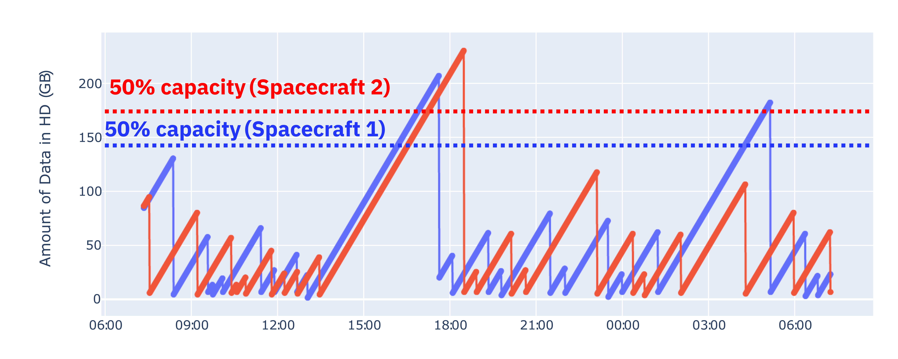
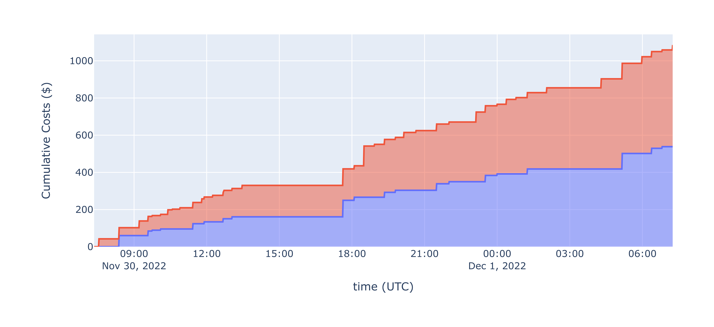

Visualizations
==============

This test suite contains two types of dynamic visualizations, both of which are unmanaged applications. Although these are used in conjunction with the managed applications of this test suite, they do not subscribe to :obj:`Manager` messages. These applications are strictly subscribers, they do not publish any messages to any topic endpoints on the message broker.

CesiumJS Scoreboard
-------------------

This application is essentially the same as the :ref:`FireSat+ Scoreboard<firesatScoreboard>`. The same Cesium access token and **env.js** file can be used in conjunction with this scoreboard, although this example adds *PREFIX* as another environment variable which enables more dynamic and extensibile use cases.

   
   Screenshot of Scoreboard Displaying Missed Downlink Opportunity

Because there are no fires or events to detect, the sensor circles representing the instrument field of view are omitted from this scoreboard. Ground stations that are active appear as pink points with inverted cones representing the minimum elevation angle for establishing communication links. When a ground station outage occurs, the cone disappears and the pink point changes colors to light gray. When operations are restored at the ground station, the point reverts to pink and the inverted cone reappears.

The purpose of this test suite is to highlight cases exactly like what is displayed in the latter figure. In this example, a satellite passing over the US mainland is just out-of-view of a ground station in Ohio. It would be in view of the ground station in California, but that station is currently experiencing an outage, requiring the satellite to wait until the next downlink opportunity to offload stored mission data.

SatelliteStorage State Dashboard
--------------------------------

.. automodule:: examples.downlink.scoreboard.downlinkDashboard
  :noindex:
  :show-inheritance:
  :member-order: bysource
  :exclude-members: examples.downlink.scoreboard.downlinkDashboard.on_message, examples.downlink.scoreboard.downlinkDashboard.update_capacity, examples.downlink.scoreboard.downlinkDashboard.update_cost, examples.downlink.scoreboard.downlinkDashboard.disable_dash

.. automethod:: examples.downlink.scoreboard.downlinkDashboard.on_message

.. automethod:: examples.downlink.scoreboard.downlinkDashboard.update_capacity

   
   Example Dashboard Display Updating Satellite Storage Capacity Used

.. automethod:: examples.downlink.scoreboard.downlinkDashboard.update_cost

   
   Example Dashboard Display Updating Satellite Costs Incurred

.. automethod:: examples.downlink.scoreboard.downlinkDashboard.disable_dash

