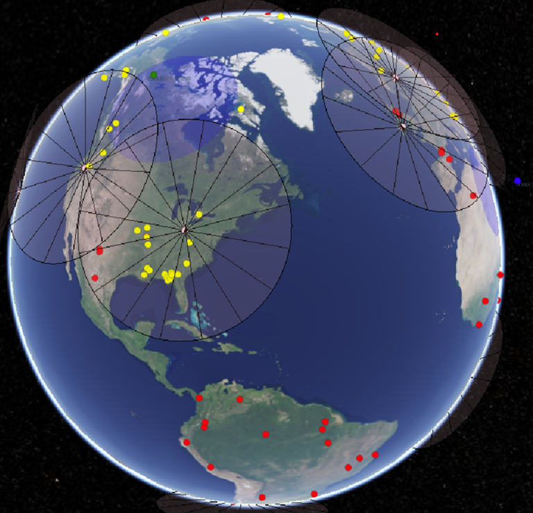

Scoreboard
==========

*Unmanaged application written in JavaScript leveraging the CesiumJS platform to visualize FireSat+ test cases.*

Below is an example view of what the Scoreboard looks like. The yellow (detected) and red (ignited) dots represent fires.
The pink dots and cones represent ground stations and their elevation angles. The blue dots and cones is a spacecraft
and its field of regard.

