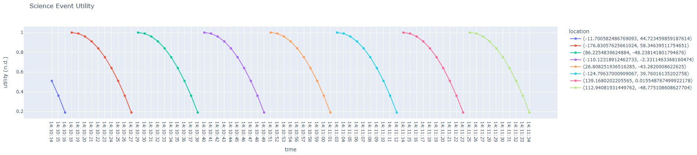

.. _scienceDash:

Science Event Dashboard
=======================

This example largely follows the instructions from the `Plotly Dash documentation. <https://dash.plotly.com/basic-callbacks>`_

.. automodule:: scienceDash.scienceEventDashboard

.. automethod:: scienceDash.scienceEventDashboard.on_message

.. automethod:: scienceDash.scienceEventDashboard.update_fig

Below is what the dashboard will display in a browser.

