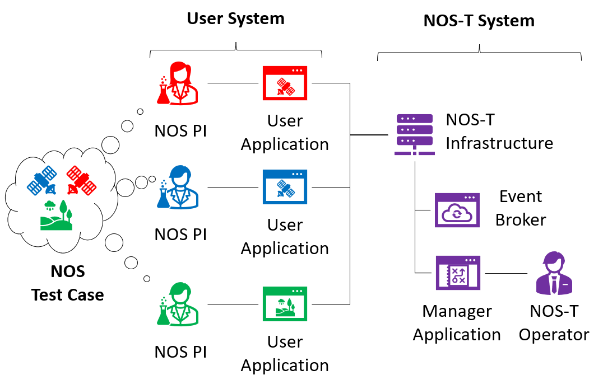

NOS Testbed (NOS-T) Documentation
=================================

The New Observing Strategies Testbed (NOS-T) is a comprehensive digital engineering environment
designed to develop, test, mature, and socialize new operating concepts and technology for
NASA's New Observing Strategies initiative. NOS-T provides a framework for scientists, engineers,
and mission planners to model, simulate, and analyze novel observational approaches across various
space science disciplines.

Key Capabilities
---------------

* **Distributed Simulation Framework**: Connect multiple simulation components through standardized Advanced Message Queuing Protocol (AMQP) messaging protocols
* **Managed Application Architecture**: Synchronize and control simulation components with built-in time management and state control
* **Schema-Based Communication**: Leverage standardized message schemas for consistent data exchange between applications
* **Flexible Deployment Options**: Run simulations locally or deploy to cloud environments like AWS
* **Example Test Suites**: Build on existing scenarios like FireSat+, Science Event Dashboard, and Snow Observing Systems
* **Scalability Testing**: Validate performance under varying message loads and simulation complexities
* **Visualization & Analysis Tools**: Visualize simulation results through integrated dashboards and analysis tools

.. graphviz::
   :name: nos_t_concept
   :caption: NOS-T Graphical Concept: Visual representation of the testbed architecture and operational flow
   :alt: NOS-T conceptual diagram showing key components and workflows
   :align: center

   digraph {
      splines=curved;
      overlap=false;

      "NOS Test Case" -> "NOS PI 1";
      "NOS Test Case" -> "NOS PI 2";
      "NOS Test Case" -> "NOS PI 3";
      
      subgraph cluster0 {
         style=filled;
         color=lightgrey;
         label="User System";
         labeljust="l";
         fontsize=18;
         fontname="Helvetica-Bold";
         
         "NOS PI 1" [label="NOS PI", fillcolor="#E74C3C", style=filled] -> "User Application 1";
         "NOS PI 2" [label="NOS PI", fillcolor="#3498DB", style=filled] -> "User Application 2";
         "NOS PI 3" [label="NOS PI", fillcolor="#2ECC71", style=filled] -> "User Application 3";
         
      }
      
      subgraph cluster1 {
         style=filled;
         color=lightgrey;
         label="NOS-T System";
         labeljust="l";
         fontsize=18;
         fontname="Helvetica-Bold";
         
         "NOS-T Infrastructure" -> "Event Broker";
         "NOS-T Infrastructure" -> "Manager Application";
         
         subgraph cluster2 {
               style=filled;
               color=white;
               labelloc="t";
               fontsize=12;
               label="NOS-T Operator";
               
               "Event Broker";
               "Manager Application";
               
         }
         
      }
      "User Application 1" -> "NOS-T Infrastructure";
      "User Application 2" -> "NOS-T Infrastructure";
      "User Application 3" -> "NOS-T Infrastructure";
      
   }

Who Should Use NOS-T?
--------------------

* Scientists developing new observation strategies for space missions
* Engineers designing spacecraft systems and instruments
* Mission planners optimizing science return and resource utilization
* Researchers evaluating observation trade-offs and capabilities
* Program managers assessing technology readiness and performance metrics

Documentation Contents
--------------------

The following sections provide comprehensive information about NOS-T:

.. toctree::
   :maxdepth: 2
   :caption: Contents:

   overview/index
   installation/installation
   learning_resources/index
   operators_guide/index
   nost_tools_api/index
   examples/index
   resources_library/index
   release_docs/index
   publications
   contributing/index
   faq/index

   NOS-T Graphical Concept: Visual representation of the testbed architecture and operational flow

Getting Started
-------------

New to NOS-T? We recommend:

1. Read the :doc:`overview/index` to understand NOS-T fundamentals
2. Follow the :doc:`installation/index` guide to set up your environment
3. Work through tutorials in :doc:`learning_resources/index`
4. Explore :doc:`examples/index` to see NOS-T in action

Support and Community
-------------------

* Report issues on our `GitHub repository <https://github.com/code-lab-org/nost-tools/issues>`_
* Attend virtual workshops and training sessions
* Contact the NOS-T team:
   * PI: Paul T. Grogan, `paul.grogan@asu.edu <mailto:paul.grogan@asu.edu>`_
   * Research Scientist: Emmanuel M. Gonzalez, `emmanuelgonzalez@asu.edu <mailto:emmanuelgonzalez@asu.edu>`_

Indices and References
--------------------

* :ref:`genindex`
* :ref:`modindex`
* :ref:`search`