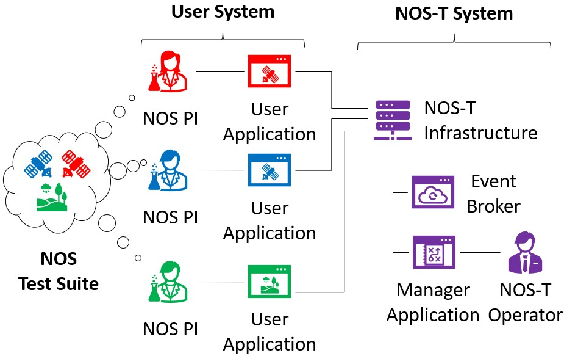

.. NOS-T documentation master file, created by
   sphinx-quickstart on Fri Jul  1 13:20:28 2022.
   You can adapt this file completely to your liking, but it should at least
   contain the root `toctree` directive.

NOS-T Documentation
===================

The New Observing Strategies Testbed (NOS-T) is a digital engineering environment for testing
distributed space mission concepts.

NOS-T Graphical Concept

.. toctree::
   :maxdepth: 1
   :caption: Contents:

   documents
   nost_tools
   examples
   publications

Indices and tables
==================

* :ref:`genindex`
* :ref:`modindex`
* :ref:`search`

Contents
--------

.. toctree::
