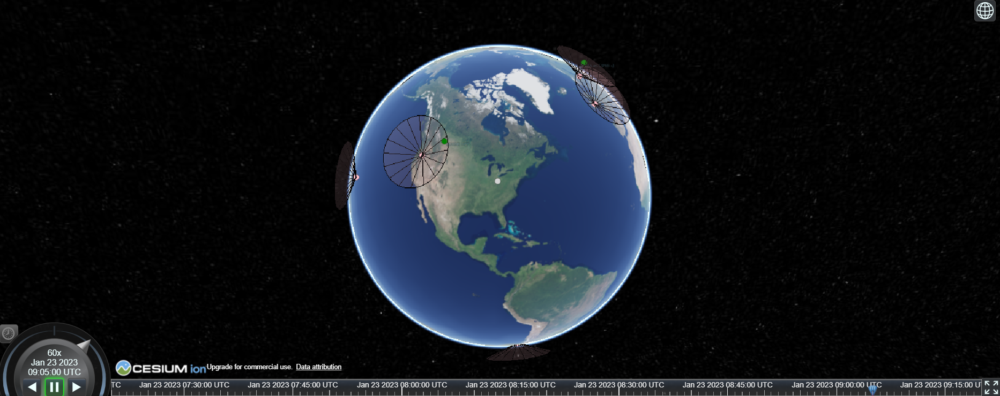

.. _downlinkTutorial:

Downlink Test Suite
===================

This tutorial contains information for those who are just starting out and builds up to show how complex test suites can be built.

Introduction
------------

NOS-T
~~~~~

.. include:: /../../docs/source/learning_resources/nost_description.rst

Downlink Test Suite
~~~~~~~~~~~~~~~~~~~

The Downlink test suite demonstrates how to model satellite data downlink operations using the NOS-T Tools library. This test suite consists of four main applications:

- **SatelliteStorage**: Models satellites that generate and store data, then downlink when in contact with ground stations
- **Grounds**: Models a network of ground stations that receive data from satellites
- **Outages**: Introduces random outages in ground station operations
- **Manager**: Orchestrates the simulation timing and execution
- **Scoreboard**: Geospatial visualization tool that displays the data from the other applications

The operational concept for the Downlink test suite is that satellites generate data during their orbits and must downlink this data when they come in range of operational ground stations. Ground stations may experience random outages, creating realistic constraints on data downlink opportunities.

Setup
-----

This section will show you how to set up NOS-T assuming you are a beginner to both coding and the testbed. The setup phase involves:

1. Integrated Development Environment Installation
2. NOS-T Tools Installation
3. RabbitMQ Event Broker Setup
4. Repository Cloning

Integrated Development Environment Installation
~~~~~~~~~~~~~~~~~~~~~~~~~~~~~~~~~~~~~~~~~~~~~~~

.. include:: /../../docs/source/installation/installation.rst
  :start-after: start-ide-installation
  :end-before: end-ide-installation

NOS-T Tools Installation
~~~~~~~~~~~~~~~~~~~~~~~~

.. include:: /../../docs/source/installation/installation.rst
  :start-after: start-nos-t-installation
  :end-before: end-nos-t-installation

RabbitMQ Event Broker Setup
~~~~~~~~~~~~~~~~~~~~~~~~~~~

Refer to the :ref:`localBroker` guide for instructions on how to set up a RabbitMQ event broker locally.

.. important::
  The test suite uses a RabbitMQ event broker to facilitate communication between applications. Ensure that your RabbitMQ broker is running and accessible before proceeding with the test suite.
|

Repository Cloning
~~~~~~~~~~~~~~~~~~

.. include:: /../../docs/source/installation/installation.rst
  :start-after: start-repository-cloning
  :end-before: end-repository-cloning

This will create a directory called ``nost-tools`` in your current working directory. Inside this directory, you will find the example code under the ``examples/downlink/`` folder.

Component Applications Overview
-------------------------------

The Downlink test suite consists of several components. Below is an overview of the main applications involved in the FireSat+ test suite: **SatelliteStorage** and **Manager**.

.. note::
    The **Grounds**, **Outages**, and **Scoreboard** applications are not covered in this tutorial, but you can find more information about them :ref:`here <downlink>`.

**SatelliteStorage**
~~~~~~~~~~~~~~~~~~~~

A key component of the Downlink test suite is the **SatelliteStorage** application (``main_satelliteStorage.py``). This application models satellites generating and storing data, and downlinking when in view of ground stations. You will be guided through the how each code block works, to help understand the purpose of different components in an application.

The first section of the code includes import statements that bring in the necessary dependencies for building the application. The imports at the top are standard Python libraries, while those at the bottom are sourced from the :ref:`NOS-T tools library <nostTools>`.

.. literalinclude:: /../../examples/downlink/satelliteStorage/main_satelliteStorage.py
	:lines: 11-12, 14, 25, 26, 27-31

The next section imports the message schema configuration, which defines the structure for how **Satellites** transmit data.

.. literalinclude:: /../../examples/downlink/satelliteStorage/main_satelliteStorage.py
	:lines: 15-24

A logger is initialized for monitoring the behavior and flow of the program. You can find more details about the different logging levels 
`here <https://docs.python.org/3/howto/logging.html#when-to-use-logging>`__.

.. literalinclude:: /../../examples/downlink/satelliteStorage/main_satelliteStorage.py
    :lines: 33-34

Following that, the function ``get_elevation_angle`` calculates the elevation angle between a satellite and a ground station. This is crucial for determining whether the satellite can downlink data to the ground station. It takes three parameters: ``t`` (time), ``sat`` (Skyview EarthSatellite object), and ``loc`` (geographic location on surface specified by latitude-longitude). The function returns the elevation angle in degrees. These inputs are used in mathematical computations to determine and return the elevation angle of a satellite at a given time and location, with respoect to the topocentric horizon.

.. literalinclude:: /../../examples/downlink/satelliteStorage/main_satelliteStorage.py
    :pyobject: get_elevation_angle

Next, the ``check_in_range`` function checks if a satellite is within range of a ground station based on the elevation angle. It takes three parameters: ``t`` (time), ``sat`` (Skyview EarthSatellite object), and ``grounds`` (dataframe of ground station locations, minimum elevation angles for communication, and operational status). The function returns a boolean indicating whether the satellite is in range of the ground station and the ground ID number. 

.. literalinclude:: /../../examples/downlink/satelliteStorage/main_satelliteStorage.py
    :pyobject: check_in_range

``SatelliteStorage`` class
^^^^^^^^^^^^^^^^^^^^^^^^^^

The next section of code blocks define the SatelliteStorage class. In object-oriented programming, a class is a replicable object that can be assigned unique parameters to generate a diverse collection of similar objects.

The SatelliteStorage class leverages the NOS-T tools library 'Entity' object class to construct the constellation chain.

The first two functions in the Constellation class, ``init`` and ``initialize``, prepare the test run for startup by initializing data.

.. literalinclude:: /../../examples/downlink/satelliteStorage/main_satelliteStorage.py
    :pyobject: SatelliteStorage
    :end-before: tick

The next two functions, ``tick`` and ``tock``, are very important for executing time-managed test suites. Generally, the ``tick`` function computes the current state of an application. Any cumbersome functions like simulations should be performed here. The ``tock`` function commits the state changes. You want this done as quickly as possible to maintain consistent timing between applications.

.. literalinclude:: /../../examples/downlink/satelliteStorage/main_satelliteStorage.py
    :pyobject: SatelliteStorage
    :start-at: tick
    :end-before: on_ground

The function ``on_ground`` processes ground station information received from published messages. When a ground station publishes its location and operational parameters, this function updates the satellite's internal database of ground stations. It extracts the station name, location (latitude, longitude), and minimum elevation angle required for communication, then stores this information for later use when determining if satellites can establish contact with ground stations.

.. literalinclude:: /../../examples/downlink/satelliteStorage/main_satelliteStorage.py
    :pyobject: SatelliteStorage.on_ground

The function ``on_linkStart`` handles the start of a downlink operation. When a satellite comes within range of a ground station, this function initiates the data transfer process. It extracts information about which satellite and ground station are involved, calculates the maximum possible data transfer based on the satellite's stored data and ground station downlink rate, and then begins the simulated data transfer. It also records the start time of the link for later billing calculations.

.. literalinclude:: /../../examples/downlink/satelliteStorage/main_satelliteStorage.py
    :pyobject: SatelliteStorage.on_linkStart

The function ``on_linkCharge`` processes downlink cost information. After completing a downlink session, this function receives the cost details associated with the data transfer. It updates the satellite's internal accounting records with both the base cost for establishing the connection and the per-gigabyte cost for the data transferred. This allows the test suite to track the economic aspects of satellite operations and optimize downlink strategies accordingly.

.. literalinclude:: /../../examples/downlink/satelliteStorage/main_satelliteStorage.py
    :pyobject: SatelliteStorage.on_linkCharge

The function ``on_outage`` handles ground station outage notifications. When a ground station experiences a simulated failure, this function updates the satellite's internal database to mark that station as unavailable. This prevents the satellite from attempting to establish contact with non-operational ground stations, forcing it to wait for another opportunity or seek an alternative station in the network. It also logs the outage for later analysis.

.. literalinclude:: /../../examples/downlink/satelliteStorage/main_satelliteStorage.py
    :pyobject: SatelliteStorage.on_outage

The function ``on_restore`` handles ground station restoration notifications. After an outage period ends, this function processes the message that indicates a ground station has returned to operational status. It updates the satellite's internal database to mark the station as available again, allowing the satellite to establish contact with that station on subsequent orbital passes. This function also logs when stations return to service for operational analytics.

.. literalinclude:: /../../examples/downlink/satelliteStorage/main_satelliteStorage.py
    :pyobject: SatelliteStorage.on_restore

``SatStatePublisher`` class
^^^^^^^^^^^^^^^^^^^^^^^^^^^

The next class in the **SatelliteStorage** application is the ``SatStatePublisher``. This class is responsible for publishing satellite status information over the NOS-T infrastructure. It takes the satellite data generation, storage, and downlink status information from the SatelliteStorage class and formats it into messages that can be consumed by other applications. These messages contain details about the satellite's position, storage capacity utilization, and downlink history, which are essential for monitoring operations and for visualization in the Scoreboard application. The SatStatePublisher ensures that all components in the test suite have up-to-date information about the status of each satellite, enabling synchronized operations and comprehensive performance analysis throughout the simulation.

.. literalinclude:: /../../examples/downlink/satelliteStorage/main_satelliteStorage.py
    :pyobject: SatStatePublisher

The final block of code in the **Satellites** app is for initializing data and adding the functions and classes.

.. literalinclude:: /../../examples/downlink/satelliteStorage/main_satelliteStorage.py
    :start-at: __main__

**Manager**
~~~~~~~~~~~

Maintaining a consistent simulation clock is important for many NOS-T use cases. For test suites that need to run faster than real time, it is an absolute necessity. The NOS-T **Manager** application (``main_manager.py``) is a good way to orchestrate all of the pieces for these types of tests. The manager is included in the NOS-T Tools library and will ensure that compliant applications start at the same time, and use a consistent simulation clock throughout the test run.

Next, we will go through the Manager code block-by-block to understand what it is doing. First, we have all of the import statements that the **Manager** relies on. 

.. literalinclude:: /../../examples/downlink/manager/main_manager.py
  :start-at: import
  :end-before: basicConfig

Finally, the last line in the above code block sets up a logger to help you track what is going on. More info on the various levels can be found
`here <https://docs.python.org/3/howto/logging.html#when-to-use-logging>`__.

.. literalinclude:: /../../examples/downlink/manager/main_manager.py
  :start-at: basicConfig
  :end-before: __main__

The next block of code loads configuration settings from a YAML configuration file. This file contains the parameters that will be used to run the test suite, such as the simulation duration, RabbitMQ connection details, and other application-specific settings. The YAML file is a convenient way to manage configuration settings without hardcoding them into the application code. The file is :ref:`described below <downlinkYaml>`.

.. literalinclude:: /../../examples/downlink/manager/main_manager.py
  :start-at: __main__

Execution
---------

There are a total of five files you will need to run for the FireSat+ test suite: three user applications, the NOS-T manager application,
and the **Scoreboard**, a geospatial data visualization tool.

There are a few more steps necessary to run the Downlink test suite. You need to create a Cesium token to run the **Scoreboard** and set up
environment files for each application.

.. _downlinkYaml:

YAML Configuration File
~~~~~~~~~~~~~~~~~~~~~~~

Each application reads a single YAML configuration file to access the parameters for the test case. The configuration file is located in the ``examples/downlink/`` folder. The configuration file is named ``downlink.yaml`` and contains the following parameters:

.. literalinclude:: /../../examples/downlink/downlink.yaml

.. note::

  For details about the YAML configuration file, refer to the :ref:`yamlConfig` guide.

Cesium Access Token and Assets
~~~~~~~~~~~~~~~~~~~~~~~~~~~~~~

.. include:: /../../docs/source/learning_resources/cesium_setup.rst
  :start-after: start-access-key:
  :end-before: end-access-key:

Setting Up Environment Files
~~~~~~~~~~~~~~~~~~~~~~~~~~~~

.. include:: /../../docs/source/learning_resources/cesium_setup.rst
  :start-after: start-env-setup:
  :end-before: end-env-setup:

Executing the Downlink Test Suite
~~~~~~~~~~~~~~~~~~~~~~~~~~~~~~~~~

Finally, you need to run the five applications together in order to execute the Downlink test suite. These applications need to be logically separated when running. For the Python scripts, this can be done by running them on separate computers, by using separate consoles in Spyder, or separate terminals with VSCode. The **Scoreboard** is an .html file and can be run in a web browser, double-clicking the file should work.  Each folder in the Downlink test suite has a code you need to run, they are:

* main_satelliteStorage.py - The **SatelliteStorage** app models satellites that generate and store data during their orbits, then downlink when in contact with operational ground stations.
* main_ground.py - The **Ground** app models a network of ground stations that receive data from satellites, providing geographic locations, elevation angles, and downlink rates.
* main_outages.py - The **Outages** app introduces realistic constraints by randomly creating outages in ground station operations.
* scoreboard.html - The **Scoreboard** provides a geospatial visualization of satellite positions, ground stations (active in pink, inactive in gray), and data transmission activities.
* main_manager.py - The NOS-T **Manager** app orchestrates each test run by starting the other apps simultaneously, maintaining a consistent simulation time, and shutting down the apps at the end.

.. * downlinkDashboard.py - The Dashboard displays real-time graphs showing satellite storage capacity usage and downlink costs over time.

.. note::
  You **must** run the manager application (``manager/main_manager.py``) first, as it establishes the RabbitMQ exchange required to run the execution. Tt does not matter in which order you start the other applications.

If everything is running correctly, the Scoreboard app should show an image similar
to below.

Conclusion
----------

The Downlink test suite demonstrates how to model satellite data downlink operations using the NOS-T Tools library. By following this tutorial, you have learned how to set up the necessary components, understand the application code, and execute the test suite. The Downlink test suite provides a foundation for simulating realistic satellite operations and can be extended for more complex scenarios in the future. Some good next steps for learning other NOS-T functions and developing your own test suites can be found at the following links:

* :ref:`Main Downlink documentation <downlink>`
* :ref:`Science Event Dashboard Test Suite <instructionsScienceDash>`
* :ref:`FireSat+ Test Suite <tutorial>`
* :ref:`NOS-T Tools API documentation <nostTools>`