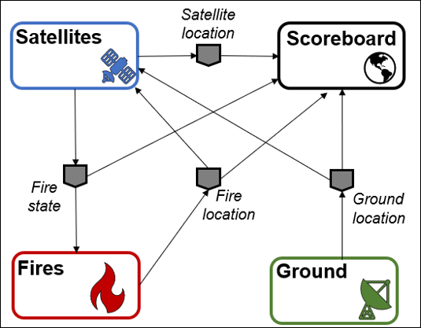

.. _instructionsFireSat:

FireSat+
========

This guide contains step-by-step instructions for running the FireSat+ test
suite. This is based on the FireSat mission seen in *Space Mission
Analysis and Design, Third Edition* by James R. Wertz and Wiley J. Larson
(1999). In contrast to the Science Dashboard example test suite, the FireSat+ 
test suite uses the NOS-T tools library and provides an example for how 
to create a more capable application case than the Science Event Dashboard.

* The Interface Control Document has a high-level description of FireSat+ here: :ref:`ICDfireSat`.
* A deeper dive into the applications and code is here: :ref:`fireSatExampleTop`.

Cesium Access Token and Assets
------------------------------

The FireSat+ Scoreboard application is a great way to visualize what is happening during a test.
It uses the Cesium geospatial visualization tool which requires getting an access token.
You will get an access token by signing in at the following link:

https://cesium.com/ion/signin/tokens

After creating an account, you *must* add the Asset “Blue Marble Next Generation
July, 2004” from the Asset Depot (ID 3845) to the account assets to enable
visualization.

Setting Up Environment Files
----------------------------

In order to protect your (and our) information, these applications all use
environment files for usernames, passwords, event broker host site URLs, and
port numbers.

For the applications coded in python (.py files) you will need to create a text
file with the name ".env" containing the following text:

::

  HOST="your event broker host URL"
  PORT=#### - your connection port
  USERNAME="your event broker username"
  PASSWORD="your event broker password"

The Scoreboard application is .html, and therefore the environment needs
to be set in a JavaScript file. To do this create a text file with the name
"env.js" containing the following information:

::

  var HOST="your event broker host URL"
  var PORT=#### - your connection port
  var USERNAME="your event broker username"
  var PASSWORD="your event broker password"
  var TOKEN="your Cesium token (see Cesium installation instructions)"

Running FireSat+
----------------

There are five files you will need to run for FireSat+, four user applications, the NOS-T manager application,
and the **Scoreboard**, a geospatial data visualization tool. These applications need to be
logically separated when running. For the python scripts, this can be done by running them on separate computers, 
by using separate consoles in Spyder, or separate terminals with VSCode. The **Scoreboard** is an .html file
and can be run in a web browser, double-clicking the file should work.  Each folder in the FireSat+ test suite
has a code you need to run, they are:

* main_fire.py - The **Fires** app publishes historical fire data.
* main_ground.py - The **Ground** app models a ground station in Svalbard, Norway.
* main_constellation.py - The **Satellites** app models the constellation of spacecraft observing and reporting the fires.
* scoreboard.html - The aforementioned **Scoreboard** gives a view of what's happening during a test run.
* main_manager.py - The NOS-T **Manager** app orchestrates each test run by starting the other apps at the same time, maintaining a consistent time throughout, and shutting down the apps at the end.

You **must** start the main_manager.py application last, otherwise it does not matter in which 
order you start the other applications. All of the .py applications will give an output that
they are waiting for the test case to start up. 

If everything is running correctly, the Scoreboard app should show an image similar
to below.

.. image:: media/fireSatScoreboard.png
   :width: 600
   :align: center

| 
| Next is a graphical representation of the FireSat+ message flows and their payloads. 

