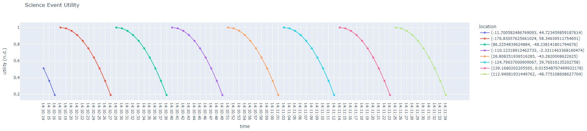

.. _instructionsScienceDash:

Visualization Implementation Example
====================================

This example illustrates how to build a basic visualization tool using a publish-subscribe (pub/sub) architecture powered by a RabbitMQ event broker. It aims to help users understand how to visualize data flows within a test suite, with a focus on science event data.

.. note::
   This example does not require the full NOS-T tools library, making it accessible for users who want to implement similar functionality without the overhead of the entire tools suite.

Introduction
------------

The Science Event Dashboard Test Suite is a simple example of NOS-T
capabilities. It does not require the use of the NOS-T tools library.
It contains two applications: a publisher (``scienceEventPublisher.py``) and a dashboard (``scienceEventDashboard.py``).
Importantly, it uses a dashboard to visualize data being sent over the testbed. The development 
team has found visualization tools like this to be essential in ensuring test suites are functioning as intended.

The Science Event Publisher regularly publishes a utility score and globally distributed random location.
The utility scores follow a parabolic curve from the apex down to zero for each time step.
The second application is a basic dashboard which publishes the utility and 
location with the Python Dash library. The development team has found visualization
tools like this dashboard to be very helpful to ensure that test behavior is
as expected. A basic graphical representation of the data flow is shown below.

|

Setup
-----

The setup phase involves:

1. Installing the NOS-T Tools library
2. Setting up a RabbitMQ Event Broker
3. Cloning the NOS-T Tools repository

.. note::
   

NOS-T Tools Installation
~~~~~~~~~~~~~~~~~~~~~~~~

Although the Science Event Test Suite code does not require the full NOS-T Tools library, it is recommended to install the library to simplify installation of dependencies for this test suite.

The NOS-T Tools library is available on `PyPi <https://pypi.org/project/nost-tools/>`__ and can be installed using pip, the standard package manager for Python. The library is compatible with Python 3.8 and later versions.

.. include:: /../../docs/source/installation/installation.rst
  :start-after: start-nos-t-installation
  :end-before: end-nos-t-installation

.. note:: 
  Following the instructions above will install the Python packages that the Science Event test suite depends on to run. The details of these dependencies, including version numbers, can
  otherwise be found in the `requirements file <https://github.com/code-lab-org/nost-tools/blob/main/pyproject.toml>`__.

Setting up a RabbitMQ Event Broker
~~~~~~~~~~~~~~~~~~~~~~~~~~~~~~~~~~

Refer to the :ref:`localBroker` guide for instructions on how to set up a RabbitMQ event broker locally.

Repository Cloning
~~~~~~~~~~~~~~~~~~

.. include:: /../../docs/source/installation/installation.rst
  :start-after: start-repository-cloning
  :end-before: end-repository-cloning

This will create a directory called ``nost-tools`` in your current working directory. Inside this directory, you will find the example code under the ``examples/scienceDash/`` folder.

.. note::
   
   More in-depth descriptions of what the code is doing can be found here: :ref:`scienceDashEX`.

Initial Requirements
--------------------

This test suite assumes that you have first downloaded the constituent applications.
It is also necessary to install several python packages as found in the `requirements file <https://github.com/code-lab-org/nost-tools/blob/main/docs/requirements.txt>`__.
However, this is an unmanaged NOS-T test suite and it is not necessary to have the tools library installed.

Setting Up Environment Files
----------------------------

For this test suite, you will need to use a text editor to create a file with the
name ``.env`` containing the following information:

::

  HOST="your event broker host URL"
  PORT=8883 - your connection port
  USERNAME="your event broker username"
  PASSWORD="your event broker password"

if you are running the test suite on your local computer using a local RabbitMQ event broker, you can set up the ``.env`` file like this:

::

   HOST="localhost"
   PORT=5672
   USERNAME="admin"
   PASSWORD="admin"

.. note::

  For details on setting up a local RabbitMQ broker, refer to the :ref:`localBroker` guide.

Running a Test Case
-------------------

Next, run each application on separate computers or consoles using the following commands: 

1. Run the Dashboard application:

   .. code-block:: bash

      python3 scienceEventDashboard.py

2. Run the Publisher application:

   .. code-block:: bash

      python3 scienceEventPublisher.py

Wherever the dashboard application is running, you should be able to see the utility scores
from a web browser (default address:  http://127.0.0.1:8050/). If everything is
running properly the dashboard will look like the figure below:

