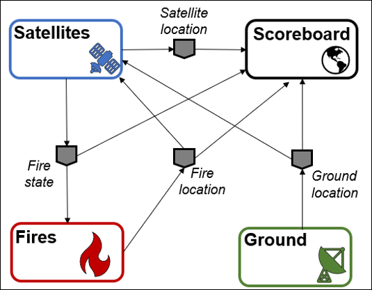
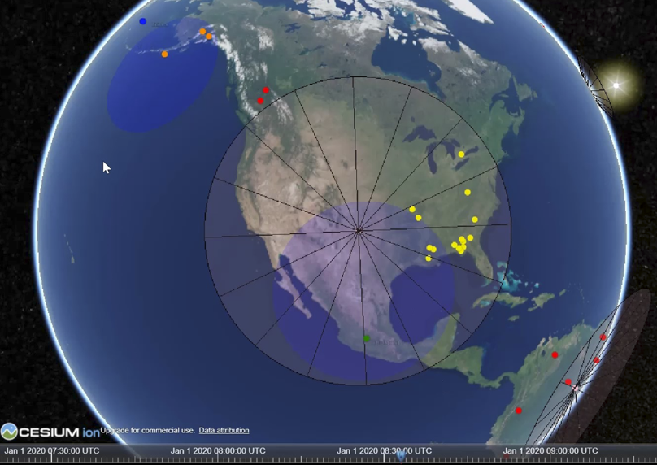

.. _tutorial:

Hands-on Tutorial
=================

This tutorial contains information for those who are just starting out and builds up to show how complex test suites can be built.

Introduction
------------

The New Observing Strategies Testbed (NOS-T) is a computational environment to
develop, test, mature, and socialize new operating concepts and technology for
NOS. NOS-T provides infrastructure to integrate and orchestrate user-contributed
applications for system-of-systems test cases with true distributed
control over constituent systems. The overall concept, illustrated below, 
interconnects individual user applications and a NOS-T manager
application via common information system infrastructure to coordinate
the execution of virtual Earth science missions. NOS-T enables principal
investigators to conduct test runs in the same environment,
systematically changing variables to assess the overall efficacy of the
proposed new observing strategies. Recorded data and outcomes provide
evidence to advance technology readiness level and improve or innovate
upon existing Earth science measurement techniques.

Setup
-----

This section will show you how to set up NOS-T assuming you are a beginner to both coding and the testbed.

Integrated Development Environment (IDE)
~~~~~~~~~~~~~~~~~~~~~~~~~~~~~~~~~~~~~~~~

An IDE will make developing applications and interacting with the testbed much easier. The developers have mostly used Microsoft's `Visual Studio Code <https://visualstudio.microsoft.com/>`__. This tutorial will proceed under the assumption that you are using Visual Studio Code or a comparable IDE.

NOS-T Tools Download and Installation
~~~~~~~~~~~~~~~~~~~~~~~~~~~~~~~~~~~~~

The NOS-T Tools library is available on `PyPi <https://pypi.org/project/nost-tools/>`__ and can be installed using pip, the standard package manager for Python. The library is compatible with Python 3.8 and later versions.

Example code for the FireSat+ test suite is hosted on GitHub and can be easily cloned to your local environment for use.

NOS-T Tools Installation
^^^^^^^^^^^^^^^^^^^^^^^^

First, install pip version 23 or greater:
::
  python3 -m pip install --upgrade pip

Then, install the NOS-T Tools library from `PyPi <https://pypi.org/project/nost-tools/>`__:
::
  python3 -m pip install "nost_tools[examples]"

Cloning the Repository
^^^^^^^^^^^^^^^^^^^^^^

The best way to get the NOS-T Tools example codes is to clone the NOS-T git repository. There are several ways to clone a git repository, more details are available `here <https://docs.github.com/en/repositories/creating-and-managing-repositories/cloning-a-repository?tool=webui>`__.

Clone the repository:
::
  git clone git@github.com:code-lab-org/nost-tools.git

If the above fails, you can also try the HTTPS version:
::
  git clone https://github.com/code-lab-org/nost-tools.git

Following the instructions above will install the Python packages that the FireSat+ test suite depends on to run. The details of these dependencies, including version numbers, can
otherwise be found in the `requirements file <https://github.com/code-lab-org/nost-tools/blob/main/pyproject.toml>`__.

.. _tutorialSystemDescription:

NOS-T System description
------------------------

The NOS-T system architecture follows a loosely coupled event-driven
architecture (EDA) where member applications communicate state changes
through events that are embodied as notification messages sent over a
network. These event/message payloads contain the relevant data for communicating these state changes. EDA provides enhanced scalability and reliability over other software architectures by replicating event handling functions across
infrastructure instances while maintaining modularity between
applications through a simple event-handling interface. NOS-T can also
be described as a service-oriented architecture (SOA) as applications
trigger services in response to events.

The NOS-T architecture relies on a centralized infrastructure component
called an event broker (synonymous with message broker) to exchange
event notifications between applications. A broker simplifies the
communication structure because each member application (client) only
directly connects to the broker, rather than requiring each application
to directly connect to every other application.

The FireSat+ Test Suite
-----------------------

From here, the tutorial will explain important functions using FireSat+, an example NOS-T test suite based on FireSat, the common space systems 
engineering application case. The operational concept for FireSat+ is that one or several satellites are searching for fires. The fires are ignited following a historical dataset. When one of the satellites orbit above these locations, it will detect the fire. Finally, once that satellite is in range of a ground station, it will report the fire.

This is a graphical representation of the FireSat+ message flows and their payloads. 

|

For more information on FireSat+, please see the following:

* The Interface Control Document has a high-level description of FireSat+ :ref:`here <ICDfireSat>`.
* A deeper dive into the applications and code is :ref:`here <fireSatExampleTop>`.
* A paper describing this test suite is `here <https://doi.org/10.1109/IGARSS46834.2022.9883290>`__.

NOS-T test suites are made up of applications communicating over the broker. Next, the tutorial will detail two of the FireSat+ apps to give you a better idea of how they work. 

.. _tutorialSat:

The **Satellites** application - main_constellation.py
~~~~~~~~~~~~~~~~~~~~~~~~~~~~~~~~~~~~~~~~~~~~~~~~~~~~~~

A key component of the FireSat+ example case is the **Satellite** application. This application enables the user to generate a satellite constellation using the NOS-T Tools library, leveraging predefined templates to construct a model of a real-life constellation. You will be guided through the how each code block works, to help understand the purpose of different components in an application.

The first section of the code includes import statements that bring in the necessary dependencies for building the application. The imports at the top are standard Python libraries, while those at the bottom are sourced from the :ref:`NOS-T tools library <nostTools>`.

.. literalinclude:: /../../examples/firesat/satellites/main_constellation.py
	:lines: 1-6,15-22

This next group of import statements is tailored for FireSat+, pulling in values from the constellation configuration files.  The first set brings in the ``FIELD_OF_REGARD`` parameter, which specifies the area on Earth visible to the satellite\’s instrument. The second set imports the message schema configuration, which defines the structure for how **Satellites** transmit data.

.. literalinclude:: /../../examples/firesat/satellites/main_constellation.py
	:lines: 7-14

A logger is initialized for monitoring the behavior and flow of the program. You can find more details about the different logging levels 
`here <https://docs.python.org/3/howto/logging.html#when-to-use-logging>`__.

.. literalinclude:: /../../examples/firesat/satellites/main_constellation.py
  :lines: 24-25

Following that, the function ``compute_min_elevation`` calculates the minimum elevation angle necessary for a satellite to observe a specific point from its current position. It takes two parameters: ``altitude`` and ``field_of_regard``. These inputs are used in mathematical computations to determine and return the minimum elevation angle in degrees.

.. literalinclude:: /../../examples/firesat/satellites/main_constellation.py
  :pyobject: compute_min_elevation
 
Next, the ``compute_sensor_radius`` function  pulls in the result of ``compute_min_elevation`` and the altitude value to return ``sensor_radius``, which provides the radius of the nadir pointing sensor's circular view projected onto Earth. 

.. literalinclude:: /../../examples/firesat/satellites/main_constellation.py
	:pyobject: compute_sensor_radius

The ``get_elevation_angle`` is a function that uses the Skyfield library. It accepts the parameters ``t``, ``sat``, and ``loc``. The first two, respectively, represent the Skyfield time object, the Skyfield EarthSat object. The third is the latitude/longitude of the spacecraft's subpoint, along with the spacecraft altitude. It returns an elevation angle in respect to the topocentric horizon.

.. literalinclude:: /../../examples/firesat/satellites/main_constellation.py
	:pyobject: get_elevation_angle

These two functions, ``check_in_view`` and ``check_in_range``, affirm if the elevation angle and immediate location of the satellite enable it to connect to a ground station and view regions on Earth. 

.. literalinclude:: /../../examples/firesat/satellites/main_constellation.py
	:pyobject: check_in_view

.. literalinclude:: /../../examples/firesat/satellites/main_constellation.py
  :pyobject: check_in_range

.. _tutorialConstellation:

Constellation class
~~~~~~~~~~~~~~~~~~~

The next section of code blocks define the Constellation class. In object-oriented programming, a class is a replicable object that can be assigned unique parameters to generate a diverse collection of similar objects.
The Constellation class leverages the NOS-T tools library 'Entity' object class to construct the constellation chain.

The first two functions in the Constellation class, ``init`` and ``initialize``, prepare the test run for startup by initializing data.

.. literalinclude:: /../../examples/firesat/satellites/main_constellation.py
  :pyobject: Constellation
  :end-before: tick

The next two functions, ``tick`` and ``tock``, are very important for executing time-managed test suites. Generally, the ``tick`` function computes the current state of an application. Any cumbersome functions like simulations should be performed here. The ``tock`` function commits the state changes. You want this done as quickly as possible to maintain consistent timing between applications.

.. literalinclude:: /../../examples/firesat/satellites/main_constellation.py
  :pyobject: Constellation
  :start-at: tick
  :end-before: on_fire

The next function, ``on_fire``, checks the current simulation time vs. a database of actual fires detected by an space-based infrared sensor. This function then publishes a message containing information about the fire. It also maintains an internal database for when fires are detected and reported, and which satellite did the detecting/reporting.

.. literalinclude:: /../../examples/firesat/satellites/main_constellation.py
  :pyobject: Constellation.on_fire

The final block of the Constellation class is next. It contains the ``on_ground`` function which is used to collect information on ground station locations and elevation angles when those messages are published.

.. literalinclude:: /../../examples/firesat/satellites/main_constellation.py
  :pyobject: Constellation.on_ground

Position Publisher Class
~~~~~~~~~~~~~~~~~~~~~~~~

The next class in the **Satellites** application is the Position Publisher. This class takes the satellite location information from the Constellation class and publishes it over the NOS-T infrastructre. These messages are used for the **Scoreboard** application, which is a geospatial visualization tool.

.. literalinclude:: /../../examples/firesat/satellites/main_constellation.py
	:pyobject: PositionPublisher

Fire Observer Classes
~~~~~~~~~~~~~~~~~~~~~

The next code block contains two different fire observation classes. The first of these is for detecting fires and the second is for reporting fires. The concept of operations for FireSat+ is that fires are first *ignited*, then *detected* when a satellite passes over them. Finally, the fires are *reported* when the detecting satellite is in range of a ground station for the data downlink. The Fire Observer classes publish this over the testbed for postprocessing of results, and for **Scoreboard** visualization.

.. literalinclude:: /../../examples/firesat/satellites/main_constellation.py
	:pyobject: FireDetectedObserver

.. literalinclude:: /../../examples/firesat/satellites/main_constellation.py
	:pyobject: FireReportedObserver

The final block of code in the **Satellites** app is for initializing data and adding the functions and classes.

.. literalinclude:: /../../examples/firesat/satellites/main_constellation.py
  :start-at: __main__

The **Manager** application - main_manager.py
~~~~~~~~~~~~~~~~~~~~~~~~~~~~~~~~~~~~~~~~~~~~~

Maintaining a consistent simulation clock is important for many NOS-T use cases. For test suites that need to run faster than real time,
it is an absolute necessity. The NOS-T **Manager** application is a good way to orchestrate all of the pieces for these types of tests.
The manager is included in the NOS-T Tools library and will ensure that compliant applications start at the same time, and use a consistent
simulation clock throughout the test run. 

As above with the **Satellites** application, you should create a blank main_manager.py file in the examples/firesat_tutorial/manager folder. 
NOTE: You *must* maintain the indentations you see in these code blocks when pasting them into the main_manager.py file.

Next, we will go through the Manager code block-by-block to understand what it is doing. First, we have all of the import statements that the 
**Manager** relies on. The first of these three are general Python dependencies, and the
second two are drawn from the NOS-T tools library. The last imports come from a config file that you should adjust for any specific test suites.
In that config file you will need to set your desired event message prefix, the time scale, and any time scale updates. 

.. literalinclude:: /../../examples/firesat/manager/main_manager.py
	:end-at: basicConfig

.. _timeScaleUpdate:

The time scale is a simple multiplier, i.e. if :code:`SCALE = 60` then the time will be sped up by 60x -- meaning that each second of real time
will be one minute of simulation time. The time scale updates are used when you want to change the time scale at any point during 
the simulation. As for the updates, They take a form like this:

:code:`UPDATE = [TimeScaleUpdate(120.0, datetime(2020, 1, 1, 8, 20, 0, tzinfo=timezone.utc))]` 

The above command would change the time scale to 120x at the given datetime object in simulation time. If you do not wish to update the time scale
during a test case, then you can set 

:code:`UPDATE = []`

Finally, the last line in the above code block sets up a logger to help you track what is going on. More info on the various levels can be found
`here <https://docs.python.org/3/howto/logging.html#when-to-use-logging>`__.

The next block of code starts with a name guard and credentials like the **Satellites** app above. These credentials will be drawn from an environment 
file :ref:`described below<envSetUp>`. The next four lines of code follow their preceding comments. Using the various NOS-T tools from the library the connection is set, the manager application is created, it is set to shut down after the test case, and is commanded to start up.

.. literalinclude:: /../../examples/firesat/manager/main_manager.py
  :start-at: main

Executing the FireSat+ Test Suite
---------------------------------

There are a total of five files you will need to run for FireSat+, four user applications, the NOS-T manager application,
and the **Scoreboard**, a geospatial data visualization tool.

There are a few more steps necessary to run FireSat+. You need to create a Cesium token to run the **Scoreboard** and set up
environment files for each application.

YAML Configuration File
~~~~~~~~~~~~~~~~~~~~~~~

Each application reads a YAML configuration file to set up the parameters for the test case. The configuration file is located in the ``examples/firesat/`` folder. The configuration file is named ``firesat.yaml`` and contains the following parameters:

.. literalinclude:: /../../examples/firesat/firesat.yaml

.. note::

  For details about the YAML configuration file, refer to the :ref:`yamlConfig` guide.

Cesium Access Token and Assets
~~~~~~~~~~~~~~~~~~~~~~~~~~~~~~

The FireSat+ Scoreboard application uses the Cesium geospatial visualization tool which requires getting an access token
and an 3D Earth map asset. You will get an access token by signing in at the following link:

https://cesium.com/ion/signin/tokens

After creating an account, you *must* add the Asset “Blue Marble Next Generation
July, 2004” from the `Asset Depot (ID 3845) <https://ion.cesium.com/assetdepot/3845>`__ to your account assets to enable
visualization.

.. _envSetUp:

Setting Up Environment Files
~~~~~~~~~~~~~~~~~~~~~~~~~~~~

The Scoreboard application is in .html, and pulls in credentials from a JavaScript file. To do this create a text file with the name "env.js" containing the following information:

::

  var HOST="your event broker host URL"
  var RABBITMQ_PORT=15670
  var USERNAME="your event broker username"
  var PASSWORD="your event broker password"
  var TOKEN="your Cesium token (see Cesium installation instructions)"

For example, if you are running the test suite on your local computer using a local RabbitMQ event broker, you can set up the env.js file like this:
::

  var HOST="localhost"
  var RABBITMQ_PORT=15670
  var USERNAME="admin"
  var PASSWORD="admin"
  var TOKEN="your Cesium token (see Cesium installation instructions)"

.. note::

  For details on setting up a local RabbitMQ broker, refer to the :ref:`localBroker` guide.

Executing FireSat+
~~~~~~~~~~~~~~~~~~

Finally, you need to run the five applications together in order to execute the FireSat+ test suite. These applications need to be
logically separated when running. For the python scripts, this can be done by running them on separate computers, 
by using separate consoles in Spyder, or separate terminals with VSCode. The **Scoreboard** is an .html file
and can be run in a web browser, double-clicking the file should work.  Each folder in the FireSat+ test suite
has a code you need to run, they are:

* main_fire.py - The **Fires** app publishes historical fire data.
* main_ground.py - The **Ground** app models a ground station in Svalbard, Norway.
* main_constellation.py - The **Satellites** app models the constellation of spacecraft observing and reporting the fires.
* scoreboard.html - The aforementioned **Scoreboard** gives a view of what's happening during a test run.
* main_manager.py - The NOS-T **Manager** app orchestrates each test run by starting the other apps at the same time, maintaining a consistent time throughout, and shutting down the apps at the end.

If everything is running correctly, the Scoreboard app should show an image similar
to below.

Conclusion
----------

This hands-on tutorial was developed to help users get started with NOS-T from a basic level. It begins with
downloading an IDE for running scripts to interface with NOS-T and finishes with executing the FireSat+ example code. Some good next
steps for learning other NOS-T functions and developing your own test suites can be found at the following links:

* :ref:`Main FireSat+ documentation <fireSatExampleTop>`
* :ref:`Science Event Dashboard test suite walkthrough <instructionsScienceDash>`
* :ref:`NOS-T Tools API documentation <nostTools>`

