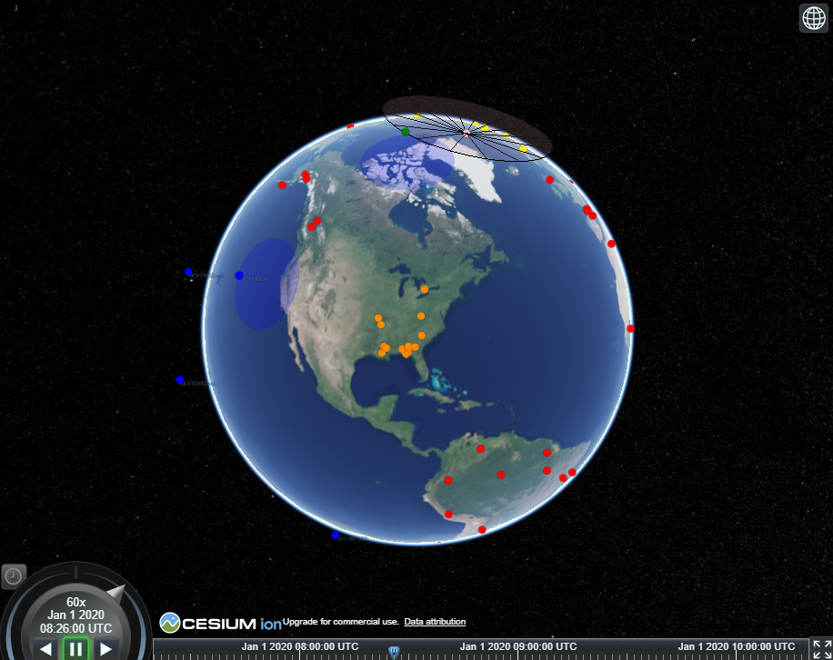

.. _tutorial:

FireSat+ Test Suite
===================

This tutorial contains information for those who are just starting out and builds up to show how complex test suites can be built.

Introduction
------------

NOS-T
~~~~~

.. include:: /../../docs/source/learning_resources/nost_description.rst

FireSat+ Test Suite
~~~~~~~~~~~~~~~~~~

The FireSat+ test suite is a hands-on example of how to use the NOS-T Tools library to create a test suite. It contains five applications:

- **Fires**: Publishes historical fire data.
- **Ground**: Models a ground station in Svalbard, Norway.
- **Satellites**: Models a constellation of spacecraft observing and reporting the fires.
- **Manager**: Orchestrates the simulation timing and execution
- **Scoreboard**: Geospatial visualization tool that displays the data from the other applications.

The operational concept for FireSat+ is that one or several satellites are searching for fires. The fires are ignited following a historical dataset. When one of the satellites orbit above these locations, it will detect the fire. Finally, once that satellite is in range of a ground station, it will report the fire.

A graphical representation of the FireSat+ message flows and their payloads is shown below:

.. image:: media/fireSatWorkflow.png
   :width: 400
   :align: center

|

.. seealso::
  For more information on FireSat+, please refer to the following resources:

  * The Interface Control Document has a high-level description of FireSat+ :ref:`here <ICDfireSat>`.
  * A deeper dive into the applications and code is :ref:`here <fireSatExampleTop>`.
  * A paper describing this test suite is `here <https://doi.org/10.1109/IGARSS46834.2022.9883290>`__.

|

Setup
-----

This section will show you how to set up NOS-T assuming you are a beginner to both coding and the testbed. The setup phase involves:

1. Integrated Development Environment Installation
2. NOS-T Tools Installation
3. RabbitMQ Event Broker Setup
4. Repository Cloning

Integrated Development Environment Installation
~~~~~~~~~~~~~~~~~~~~~~~~~~~~~~~~~~~~~~~~~~~~~~~

.. include:: /../../docs/source/installation/installation.rst
  :start-after: start-ide-installation
  :end-before: end-ide-installation

NOS-T Tools Installation
~~~~~~~~~~~~~~~~~~~~~~~~

.. include:: /../../docs/source/installation/installation.rst
  :start-after: start-nos-t-installation
  :end-before: end-nos-t-installation

RabbitMQ Event Broker Setup
~~~~~~~~~~~~~~~~~~~~~~~~~~~

Refer to the :ref:`localBroker` guide for instructions on how to set up a RabbitMQ event broker locally.

.. important::
  The test suite uses a RabbitMQ event broker to facilitate communication between applications. Ensure that your RabbitMQ broker is running and accessible before proceeding with the test suite.
|

Repository Cloning
~~~~~~~~~~~~~~~~~~

.. include:: /../../docs/source/installation/installation.rst
  :start-after: start-repository-cloning
  :end-before: end-repository-cloning

This will create a directory called ``nost-tools`` in your current working directory. Inside this directory, you will find the example code under the ``examples/firesat/`` folder.

.. _tutorialSystemDescription:

Component Applications Overview
-------------------------------

The FireSat+ test suite consists of several applications. Below is an overview of the main applications involved in the FireSat+ test suite: **Satellites** and **Manager**. 

.. note::
  The **Fires**, **Ground**, and **Scoreboard** applications are not covered in this tutorial, but you can find more information about them :ref:`here <fireSatExampleTop>`.
|

.. _tutorialSat:

**Satellites**
~~~~~~~~~~~~~~

A key component of the FireSat+ test suite is the **Satellite** application (``main_constellation.py``). This application enables the user to generate a satellite constellation using the NOS-T Tools library, leveraging predefined templates to construct a model of a real-life constellation. You will be guided through the how each code block works, to help understand the purpose of different components in an application.

The first section of the code includes import statements that bring in the necessary dependencies for building the application. The imports at the top are standard Python libraries, while those at the bottom are sourced from the :ref:`NOS-T tools library <nostTools>`.

.. literalinclude:: /../../examples/firesat/satellites/main_constellation.py
	:lines: 1-6,15-22

This next group of import statements is tailored for FireSat+, pulling in values from the constellation configuration files.  The first set brings in the ``FIELD_OF_REGARD`` parameter, which specifies the area on Earth visible to the satellite\’s instrument. The second set imports the message schema configuration, which defines the structure for how **Satellites** transmit data.

.. literalinclude:: /../../examples/firesat/satellites/main_constellation.py
	:lines: 7-14

A logger is initialized for monitoring the behavior and flow of the program. You can find more details about the different logging levels 
`here <https://docs.python.org/3/howto/logging.html#when-to-use-logging>`__.

.. literalinclude:: /../../examples/firesat/satellites/main_constellation.py
  :lines: 24-25

Following that, the function ``compute_min_elevation`` calculates the minimum elevation angle necessary for a satellite to observe a specific point from its current position. It takes two parameters: ``altitude`` and ``field_of_regard``. These inputs are used in mathematical computations to determine and return the minimum elevation angle in degrees.

.. literalinclude:: /../../examples/firesat/satellites/main_constellation.py
  :pyobject: compute_min_elevation
 
Next, the ``compute_sensor_radius`` function  pulls in the result of ``compute_min_elevation`` and the altitude value to return ``sensor_radius``, which provides the radius of the nadir pointing sensor's circular view projected onto Earth. 

.. literalinclude:: /../../examples/firesat/satellites/main_constellation.py
	:pyobject: compute_sensor_radius

The ``get_elevation_angle`` is a function that uses the Skyfield library. It accepts the parameters ``t``, ``sat``, and ``loc``. The first two, respectively, represent the Skyfield time object, the Skyfield EarthSat object. The third is the latitude/longitude of the spacecraft's subpoint, along with the spacecraft altitude. It returns an elevation angle in respect to the topocentric horizon.

.. literalinclude:: /../../examples/firesat/satellites/main_constellation.py
	:pyobject: get_elevation_angle

These two functions, ``check_in_view`` and ``check_in_range``, affirm if the elevation angle and immediate location of the satellite enable it to connect to a ground station and view regions on Earth. 

.. literalinclude:: /../../examples/firesat/satellites/main_constellation.py
	:pyobject: check_in_view

.. literalinclude:: /../../examples/firesat/satellites/main_constellation.py
  :pyobject: check_in_range

.. _tutorialConstellation:

``Constellation`` class
^^^^^^^^^^^^^^^^^^^^^^^

The next section of code blocks define the Constellation class. In object-oriented programming, a class is a replicable object that can be assigned unique parameters to generate a diverse collection of similar objects.
The Constellation class leverages the NOS-T tools library 'Entity' object class to construct the constellation chain.

The first two functions in the Constellation class, ``init`` and ``initialize``, prepare the test run for startup by initializing data.

.. literalinclude:: /../../examples/firesat/satellites/main_constellation.py
  :pyobject: Constellation
  :end-before: tick

The next two functions, ``tick`` and ``tock``, are very important for executing time-managed test suites. Generally, the ``tick`` function computes the current state of an application. Any cumbersome functions like simulations should be performed here. The ``tock`` function commits the state changes. You want this done as quickly as possible to maintain consistent timing between applications.

.. literalinclude:: /../../examples/firesat/satellites/main_constellation.py
  :pyobject: Constellation
  :start-at: tick
  :end-before: on_fire

The next function, ``on_fire``, checks the current simulation time vs. a database of actual fires detected by an space-based infrared sensor. This function then publishes a message containing information about the fire. It also maintains an internal database for when fires are detected and reported, and which satellite did the detecting/reporting.

.. literalinclude:: /../../examples/firesat/satellites/main_constellation.py
  :pyobject: Constellation.on_fire

The final block of the Constellation class is next. It contains the ``on_ground`` function which is used to collect information on ground station locations and elevation angles when those messages are published.

.. literalinclude:: /../../examples/firesat/satellites/main_constellation.py
  :pyobject: Constellation.on_ground

Position Publisher Class
^^^^^^^^^^^^^^^^^^^^^^^^

The next class in the **Satellites** application is the Position Publisher. This class takes the satellite location information from the Constellation class and publishes it over the NOS-T infrastructre. These messages are used for the **Scoreboard** application, which is a geospatial visualization tool.

.. literalinclude:: /../../examples/firesat/satellites/main_constellation.py
	:pyobject: PositionPublisher

Fire Observer Classes
^^^^^^^^^^^^^^^^^^^^^

The next code block contains two different fire observation classes. The first of these is for detecting fires and the second is for reporting fires. The concept of operations for FireSat+ is that fires are first *ignited*, then *detected* when a satellite passes over them. Finally, the fires are *reported* when the detecting satellite is in range of a ground station for the data downlink. The Fire Observer classes publish this over the testbed for postprocessing of results, and for **Scoreboard** visualization.

.. literalinclude:: /../../examples/firesat/satellites/main_constellation.py
	:pyobject: FireDetectedObserver

.. literalinclude:: /../../examples/firesat/satellites/main_constellation.py
	:pyobject: FireReportedObserver

The final block of code in the **Satellites** app is for initializing data and adding the functions and classes.

.. literalinclude:: /../../examples/firesat/satellites/main_constellation.py
  :start-at: __main__

**Manager**
~~~~~~~~~~~

Maintaining a consistent simulation clock is important for many NOS-T use cases. For test suites that need to run faster than real time, it is an absolute necessity. The NOS-T **Manager** application (``main_manager.py``) is a good way to orchestrate all of the pieces for these types of tests. The manager is included in the NOS-T Tools library and will ensure that compliant applications start at the same time, and use a consistent simulation clock throughout the test run.

Next, we will go through the Manager code block-by-block to understand what it is doing. First, we have all of the import statements that the **Manager** relies on.

.. literalinclude:: /../../examples/firesat/manager/main_manager.py
  :start-at: import
  :end-before: basicConfig

Finally, the last line in the above code block sets up a logger to help you track what is going on. More info on the various levels can be found
`here <https://docs.python.org/3/howto/logging.html#when-to-use-logging>`__.

.. literalinclude:: /../../examples/firesat/manager/main_manager.py
  :start-at: basicConfig
  :end-before: __main__

The next block of code loads configuration settings from a YAML configuration file. This file contains the parameters that will be used to run the test suite, such as the simulation duration, RabbitMQ connection details, and other application-specific settings. The YAML file is a convenient way to manage configuration settings without hardcoding them into the application code. The file is :ref:`described below <firesatYaml>`.

.. literalinclude:: /../../examples/firesat/manager/main_manager.py
  :start-at: __main__

Execution
---------

There are a total of five files you will need to run for the FireSat+ test suite: three user applications, the NOS-T manager application,
and the **Scoreboard**, a geospatial data visualization tool.

There are a few more steps necessary to run the FireSat+ test suite. You need to create a Cesium token to run the **Scoreboard** and set up
environment files for each application.

.. _firesatYaml:

YAML Configuration File
~~~~~~~~~~~~~~~~~~~~~~~

Each application reads a single YAML configuration file to access the parameters for the test case. The configuration file is located in the ``examples/firesat/`` folder. The configuration file is named ``firesat.yaml`` and contains the following parameters:

.. literalinclude:: /../../examples/firesat/firesat.yaml

.. note::

  For details about the YAML configuration file, refer to the :ref:`yamlConfig` guide.

Cesium Access Token and Assets
~~~~~~~~~~~~~~~~~~~~~~~~~~~~~~

.. include:: /../../docs/source/learning_resources/cesium_setup.rst
  :start-after: start-access-key:
  :end-before: end-access-key:

Setting Up Environment Files
~~~~~~~~~~~~~~~~~~~~~~~~~~~~

.. include:: /../../docs/source/learning_resources/cesium_setup.rst
  :start-after: start-env-setup:
  :end-before: end-env-setup:

Executing the FireSat+ Test Suite
~~~~~~~~~~~~~~~~~~~~~~~~~~~~~~~~~

Finally, you need to run the five applications together in order to execute the FireSat+ test suite. These applications need to be logically separated when running. For the Python scripts, this can be done by running them on separate computers, by using separate consoles in Spyder, or separate terminals with VSCode. The **Scoreboard** is an .html file and can be run in a web browser, double-clicking the file should work.  Each folder in the FireSat+ test suite has a code you need to run, they are:

* main_fire.py - The **Fires** app publishes historical fire data.
* main_ground.py - The **Ground** app models a ground station in Svalbard, Norway.
* main_constellation.py - The **Satellites** app models the constellation of spacecraft observing and reporting the fires.
* scoreboard.html - The aforementioned **Scoreboard** gives a view of what's happening during a test run.
* main_manager.py - The NOS-T **Manager** app orchestrates each test run by starting the other apps at the same time, maintaining a consistent time throughout, and shutting down the apps at the end.

.. note::
  You **must** run the manager application (``manager/main_manager.py``) first, as it establishes the RabbitMQ exchange required to run the execution. Tt does not matter in which order you start the other applications.

If everything is running correctly, the Scoreboard app should show an image similar
to below.

Conclusion
----------

This hands-on tutorial was developed to help users get started with NOS-T from a basic level. It begins with downloading an IDE for running scripts to interface with NOS-T and finishes with executing the FireSat+ example code. Some good next steps for learning other NOS-T functions and developing your own test suites can be found at the following links:

* :ref:`Main FireSat+ documentation <fireSatExampleTop>`
* :ref:`Science Event Dashboard Test Suite <instructionsScienceDash>`
* :ref:`Downlink Test Suite <downlinkTutorial>`
* :ref:`NOS-T Tools API documentation <nostTools>`

