Authentication Workflow
----------------------

When an end user first accesses the RabbitMQ management user interface and clicks the "Click here to login" button, they are redirected to the Keycloak OAuth 2.0 provider for authentication. After successfully authenticating and providing a one-time password (OTP), the user is redirected back to the RabbitMQ management user interface with a valid JSON Web Token (JWT). RabbitMQ then validates the JWT, identifies the user, and extracts their permissions from the JWT.

.. note::
   Keycloak access tokens are issued as JWTs, which are passed as parameters to RabbitMQ commands. However, since the connection cannot be maintained beyond the token's lifespan, refreshing the token is necessary for long-lived connections.

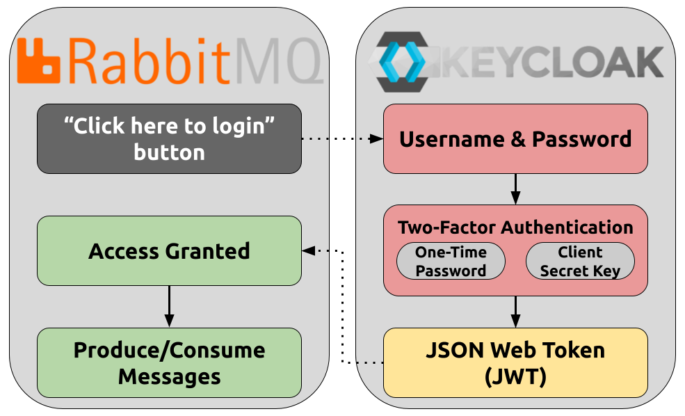

   *OAuth 2.0 workflow integrating RabbitMQ as the event broker and Keycloak as the IAM and OAuth 2.0 provider.*

----

Keycloak & RabbitMQ Setup Instructions
-------------------------------------

Below are instructions for configuring and deploying Keycloak and RabbitMQ.

Prerequisites
~~~~~~~~~~~~

This guide requires the following software to be installed and operational:

- `Docker <https://www.docker.com/get-started/>`_
- `make <https://www.geeksforgeeks.org/how-to-install-make-on-ubuntu/>`_

.. note::
   Click on the software name for directions on their installation.

Clone GitHub Repository
~~~~~~~~~~~~~~~~~~~~~

To begin setting up a RabbitMQ message broker, clone the `rabbitmq-oauth2-tutorial <https://github.com/rabbitmq/rabbitmq-oauth2-tutorial/tree/main>`_ GitHub repository:

.. code-block:: bash

   git clone git@github.com:rabbitmq/rabbitmq-oauth2-tutorial.git

Deploy Keycloak
~~~~~~~~~~~~~

To deploy a Keycloak broker, run:

.. code-block:: bash

   make start-keycloak

The above command will launch Keycloak with all the required scopes, users and clients preconfigured. Keycloak comes configured with its own signing key, and the `rabbitmq.conf <https://github.com/rabbitmq/rabbitmq-oauth2-tutorial/blob/main/conf/keycloak/rabbitmq.conf>`_ used by ``make start-keycloak`` is also configured with the same signing key.

.. note::
   For details about the ``make start-keycloak`` command, `click here <https://github.com/rabbitmq/rabbitmq-oauth2-tutorial/blob/main/bin/keycloak/deploy>`_.


To access the Keycloak Administration Console, a management interface, navigate to http://localhost:8080.

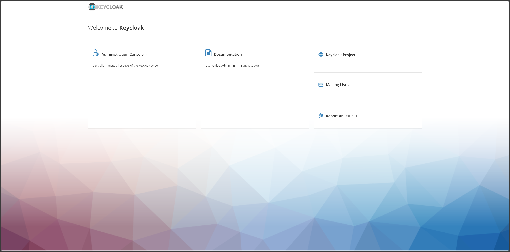

   *The Keycloak Administration Console enables administrators to manage scopes, users and clients.*

Click on "Administration Console," which will prompt a login screen. Enter the following credentials:

- Username: admin
- Password: admin

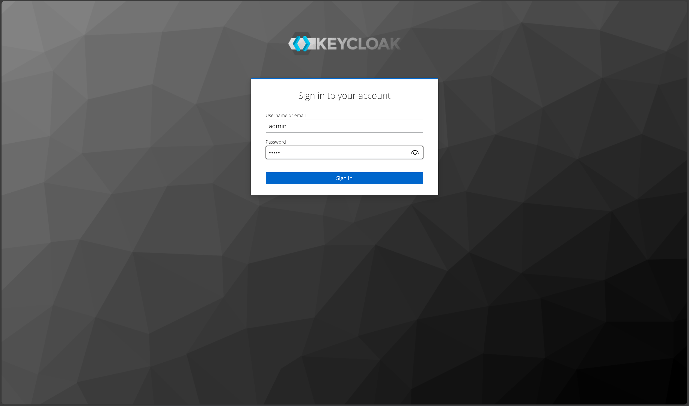

   *The Keycloak Administration Console login screen.*

There is a dedicated Keycloak realm called ``test`` that is configured with the following three clients:

- ``rabbitmq-client-code`` for the rabbitmq managament ui
- ``mgt_api_client`` to access via the management api
- ``producer`` to access via AMQP protocol.

Deploy RabbitMQ
~~~~~~~~~~~~~

To start RabbitMQ run the following two commands:

.. code-block:: bash

   export MODE=keycloak
   make start-rabbitmq

The first commands directs RabbitMQ to be configured using the `rabbitmq.conf <https://github.com/rabbitmq/rabbitmq-oauth2-tutorial/blob/main/conf/keycloak/rabbitmq.conf>`_ file. The following section contains an example of the contents of this file.

.. note::
   For details about the ``make start-rabbitmq`` command, `click here <https://github.com/rabbitmq/rabbitmq-oauth2-tutorial/blob/main/bin/deploy-rabbit>`_.

RabbitMQ Configuration
^^^^^^^^^^^^^^^^^^^^

The `rabbitmq.conf <https://github.com/rabbitmq/rabbitmq-oauth2-tutorial/blob/main/conf/keycloak/rabbitmq.conf>`_ file provides configurations to set up RabbitMQ. Below is an example of the contents of the file:

.. code-block:: none

   auth_backends.1 = rabbit_auth_backend_oauth2

   log.default.level = debug

   management.oauth_enabled = true
   management.oauth_client_id = rabbitmq-client-code
   management.oauth_scopes = openid profile rabbitmq.tag:administrator
   management.oauth_provider_url = http://localhost:8080/realms/test

   auth_oauth2.resource_server_id = rabbitmq
   auth_oauth2.preferred_username_claims.1 = user_name
   auth_oauth2.additional_scopes_key = extra_scope
   auth_oauth2.issuer = https://keycloak:8443/realms/test
   auth_oauth2.https.peer_verification = verify_none

Each option is explained below:

- Authentication Backend:
    - auth_backends.1 = rabbit_auth_backend_oauth2: This line sets RabbitMQ to use OAuth2 as the authentication backend. This is essential for integrating RabbitMQ with OAuth2 providers like Keycloak.

- Logging:
    - log.default.level = debug: This sets the logging level to debug, which is useful for troubleshooting and ensuring that the OAuth2 integration is working correctly.

- Management Plugin Configuration:
    - management.oauth_enabled = true: Enables OAuth2 authentication for the RabbitMQ management plugin.
    - management.oauth_client_id = rabbitmq-client-code: Specifies the OAuth2 client ID used by RabbitMQ to authenticate with the OAuth2 provider.
    - management.oauth_scopes = openid profile rabbitmq.tag:administrator: Defines the scopes required for OAuth2 authentication. These scopes determine the level of access granted to the authenticated user.
    - management.oauth_provider_url = http://localhost:8080/realms/test: Specifies the URL of the OAuth2 provider (in this case, Keycloak).

- OAuth2 Resource Server Configuration:
    - auth_oauth2.resource_server_id = rabbitmq: Sets the resource server ID for RabbitMQ.
    - auth_oauth2.preferred_username_claims.1 = user_name: Defines the claim used to extract the preferred username from the OAuth2 token.
    - auth_oauth2.additional_scopes_key = extra_scope: Specifies additional scopes that might be required.
    - auth_oauth2.issuer = https://keycloak:8443/realms/test: Sets the issuer URL for the OAuth2 tokens, ensuring they are validated correctly.
    - auth_oauth2.https.peer_verification = verify_none: Disables peer verification for HTTPS, which can be useful in development environments but should be used with caution in production.

RabbitMQ Management User Interface
^^^^^^^^^^^^^^^^^^^^^^^^^^^^^^^

To access the RabbitMq management user interface, navigate to http://localhost:15672/#/.


   *The RabbitMQ management user interface.*

Click on "Click here to log in" button, which will prompt a login screen. Enter the following credentials:

- Username: rabbit_admin
- Password: rabbit_admin

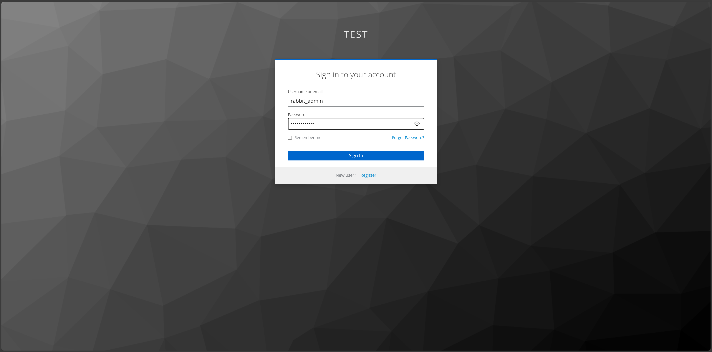

   *The RabbitMQ management user interface login screen.*

.. note::
   The ``rabbit_admin`` is the single user created in Keycloak with the appropriate scopes to access the management user interface.

---- 

Manage Authentication
------------------

Create a New User
~~~~~~~~~~~~~~

The Keycloak Administration Console allows you to manage scopes, users and clients. In this section, we will add a new user that is able to access the RabbitMQ event broker.

Navigate to http://localhost:8080. Click on "Administration Console," which will prompt a login screen. Enter the following credentials:

- Username: admin
- Password: admin

Ensure you are in the ``test`` realm. Then, navifate to "Users" > "Add user." Fill in the fields, then click "Create."

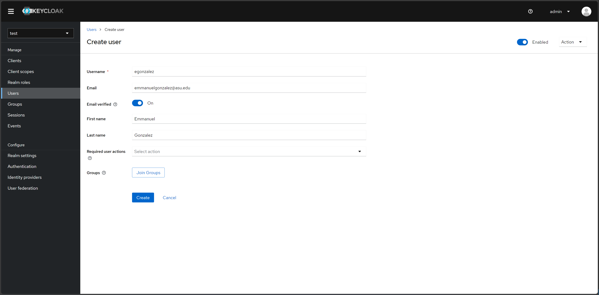

   *Creating a user in the test realm.*

After creating the user, navigate to "Credentials" > "Set password," which will prompt you to create a password for the new user.

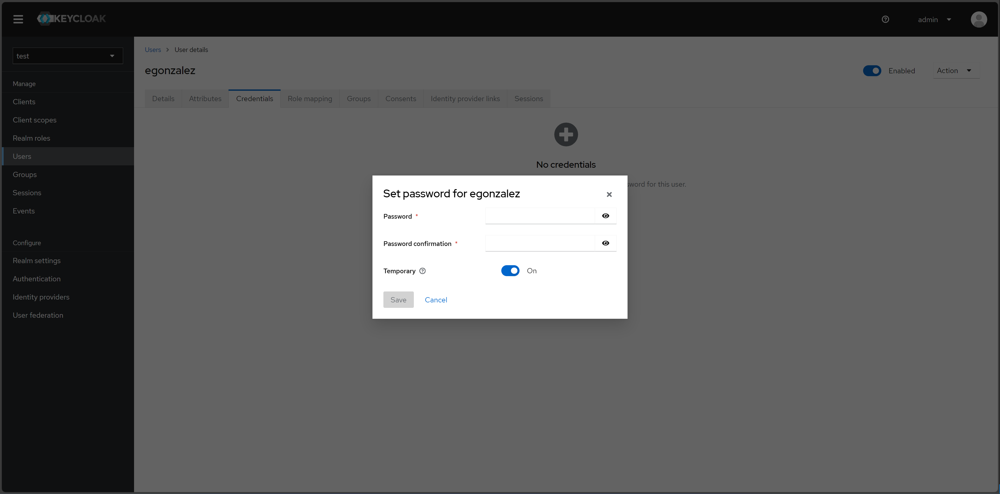

   *Creating a password for the new user in the test realm.*

Assign Roles to User
~~~~~~~~~~~~~~~~

The user must be granted the necessary roles. To do this, navigate to "Users" > "Role mapping" > "Assign role". 

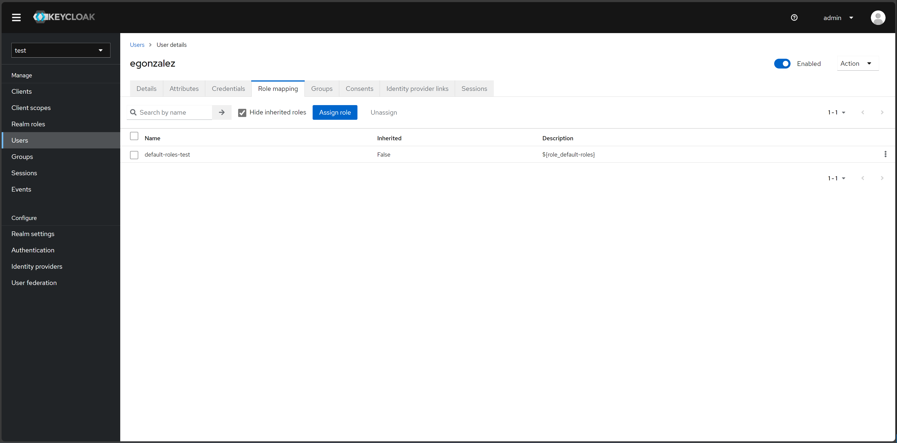

   *Role mapping management in Keycloak.*

Add the following roles to your new user:

- ``rabbitmq.tag:administrator``: Grants a user access to the RabbitMQ management user interface
- ``rabbitmq.configure:*/*``: Grants a user access to configure RabbitMQ settings
- ``rabbitmq``: Grants a user general access to RabbitMQ
- ``rabbitmq.write:*/*``: Grants a user write permission
- ``rabbitmq.read:*/*``: Grants a user read permission

Once selected, click "Assign."

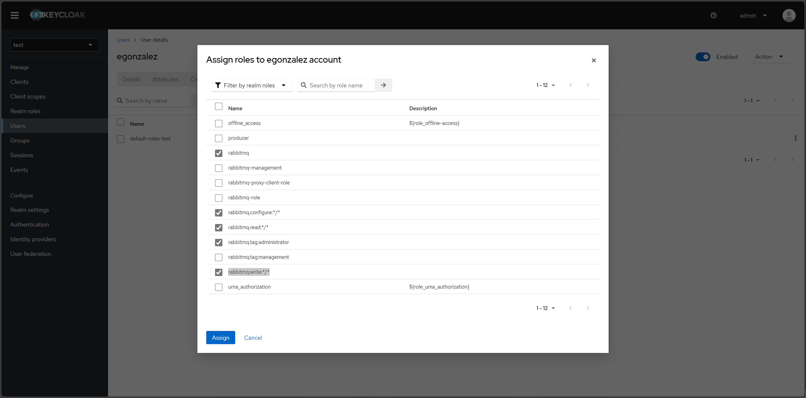

   *Assign roles to a user in Keycloak.*

Updating Client Scopes
~~~~~~~~~~~~~~~~~~~

Client scopes set restrictions to the topic exchanges within RabbitMQ. The default client scopes include:

- ``rabbitmq.write:*/*``: Grants a user write permission
- ``rabbitmq.read:*/*``: Grants a user read permission

These read and write permissions represent the following:

- ``rabbitmq.write:<vhost>/<exchange>/<routingkey>``
- ``rabbitmq.read:<vhost>/<exchange>/<routingkey>``

The default scope, therefore, enables the user to read and write to all vhosts and exhchanges. In some cases, we may want to restrict exhchanges, for example, ``nost``. To do that we must access the Keycloak Account Management page and editing three scopes:

- From ``rabbitmq.write:*/*`` to ``rabbitmq.write:*/nost/*``
- From ``rabbitmq.read:*/*`` to ``rabbitmq.read:*/nost/*``
- From ``rabbitmq.configure:*/*`` to ``rabbitmq.configure:*/nost/*``

You can edit the scope by simply editing the "Name" value.

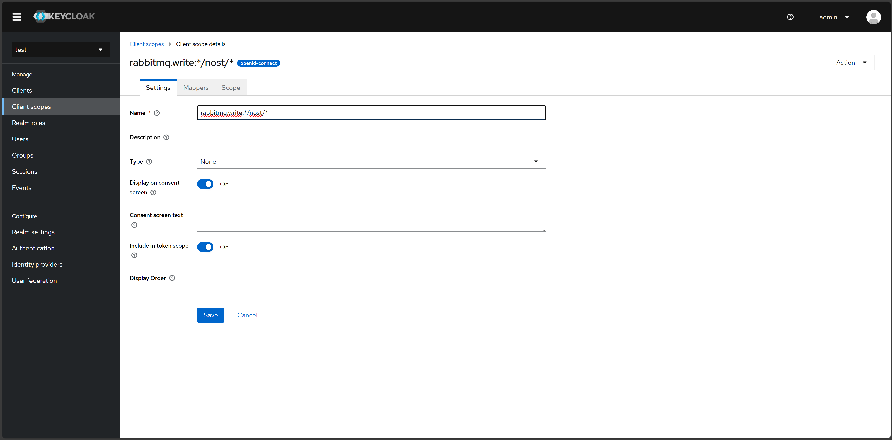

   *Editing client scope to restrict exchanges.*

This will restrict the user to posting only to the ``nost`` exchange.

Set Up Two-Factor Authentication
~~~~~~~~~~~~~~~~~~~~~~~~~~~~~

To set up 2FA using a One-Time Password (OTP), navigate to "Authentication" > "Required actions" > Enable "Configure OTP."

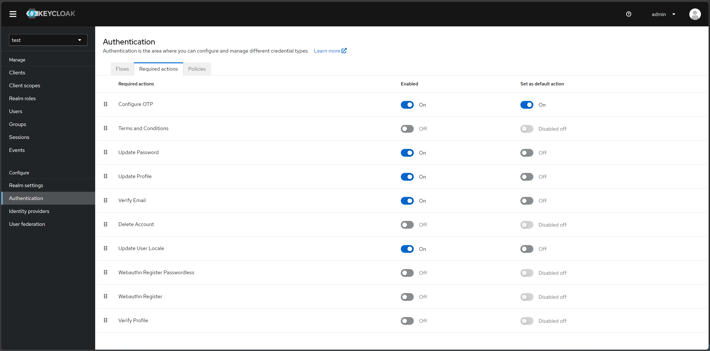

   *Assign roles to a user in Keycloak.*

Configuring OTP
~~~~~~~~~~~~

The user must configure their 2FA application. They can do this the first time they access your application, in this case RabbitMQ.

Navigate to http://localhost:15672/#/:


   *The RabbitMQ management user interface.*

Click on "Click here to log in" button, which will prompt a login screen. Enter the credentials of your new user:

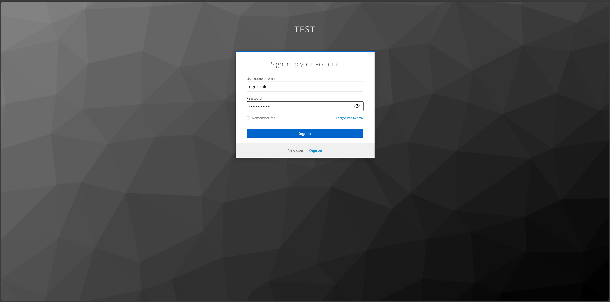

   *Logging into RabbitMQ using Keycloak authentication page.*

The user will be prompted to set up a 2FA application. Scan the QR code using the Google Authenticator or FreeOTP apps, get a one-time code, and name the device.

.. note::
   Keycloak supports both Google Authenticator and FreeOTP.

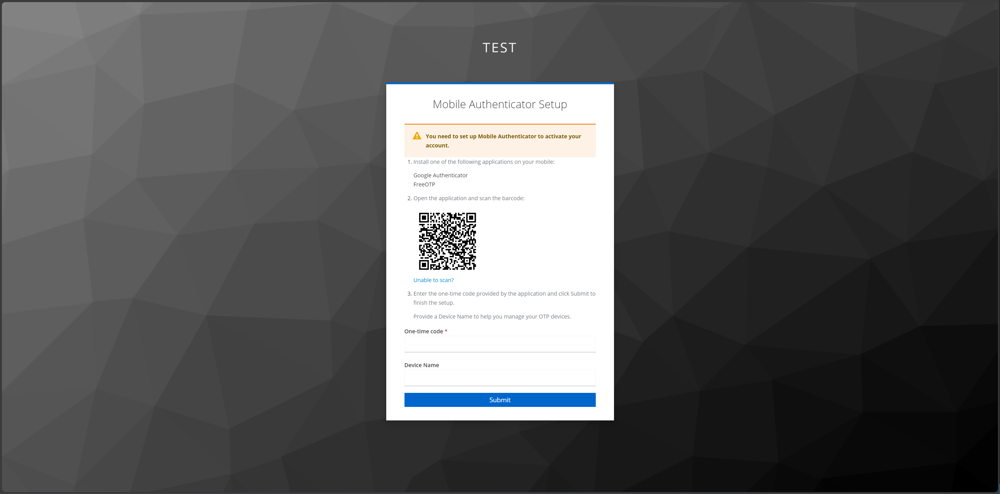

   *Prompt to set up 2FA application on Keycloak.*

Once the user completes the set up, they will have access to RabbitMQ.

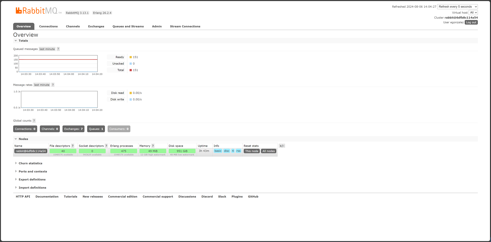

   *Successful login using 2FA on Keycloak to access RabbitMQ event broker.*

Account Management
~~~~~~~~~~~~~~~

The Keycloak Account Management user interface enables users to manage their Authenticator applications.

Navigate to http://localhost:8080/realms/test/account/#

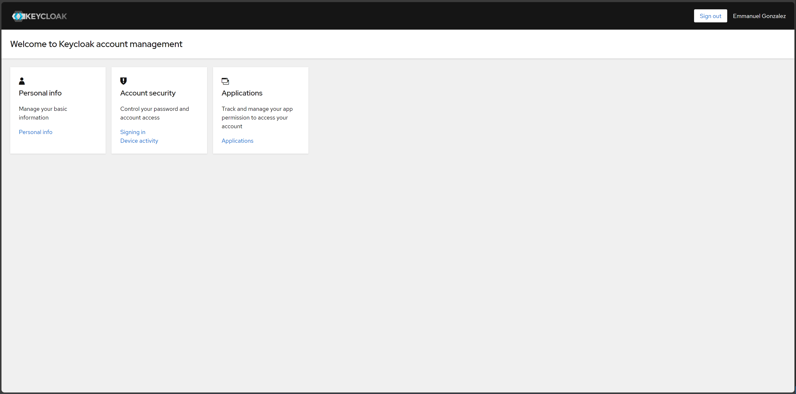

   *Keycloak account management user interface.*

To manage 2FA applications, navigate to "Signing in" > "Two-factor authentication."

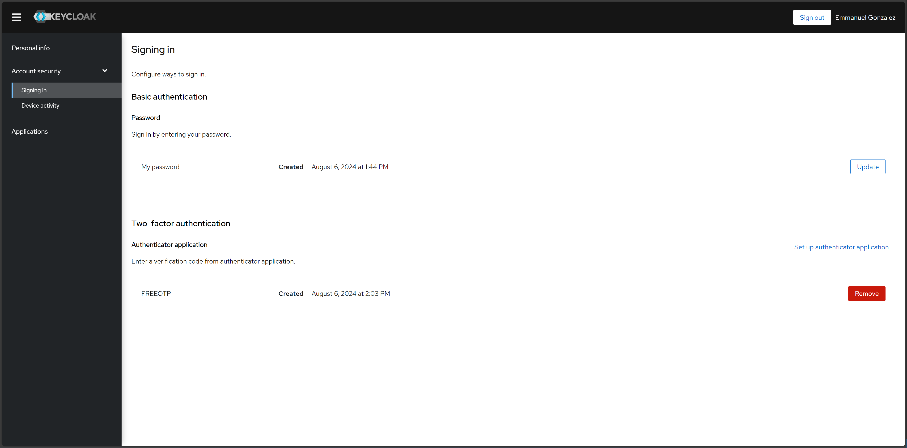

   *Keycloak account management user interface sign in settings, including 2FA.*

----

Testing Keycloak Authentication for RabbitMQ
-----------------------------------------

Configuring User Roles for OAuth 2.0 and 2FA
~~~~~~~~~~~~~~~~~~~~~~~~~~~~~~~~~~~~~~~~~

To test OTP-based 2FA, you must install dependencies:

.. code-block:: bash

   python3 -m pip install pika requests python-keycloak

Ensure you are in the ``test`` realm. Navigate to "Clients" > select "producer" > scroll to "Capability config". Make sure "Client authentication" is enabled, and "Direct access grants" is selected.

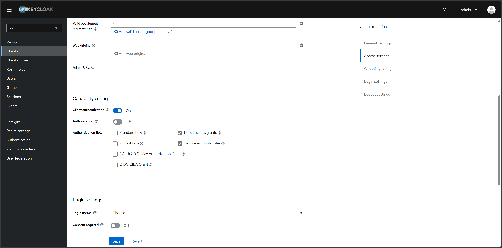

   *Enabling 2FA for AMQP protocol access using the Python package Pika.*

Then, make sure to assign your user the ``producer`` role. Navigate to "Users" > select a user > "Role mapping" > "Assign role" > check the "producer" option > click "Assign" button.

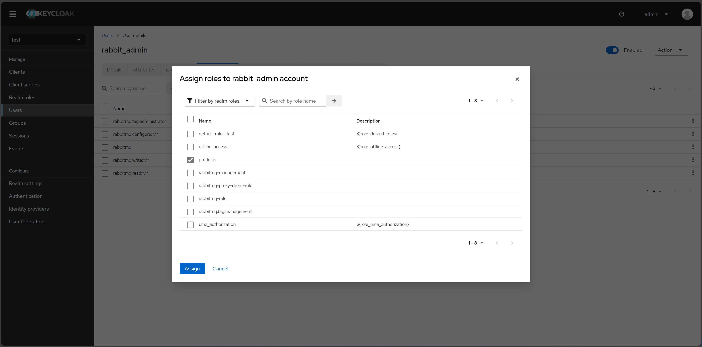

   *Assigning roles to a user to enable successful two-factor authentication (2FA) using Pika.*

You should now see the ``producer`` role under your user.

.. note::
   If you do not assign the ``producer`` role to your user, you will run into errors in subsequent sections of this tutorial. For example, you may see an error like the following: ``Access denied: ConnectionClosedByBroker: (530) "NOT_ALLOWED - access to vhost '/' refused for user '4cf4d6b5-09e5-453f-bf22-c8efdc2dd1dc'"``

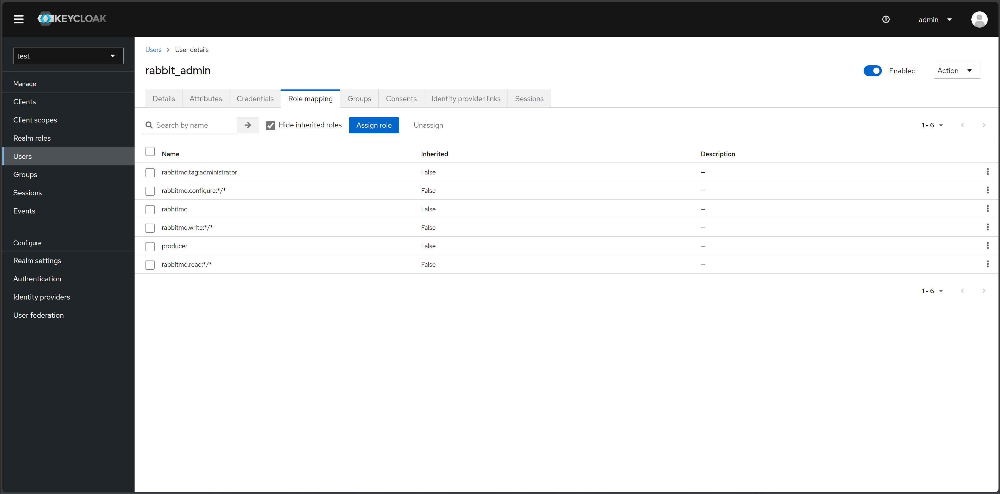

   *Assigned roles for a user to enable two-factor authentication (2FA) using Pika.*

Using Pika Python Client to Access the AMQP Protocol
~~~~~~~~~~~~~~~~~~~~~~~~~~~~~~~~~~~~~~~~~~~~~~~

Secret key
^^^^^^^^

The AMQP protocol can be accessed using the Pika Python client. A Python sample application that receives a token, uses the token to authenticate and publish AMQP messages, and refreshes the token on a live AMQP connection is provided `here <https://github.com/rabbitmq/rabbitmq-oauth2-tutorial/blob/main/pika-client/producer.py>`_.

To run the Python sample application, run:

.. code-block:: bash

   pip install pika requests

After installing the dependencies, you will need to obtain the client secret key. Ensure you are in the ``test`` realm. Navigate to "Clients" > "Credentials". In the "Client secret" section, you will find the client secret key.

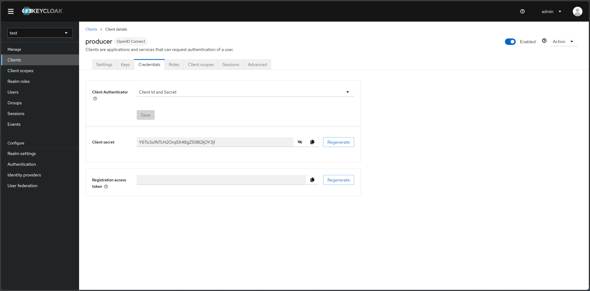

   *Retrieving the client secret key for a specific client in Keycloak.*

To set up a consumer (subscriber/receiver) sample application, run:

.. code-block:: bash

   wget https://raw.githubusercontent.com/emmanuelgonz/rabbitmq_keycloak/main/scripts/receive.py
   python3 receive.py producer kbOFBXI9tANgKUq8vXHLhT6YhbivgXxn

Next, we will set up a producer (publisher) sample application using the client ID and client secret key you retrieved above in the following format: ``python3 send.py <client ID> <client secret key>``. For example, run:

.. code-block:: bash

   wget https://raw.githubusercontent.com/emmanuelgonz/rabbitmq_keycloak/main/scripts/send.py
   python3 send.py producer kbOFBXI9tANgKUq8vXHLhT6YhbivgXxn

.. figure:: images/send_receive.png
   :align: center
   :width: 900

   *Producer and consumer applications running on two separate terminals. The producers sends messages, which a consumer receives.*

.. note::
   The application updates the access token every 55 seconds, displaying the terminal message ``Access token refreshed.`` each time it occurs.

Secret Key & 2FA Using One-Time Password
^^^^^^^^^^^^^^^^^^^^^^^^^^^^^^^^^^^^

Previously, we set up an authenticator application, such as Google Authenticator or FreeOTP. In this Python sample application, we will use a client ID, client secret key, and OTP to authenticate a RabbitMQ client connection and publish messages.

To set up a consumer (subscriber/receiver) sample application, run:

.. code-block:: bash

   wget https://raw.githubusercontent.com/emmanuelgonz/rabbitmq_keycloak/main/scripts/receive_2fa.py
   python3 receive_2fa.py producer kbOFBXI9tANgKUq8vXHLhT6YhbivgXxn 

Next, we will set up a producer (publisher) sample application using the client ID, username, password, client secret key, and OTP. For example, run:

.. code-block:: bash

   python3 send_2fa.py

For client secret key use: ``kbOFBXI9tANgKUq8vXHLhT6YhbivgXxn``.

When prompted, enter your credentials and OTP. Use the authenticator app you previously set up, such as Google Authenticator or FreeOTP. If authenticated, a successful connection with RabbitMQ will be established, printing "Connection established successfully."

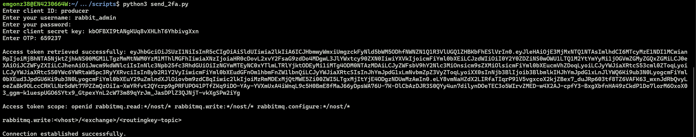

   *A producer (publisher) sample application requesting credentials and OTP.*

When prompted, provide the exchange name and routing key (also known as the topic). The application will publish messages to the specified exchange and topic. You will see terminal output indicating that messages have been sent.

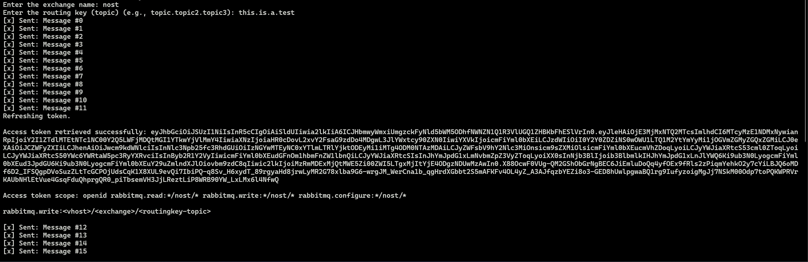

   *A producer (publisher) sample application prompting user for exchange name and topic, and refreshing access token after 55 seconds.*

.. note::
   The application updates the access token every 55 seconds, displaying the terminal message ``Refreshing token.`` each time it occurs.

The receiver will receive these messages. You will see terminal output indicating that messages have been sent.

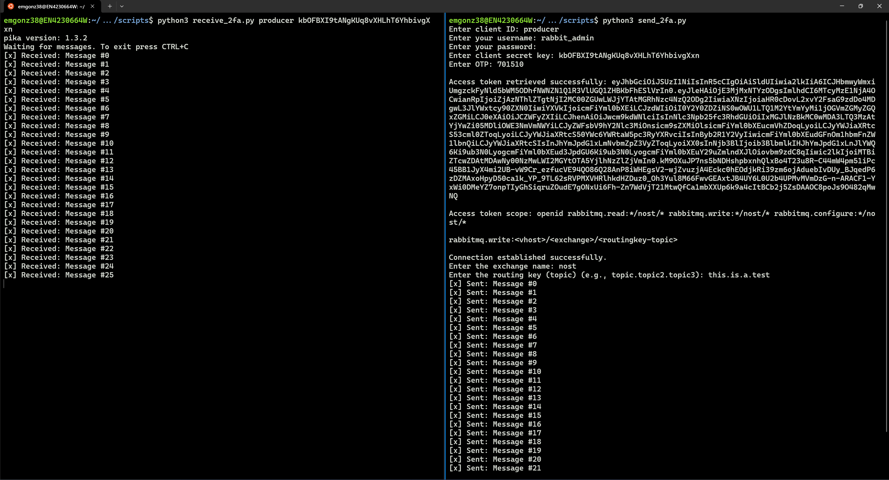

   *Left) A consumer application receives messages from the ``nost`` exchange. (Right) The sample application sends messages to the ``nost`` exchange.*

For more information on the AMQP protocol within RabbitMQ, `click here <./RABBITMQ.md>`_.

----

Frequently Asked Questions
------------------------

1. 
    Q: I see the following error when running the `send_2fa.py` sample application: ``Access denied: ConnectionClosedByBroker: (530) "NOT_ALLOWED - access to vhost '/' refused for user '4cf4d6b5-09e5-453f-bf22-c8efdc2dd1dc'"```. What could be going on?

    A: It is likely that you did not add the ``producer`` role to your user. Make sure to follow the section `Configuring User Roles for OAuth 2.0 and 2FA`_.

2. 
    Q: I see the following error when running the `send_2fa.py` sample application: ``pika.exceptions.ChannelClosedByBroker: (403, "ACCESS_REFUSED - configure access to exchange 'test' in vhost '/' refused for user '4cf4d6b5-09e5-453f-bf22-c8efdc2dd1dc'")``

    A: It is likely that you provided an exchange name other than ``nost``. Recall that during the `Updating Client Scopes`_, we restricted user access to only the exchange of ``nost``. You can remove the restriction by setting the client scopes to:
    
    - ``rabbitmq.write:*/*/*``
    - ``rabbitmq.read:*/*/*``
    - ``rabbitmq.configure:*/*/*``

3. 
    Q: I want to edit, add, and/or delete my two-factor authenticator application. How can I do that?

    A: You can manage your two-factor authentication applications using the Keycloak Account Management user interface. Refer to the section `Account Management`_.

4. 
    Q: I see the following error in the RabbitMQ management user interface after logging in via Keycloak: ``Not authorized``. What is causing this?

    A: Check the roles assigned to your user in the Keycloak Administration Console. The user should have each of the following roles assigned:
     
    - ``rabbitmq.tag:administrator``
    - ``rabbitmq.configure:*/*``
    - ``rabbitmq``
    - ``rabbitmq.write:*/*``
    - ``rabbitmq.read:*/*``
    
    This error indicates that the role  ``rabbitmq.tag:administrator`` is not assigned to your user.

----

Definitions
----------

RabbitMQ
~~~~~~~

- AMQP (Advanced Message Queuing Protocol): The protocol RabbitMQ uses to define how messages are formatted and transmitted between clients and brokers
- Binding: A link between a queue and an exchange that defines the routing rules for messages
- Consumer: A user application that receives messages
- Exchange: A message routing agent that determines how messages are routed to queues based on routing rules
- Message Broker: Software that enables applications to communicate by sending and receiving messages through queues
- Producer: A user application that sends messages
- Queue: A buffer that stores messages
- Virtual Host (vhost): A namespace within RabbitMQ that allows for logical separation of resources like exchanges, queues, and users

Keycloak
~~~~~~~

- Client: An application or service that uses Keycloak to authenticate users
- Identity Provider (IdP): A service that can authenticate a user, such as Google or Facebook, which can be integrated with Keycloak
- Realm: A space where you manage a set of users, credentials, roles, and groups. Realms are isolated from one another
- Role: A set of permissions that can be assigned to users or groups to control access to resources
- User Federation: The ability to connect Keycloak to external user databases like LDAP or Active Directory

----

Important Notes
------------

- The  ``producer`` role allows a user to send messages (producer).
- The ``rabbitmq.tag:administrator`` roles grants a user access to the RabbitMQ management user interface.
- The ``rabbitmq.read:*/nost/*`` and ``rabbitmq.write:*/nost/*`` client scopes enable the user to read and write to the ``nost`` exchange, respectively. The format is the following ``:<vhost>/<exchange>/<routingkey>``.