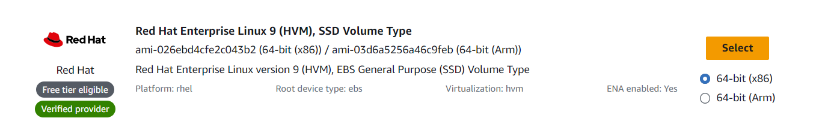
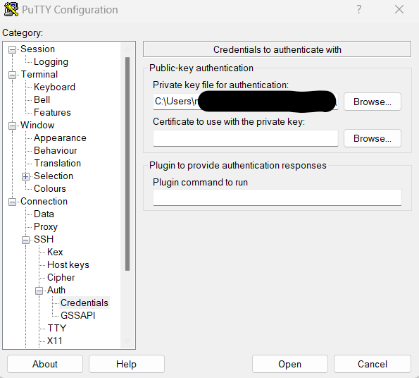
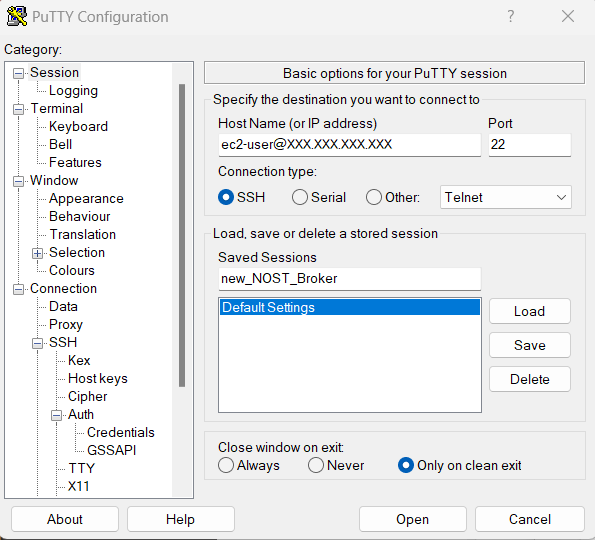

.. _cloudBroker:

Setting up AWS Cloud-Hosted NOS-T Event Broker
==============================================

A message broker only provides value if applications are able to connect to them, and thus setting up a :ref:`Local Broker<localBroker>` has limited usefulness. This section covers how to set up a cloud-based message broker. The NOS-T message broker has been set up on an AWS Elastic Compute Cloud (EC2) instance on NASA's Science Managed Cloud Environment (SMCE), so many of the instructions will be specific to Amazon Web Services. A message broker could similarly be hosted by other cloud computing services, but the instructions and nomenclature may vary.

Launching a New EC2 Instance
^^^^^^^^^^^^^^^^^^^^^^^^^^^^

Once logged into the AWS console, navigate to the EC2 dashboard and select **Launch instances**. This will open a prompt for choosing an Amazon Machine Image for the basis of the instance. 

Amazon Machine Engine (AMI)
---------------------------

This choice will vary depending on the use-case and specific security needs, but NOS-T uses the Red Hat Enterprise Linux 9.

	
|

Instance Type and Configurations
--------------------------------

Once a base image is chosen, it must be paired with an instance type. This will vary depending on the amount of activity expected on the instance, and also may depend on user cost constraints given the on-demand pricing per hour of instance operation. NOS-T currently operates on a **t3a.large** instance. 

Storage requirements and constraints must also be considered. The EC2 instance hosting the NOS-T broker currently operates with a volume of 40 GiB.

Key-Pairs and Security Settings
-------------------------------

Key-pairs are required for operators to regularly monitor and connect to the instance. Key-pair names are often chosen with a convention like {operator_last_name}-{project_name} for traceability.

Security groups have proven essential for the development team to manage access to the broker. The EC2 instance that hosts the NOS-T message broker is protected by firewall, and access is granted via white-listed IP addresses.

When setting up a security group, the operator must define which ports will be open. This depends on protocols used for communication. For NOS-T we open the following ports:

	*	**22:** Secure Shell Protocol (SSH)
	*	**8883:** MQTT Default VPN over Transport Layer Security (TLS)
	*	**8443:** MQTT Default VPN over WebSockets / TLS
	*	**9443:** REpresentational State Transfer (REST) default VPN over TLS
	*	**1443:** Web transport over Transport Layer Security (TLS)
	*	**1943:** Solace Element Management Protocol (SEMP) over TLS
	*	**8080:** SEMP/PubSub+ Manager (see :ref:`Logging into the Solace Event Broker<PubSubManager>`)
	*	**55443:** Solace Message Format (SMF) over TLS
	
Once the configurations and security groups are set, select **Launch Instances**. The operator will be prompted for an existing key-pair or to download a new key-pair for secure connection to the instance. This key-pair file should have a *.pem* extension. 

Once the instance is launched, it will be assigned a Public IPv4 address. It is recommended that operators assign an Elastic IP address to the EC2 instance, as public IP addresses may change if and when machines are disconnected and reconnected.

PuTTY
^^^^^

PuTTY is a free and open-source terminal emulator, serial console and network file transfer application. It supports many protocols, but for set up we will just use PuTTY for SSH communication.

PuTTYgen
--------

Before communicating via SSH, the operator must convert the latter discussed key-pair file with the *.pem* extension to a private key with a *.ppk* extension using the PuTTYgen tool. In the PuTTY Configuration menu, navigate to the SSH Auth submenu. Browse and select the *.ppk* file just saved.

	
|

PuTTY Configuration
-------------------

Now that the certificate with the private key is loaded, navigate to the Session menu.

	
|

Under **Host Name** use the default username ec2-user@{Public_IPv4_address}. The Public IPv4 address can be found under the **Details** tab for the corresponding EC2 instance.

Since this session will be necessary to reconnect from time to time, it is useful to save the session with a unique name that can be selected from a drop-down list.  The first time you connect, you will be prompted that "The server's host key is not cached in the registry." If you trust the host is the correct one, select Accept and you should not see this prompt again.

PuTTY Session
-------------

The first step once connected is to ensure that all installed packages and their dependencies on a Linux system are up to date, which is accomplished with the following command:

>>> sudo yum update -y

After updates complete, the most recent Docker Engine package should be installed:

>>> sudo amazon-linux-extras install docker

Once installed, the Docker service must be started:

>>> sudo service docker start

Now that the Docker service is started, add the :obj:`ec2-user` to the :obj:`docker` group so you can execute Docker commands without using :obj:`sudo`.

>>> sudo usermod -a -G docker ec2-user

Note that after changing the group, the operator may need to disconnect and reconnect the PuTTY Session to make sure Docker is running, which the operator can check with the following command:

>>> docker info

TLS Encryption
--------------

Most instances of an event broker will require TLS encryption. Setting up this encryption first requires navigating back to the Inbound Rules for the security group and opening up Port **80** (set Source Type to Anywhere-IPv4).

Next, because we are using a Linux 2 AMI, we will also need to allow installations from the Extra Packages for Enterprise Linux Repository (EPEL):

>>> sudo amazon-linux-extras install epel

Now that the instance has access to this repository, the operator can install CertBot. It should be noted that CertBot requires a domain name for the server, so keep that in mind when setting up the EC2 instance.

>>> sudo yum install -y certbot

After completion, run the following command:

>>> sudo certbot certonly --standalone

CertBot will prompt the operator to provide a contact email address and ask you to accept terms of use. Subsequently, CertBot will prompt the operator for the domain name. Once entered, the Let's Encrypt free SSL service communicates with the server, and once it is verified an SSL Certificate is issued. CertBot doesn't automatically update, but the operator can issue a CronJob such as the following to renew the SSL certificate at regular intervals:

>>> echo "0 0,12 * * * root python -c 'import random; import time; time.sleep(random.random()*3600)' && certbot renew -q" | sudo tee -a/etc/crontab > /dev/null

Next, a certificate must be set up to enable the Solace PubSub+ authentication. Navigate to the */etc/letsencrypt* directory (domain names are representative and should be customized by the operator) and execute the following command to concatenate the necessary certificates from Let's Encrypt with those required for Solace PubSub+ to set up the authentication. The results are saved into a new file called *certificate.pem*:

>>> sudo cat /etc/letsencrypt/live/nost.code-lab.org/fullchain.pem /etc/letsencrypt/live/nost.code-lab.org/privkey.pem > certificate.pem

|

Starting up the Docker Image
----------------------------

Now that the *certificate.pem* is in place, the operator can start up the Docker image in detached mode (i.e. not in this window but in the background), and map ports from the Docker container to the virtual machine:

>>> sudo docker run -d -p 1443:1443 -p 55443:55443 -p 5671:5671 -p 9443:9443 -p 8883:8883 -p 8443:8443 -p 1943:1943 --shm-size=2g --env username_admin_globalaccesslevel=admin --env username_admin_password=admin --name=solace solace/solace-pubsub-standard:latest

|

Customization of Broker by CLI
------------------------------

The subsequent customizations are accomplished via Command Line Interface (CLI), but the menu navigation is the same as was demonstrated in :ref:`Customizing your Solace PubSub+ Broker<CustomSolace>`.

To update the admin password after starting up the Docker image, access the Solace container on the server with the following commands entered successively:

>>> docker exec -it solace /usr/sw/loads/currentload/bin/cli -A
>>> enable
>>> configure
>>> username admin
>>> change-password <new value>
>>> exit
>>> exit
>>> exit

Note that the **exit** commands are necessary to get out of different subdirectories. To configure basic internal authentication for the :ref:`default message VPN<MessageVPN>`, enter the following commands (assuming still in the Solace container):

>>> enable
>>> configure
>>> message-vpn default
>>> authentication
>>> basic
>>> auth-type internal
>>> exit
>>> exit
>>> exit

Now that basic authentication has been set up, the operator can create new username-password pairs such as the following example which creates a username *nost-user* with a password *nost-2023*:

>>> create client-username nost-user message-vpn default
>>> password nost2023
>>> no shutdown

If the operator needs to increase the number of maximum connections to the broker, the broker services should first be shutdown as follows:

>>> enable
>>> configure
>>> service msg-backbone shutdown
>>> hardware message-spool shutdown
>>> exit
>>> exit

Now that the services are disabled, the operator can adjust the settings and restart the services. In this example, the max-connections are increased to 1000:

>>> system
>>> scaling
>>> max-connections 1000
>>> exit
>>> exit
>>> service
>>> msg-backbone
>>> no shutdown
>>> exit
>>> exit
>>> hardware
>>> message-spool
>>> no shutdown
>>> exit
>>> exit

|

Applying the Certificate to the Solace Container
------------------------------------------------

Exit out of the Docker image back to the SSH Session Host. The *certificate.pem* file needs to be uploaded to a specific location in the Solace container:

>>> docker cp certificate.pem solace:usr/sw/jail/certs
>>> rm certificate.pem

The latter command just removes the original certificate.pem once it has been properly uploaded to make sure there are not duplicates. Now the operator can navigate back to the Solace container:

>>> docker exec -it solace /usr/sw/loads/currentload/bin/cli -A
>>> cd certs
>>> show ssl certificate-files

If the operator sees the *certificate.pem* copied in with the private key, the certificate can be finalized with the following commands:

>>> enable
>>> configure
>>> ssl server-certificate certificate.pem

Now the Solace PubSub+ broker is operating with the proper certificate on the domain name for the EC2 instance. At this point, the operator should be able to navigate by browser to access the Solace PubSub+ Manager by following similar instructions to :ref:`Logging into the Solace Event Broker Manager<PubSubManager>`, but replacing *localhost* with the domain name for the EC2 instance. 