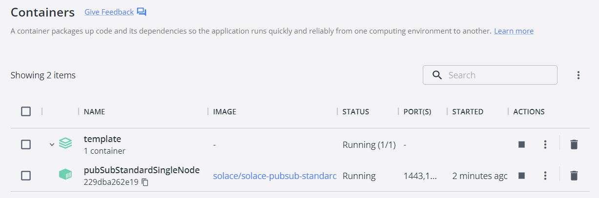
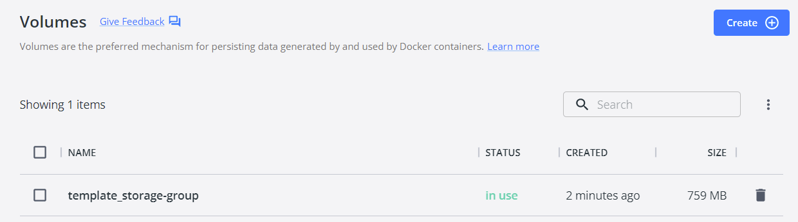
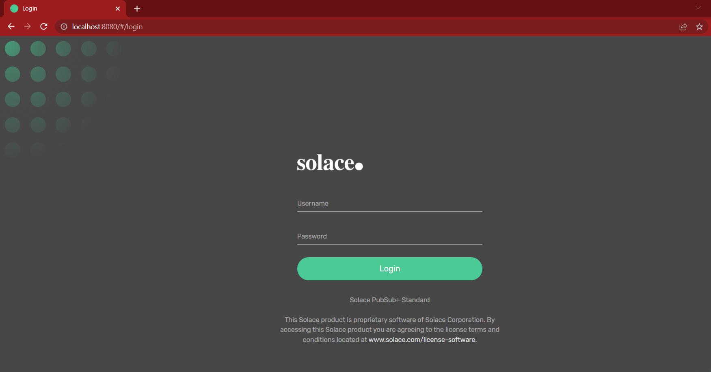
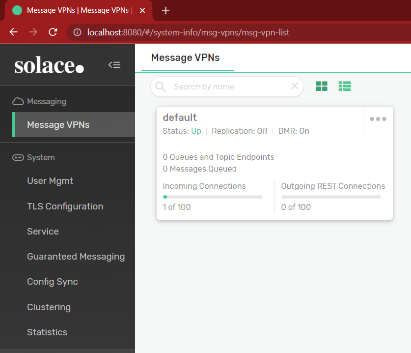
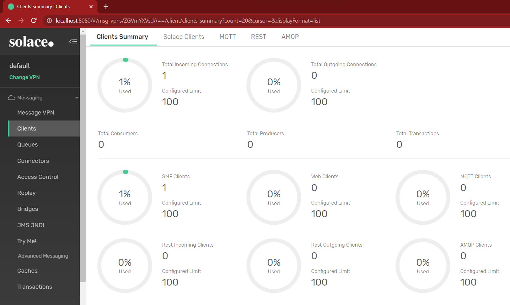
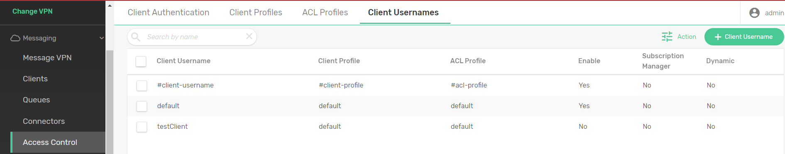
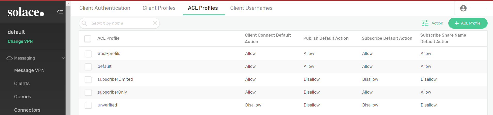
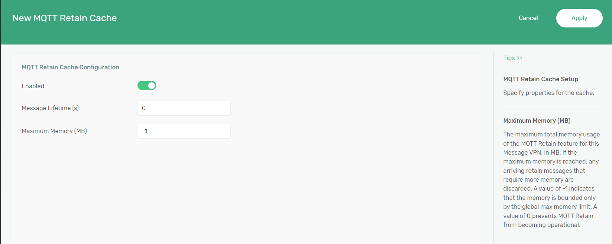

Setting up Solace Broker on Local Host
======================================

While there are many alternative broker implementation options available, NOS-T adopts the Solace PubSub+ Standard Edition event broker, a proprietary but freely available commercial product supporting up to one thousand concurrent connections and 10,000 messages per second. PubSub+ supports and interoperates among several protocols and several open protocols including Message Queuing Telemetry Transport (MQTT), Advanced Message Queuing Protocol (AMQP), and Representational State Transfer (REST). All protocols share similar messaging constructs but exhibit some minor differences in implementation and library availability. The testbed is currently designed to use strictly the MQTT protocol, but the capability of Solace to handle other protocols lends itself to future extensibility.

This page shows how to configure a new standalone Solace broker on a local host such as a personal machine or a secure local network. The tutorial mostly mirrors the SolaceLabs `solace-single-docker-compose <https://github.com/SolaceLabs/solace-single-docker-compose>`_ project which provides instructions and tools to get a single Solace PubSub+ software message broker Docker container up-and-running on a desktop using Docker Compose, a tool for defining and running multi-container Docker applications.  While the capabilities of a locally hosted broker are more limited, it is useful for becoming familiar with the Solace interface and experimenting with publisher/subscriber behaviors.

|

Initializing a Solace Event Broker with Docker Compose
------------------------------------------------------

This tutorial specifically makes use of a Docker container for setting up the broker. A Docker container image is a lightweight, standalone, executable package of software that includes everything needed to run an application: code, runtime, system tools, system libraries and settings. In order to use the Docker Compose commands described, one of the following can be installed:

	* `Docker Desktop for Windows <https://docs.docker.com/desktop/install/windows-install/>`_ with at least 2 GiB of memory dedicated to Docker Engine.
	
	* `Docker Desktop for Mac <https://docs.docker.com/desktop/install/mac-install/>`_ with at least 2 GiB of memory dedicated to Docker Engine.
	
	* `Docker Desktop for Linux <https://docs.docker.com/desktop/install/linux-install/>`_ with at least 2 GiB of memory dedicated to Docker Engine.
	
Each of the latter includes the Docker Compose tool. To check if Docker Compose is running correctly, open an elevated command prompt and enter the following:

>>> docker-compose --help

If a list of options or commands is not displayed, then `installing Docker Compose directly <https://docs.docker.com/compose/install/>`_ may be necessary.

To begin setting up a broker, clone the Solace git repository for the `solace-single-docker-compose <https://github.com/SolaceLabs/solace-single-docker-compose>`_. By cloning this repository, any updates made by Solace can be easily integrated to ensure broker compliance. Alternatively, the `PubSubStandard_singleNode.yml <https://github.com/SolaceLabs/solace-single-docker-compose/blob/37cba15c4ee6a2ce402c699a93560f4a14335e75/template/PubSubStandard_singleNode.yml>`_ file can be downloaded directly for local use, but without the benefit of syncing to the managed git repository. Open an elevated command prompt and change directories to the location of this :obj:`.yml` and enter the following:

.. code-block:: console
	
	>>> docker-compose -f PubSubStandard_singleNode.yml up -d
	[+] Running 2/2
	- Volume "template-storage-group"	Created							##.#s
	- Container pubSubStandardSingleNode	Started							##.#s
   
If actively running the Docker Desktop client, the Containers tab should include a single container called **template**. Expanding the **template** container shows a single active node:

	

|

Similarly, the Volumes tab should include a single, in-use **template_storage-group**:
	

	

|

	
Note that the names of both the container and the storage-group can be customized by editing the :obj:`.yml` file accordingly.

|

Logging into the Solace Event Broker
------------------------------------

The :obj:`PubSubStandard_singleNode.yml` file contains a list of port mappings for different protocols, including the 8080 port for SEMP (Solace Element Management Protocol). SEMP is a RESTful management API for configuring and administrating your Solace PubSub+ event broker. Once the docker container has been started up, open a browser and navigate to `http://localhost:8080/ <http://localhost:8080/>`_ to login to this new broker as an admin (Username: admin, Password: admin).

	
|

After logging in you will see a single default VPN. While more VPNs can be setup from within this menu, the default VPN serves as the locally hosted event broker.

	

|

|

Customizing your Solace Event Broker
------------------------------------

Selecting this VPN expands the **Messaging** sidebar menu for various event broker customizations, a few of which are covered below.

Message VPN
^^^^^^^^^^^

.. image:: Solace_Message_VPN_Overview.png
	:width: 800
	:align: center
	
	
|

This is the homepage for the VPN that was just started. The Summary tab lists the number of client connections and rate of messages. The Settings tab allows you to Enable and Disable the event broker and define an allotment of memory for message spooling. The Services tab allows you to customize the broker behavior with respect to different messaging protocols. While NOS-T does not make use of all of these protocols, the ability of Solace PubSub+ Event Brokers to handle all of these different protocols lends itself to flexibility beyond the MQTT clients typically employed in the testbed.

|

Clients
^^^^^^^

	

|

The Clients menu allows you to get an overview of the number and type of client connections as separated by messaging protocol. In the latter screenshot, there is only one client currently connected to this event broker, which is actually the PubSub+ Manager currently being used. This is an SMF (Solace Messaging Format) client that is unique to Solace products and provide the user interface for the event-broker (although a command-line interface is also possible). All other clients and sessions that are used by NOS-T typically are constrained to MQTT protocol. The Clients menu allows the operator to see which MQTT clients are actively connected to the broker and to which topics they are subscribed, which can be useful when trying to debug why a client isn't receiving messages.

|

Queues
^^^^^^

The original MQTT protocol was not designed to retain messages or spool a queue of messages, but Solace PubSub+ event brokers allow for clients with persistent sessions and remembered subscriptions. This can add to the reliability of a system where a subscriber may have been temporarily disconnected when the payload actually arrived to the topic endpoint. Queuing has not been implemented in the current version of NOS-T beyond tracking payload receipt timestamps, but both the Solace PubSub+ broker and version 5.0 of the MQTT protocol allow for future addition of this capability. It should be noted that queues require storage available on the message spool. Most of the example test suites included assume that all participant clients are continuously and reliably connected to the broker throughout the simulation execution, which would render queues unnecessary.

|

Access Control
^^^^^^^^^^^^^^

	

|

The Access Control menu provides several different methods for customizing authentication methods and client permissions. The **Client Authentication** tab provides ways to integrate third-party authentication, but Solace defaults to Basic Authentication via a username and a password. The admin can directly add new **Client Usernames** under the corresponding tab. **Client Profiles** and **ACL Profiles** allow for custom security groups with different levels of privileges. Client profiles set whether or not the user can create topic endpoints, whereas ACL profiles define default allow/deny behavior that gives the admin more granular control over access to topics through the use of exceptions. 

	
|

For example, if a test case will involve clients with full access to publish and subscribe to all topics and other clients that may only publish/subscribe to select topics, it may be convenient to define two ACL profiles. One ACL profile would default allow connections, publishing, and subscribing (like the **default** profile in the latter screenshot). The second ACL profile would by default deny publishing messages and subscribing to topics (like the **unverified** profile in the latter screenshot), but with specific topics listed under the exceptions.

|

Cache
^^^^^

|

The cache menu is important if you intend to use some of the advanced features such as retaining MQTT messages. Without enabling a cache and alloting some memory, none of the MQTT Retain features will work.

