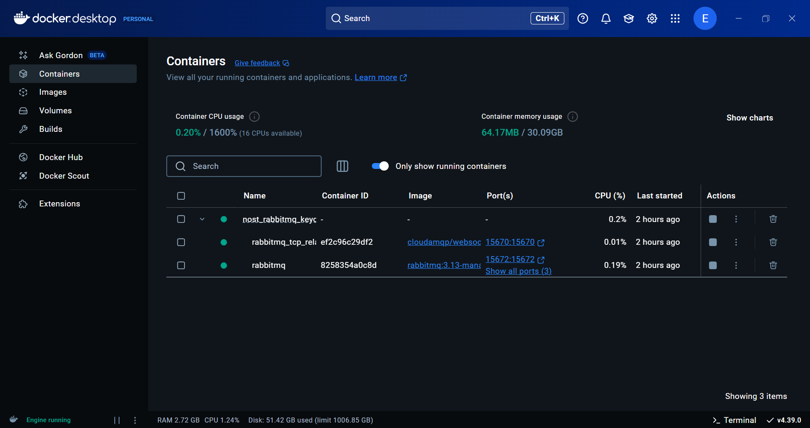
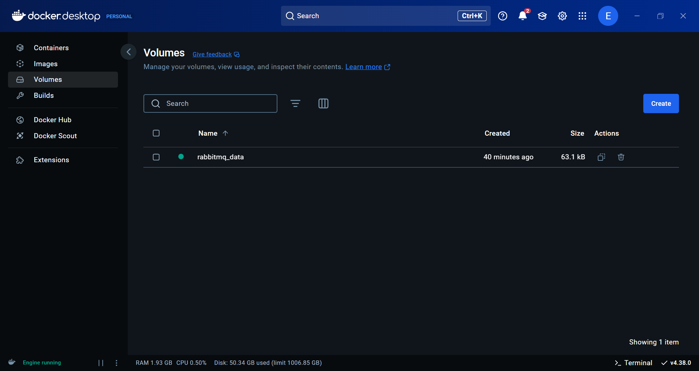
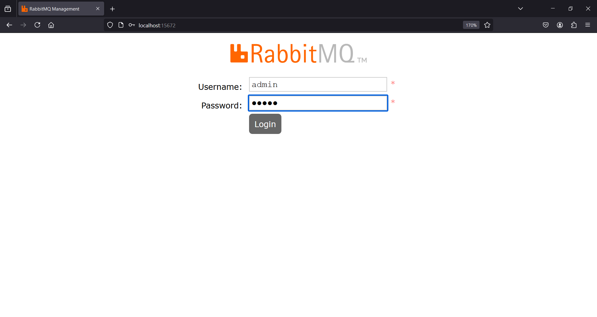
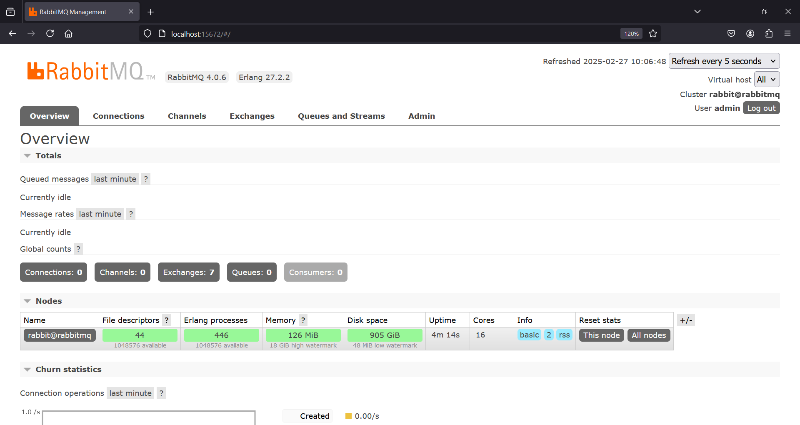
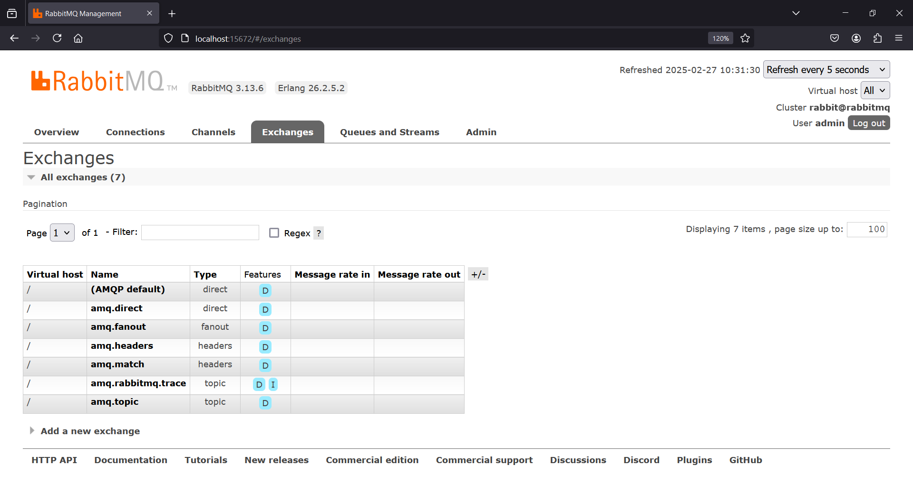
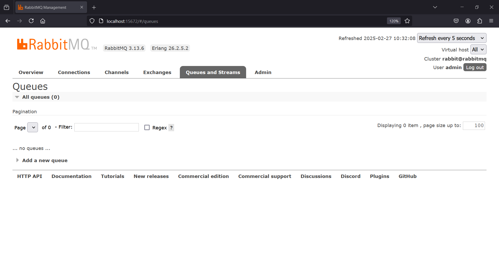
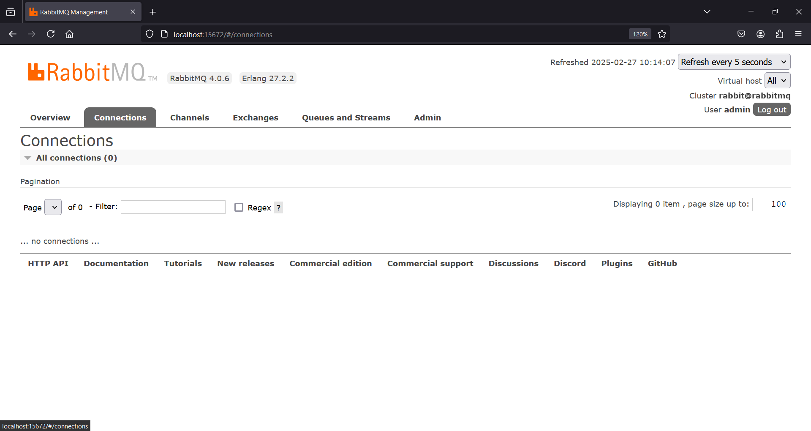
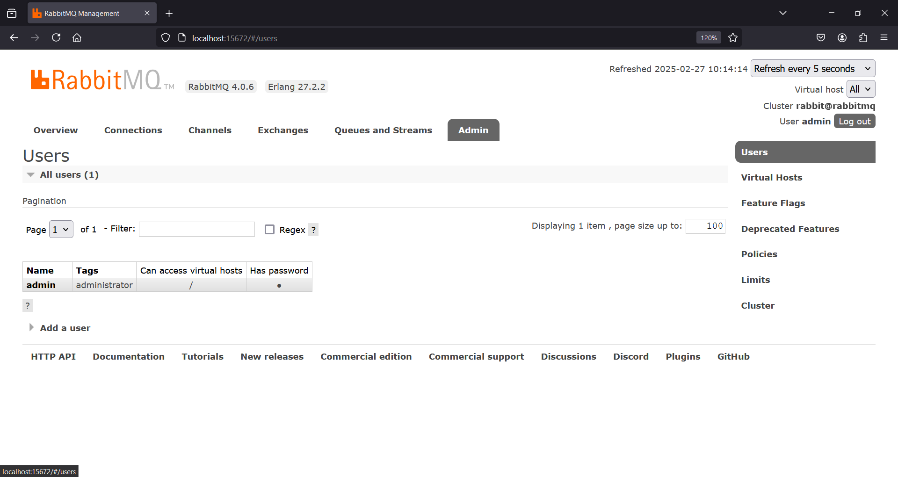

.. _localBroker:

RabbitMQ Broker on Local Host
=============================

While there are many alternative broker implementation options available, NOS-T adopts RabbitMQ as the message broker, an open-source message broker software that implements the Advanced Message Queuing Protocol (AMQP). RabbitMQ supports various messaging protocols including MQTT through plugins, making it a versatile choice for message routing. The broker is lightweight yet powerful, supporting clustering for high availability and various messaging patterns.

This page shows how to configure a new standalone RabbitMQ broker on a local host such as a personal machine or a secure local network. The tutorial uses Docker Compose to set up a RabbitMQ instance with the management and MQTT plugins enabled, providing a robust and easily configurable messaging platform for the testbed environment.

|

Initializing a RabbitMQ Broker
------------------------------

Docker Compose
^^^^^^^^^^^^^^

This tutorial specifically makes use of a Docker container for setting up the broker. A Docker container image is a lightweight, standalone, executable package of software that includes everything needed to run an application: code, runtime, system tools, system libraries and settings. In order to use the Docker Compose commands described, one of the following can be installed:

    * `Docker Desktop for Windows <https://docs.docker.com/desktop/install/windows-install/>`_ with at least 1 GiB of memory dedicated to Docker Engine.
    
    * `Docker Desktop for Mac <https://docs.docker.com/desktop/install/mac-install/>`_ with at least 1 GiB of memory dedicated to Docker Engine.
    
    * `Docker Desktop for Linux <https://docs.docker.com/desktop/install/linux-install/>`_ with at least 1 GiB of memory dedicated to Docker Engine.
    
Each of the latter includes the Docker Compose tool. To check if Docker Compose is running correctly, open an elevated command prompt and enter the following:

>>> docker-compose --help

If a list of options or commands is not displayed, then `installing Docker Compose directly <https://docs.docker.com/compose/install/>`_ may be necessary.

To begin setting up a RabbitMQ broker, create a file named `rabbitmq-docker-compose.yml` with the following content:

.. code-block:: yaml

  services:
    rabbitmq:
      image: rabbitmq:3.13-management
      hostname: rabbitmq
      container_name: rabbitmq
      ports:
        - "5672:5672"   # AMQP port
        - "15672:15672" # Management UI port
        - "1883:1883"   # MQTT port
      volumes:
        - rabbitmq_data:/var/lib/rabbitmq
      environment:
        - RABBITMQ_DEFAULT_USER=admin
        - RABBITMQ_DEFAULT_PASS=admin
      restart: always
      command: >
        bash -c "rabbitmq-plugins enable --offline rabbitmq_mqtt rabbitmq_web_mqtt &&
                docker-entrypoint.sh rabbitmq-server"
  volumes:
    rabbitmq_data:
      name: rabbitmq_data

You can download the file `here <https://raw.githubusercontent.com/emmanuelgonz/nost_rabbitmq_keycloak/refs/heads/main/rabbitmq-docker-compose.yml>`_.

Open an elevated command prompt and change directories to the location of this `.yml` file and enter the following:

.. code-block:: console
    
    >>> docker-compose -f rabbitmq-docker-compose.yml up -d
    [+] Running 2/2
    - Volume "rabbitmq_data"         Created                         ##.#s
    - Container rabbitmq             Started                         ##.#s
   
If actively running the Docker Desktop client, the Containers tab should include a single container. Expanding the **rabbitmq** container shows a single active node:

    

|

Similarly, the Volumes tab should include a single, in-use **rabbitmq_data** volume:
    

    

|

    
Note that the names of both the container and the volume can be customized by editing the `.yml` file accordingly.

|

Docker Run
^^^^^^^^^^

If you prefer not to use Docker Compose or it's unavailable in your environment, you can use the `docker run` command directly to create a RabbitMQ container:

.. code-block:: console

    >>> docker run -d --name rabbitmq \
        -p 5672:5672 -p 15672:15672 -p 1883:1883 \
        -e RABBITMQ_DEFAULT_USER=admin \
        -e RABBITMQ_DEFAULT_PASS=admin \
        -v rabbitmq_data:/var/lib/rabbitmq \
        --hostname rabbitmq \
        --restart always \
        rabbitmq:3.13-management \
        bash -c "rabbitmq-plugins enable --offline rabbitmq_mqtt rabbitmq_web_mqtt && docker-entrypoint.sh rabbitmq-server"

This command:

* Creates a detached container named "rabbitmq"
* Maps the necessary ports (AMQP, Management UI, and MQTT)
* Sets default admin credentials
* Creates a persistent volume for data storage
* Enables the MQTT plugins
* Configures automatic restart

You can verify the container is running with:

.. code-block:: console

    >>> docker ps
    CONTAINER ID   IMAGE                      COMMAND                  CREATED         STATUS         PORTS                                                                                        NAMES
    abc123def456   rabbitmq:3.13-management   "bash -c 'rabbitmq-p…"   2 minutes ago   Up 2 minutes   0.0.0.0:1883->1883/tcp, 0.0.0.0:5672->5672/tcp, 4369/tcp, 5671/tcp, 0.0.0.0:15672->15672/tcp   rabbitmq

|

.. _RabbitMQManagement:

Logging into the RabbitMQ Management Interface
---------------------------------------------

The `rabbitmq-docker-compose.yml` file contains a list of port mappings for different protocols, including the 15672 port for the RabbitMQ Management Interface. This web-based interface allows you to manage and monitor your RabbitMQ server. Once the docker container has been started up, open a browser and navigate to http://localhost:15672/ to login to this new broker as an admin (Username: admin, Password: admin).

    
|

After logging in you will see the RabbitMQ management interface overview page, which provides statistics about your broker.

    

|

|

Customizing your RabbitMQ Broker
--------------------------------

The RabbitMQ management interface provides various tabs for managing different aspects of the broker.

Exchanges
^^^^^^^^^

    
    
|

Exchanges are entities where messages are sent. RabbitMQ supports different types of exchanges (direct, fanout, topic, and headers) which handle routing messages differently. The topic exchange is particularly relevant for MQTT usage, as it allows for wildcard-based routing patterns similar to MQTT topics. In the Exchanges tab, you can create new exchanges, bind them to queues, and configure their properties.

|

Queues
^^^^^^

    

|

The Queues tab allows you to manage message queues in RabbitMQ. Queues hold messages that are consumed by applications. For MQTT clients, RabbitMQ automatically creates queues based on subscriptions. You can view message rates, queue depths, and other statistics. Additionally, you can create durable queues that survive broker restarts, which is useful for persistent sessions in MQTT.

|

Connections
^^^^^^^^^^^

    

|

The Connections tab shows all client connections to the broker. This includes AMQP and MQTT clients. You can see details such as connection duration, data rates, and client properties. This tab is useful for monitoring who is connected to your broker and troubleshooting connection issues.

|

Users and Permissions
^^^^^^^^^^^^^^^^^^^^

    

|

The Admin tab allows you to manage users and their permissions. You can create new users, assign them different permission levels, and restrict their access to specific virtual hosts. RabbitMQ's permission system is based on three operations: configure, write, and read, which can be assigned with regular expression patterns to control access to resources.

|

For more information on RabbitMQ management, refer to the `NOS-T RabbitMQ Keycloak GitHub repository <https://github.com/emmanuelgonz/nost_rabbitmq_keycloak>`_.