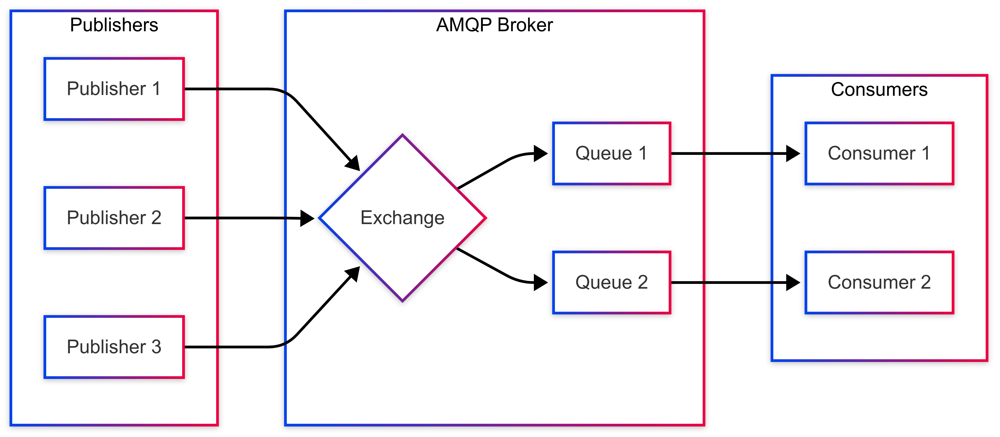

AMQP Protocol
============

*A brief summary of the AMQP protocol with links to detailed resources and a list of useful terminology used throughout this documentation.*

AMQP as a Standard Messaging Protocol
------------------------------------

AMQP (Advanced Message Queuing Protocol) is an open standard application layer protocol for message-oriented middleware. It's designed for enterprise messaging with a focus on reliability, security, and interoperability between different systems. AMQP enables applications to send messages reliably between distributed systems, often in high-throughput, mission-critical applications. There are many resources that cover the details and benefits of using the AMQP protocol, including but not limited to:

  * `OASIS Standard AMQP Version 1.0 <https://docs.oasis-open.org/amqp/core/v1.0/os/amqp-core-overview-v1.0-os.html>`_
  
  * `AMQP.org <https://www.amqp.org>`_  
  
  * `Pika Python client library <https://pypi.org/project/pika/>`_ - (NOTE: This is one of many popular AMQP libraries)
|

   
   AMQP Architecture showing the relationship between publishers, exchanges, queues, and consumers.

Useful Terminology/Nomenclature
------------------------------

A deep understanding of the protocol is not necessary to start working with AMQP, but the following are some terms that will be used commonly to explain the NOS-T architecture:

  * acknowledgments (acks): 
                Confirmations sent from consumers to the broker when messages are successfully processed. This allows the broker to know when it's safe to remove messages from queues.

  * binding: 
                A rule that tells an exchange which queues to route messages to based on routing keys or header attributes.

  * broker: 
                A server that receives and routes messages. In AMQP, the broker manages exchanges, queues, and bindings. NOS-T is hosted on an Amazon Elastic Compute Cloud (EC2) instance.

  * channel: 
                A virtual connection within a single AMQP connection. Multiple channels allow for multiple logical connections over a single TCP connection, improving efficiency.

  * client: 
                A device or application running an AMQP library and connecting to an AMQP broker over a network. These are typically applications that need reliable message delivery in enterprise environments.

  * connection: 
                A network connection between a client and broker, typically using TCP/IP. AMQP connections are persistent and designed to handle failures gracefully.

  * consumer:
                A client that connects to a queue to receive messages.

  * dead letter exchange:
                A special exchange where messages are sent when they cannot be delivered to their intended queue, typically due to message expiration or rejection.

  * exchange: 
                A routing mechanism that receives messages from publishers and routes them to queues based on routing keys and bindings. AMQP defines several exchange types (direct, topic, fanout, headers).

  * message:
                The data transmitted through AMQP, consisting of a set of properties (including headers and routing information) and a binary payload.

  * message durability:
                A property that determines whether messages survive broker restarts. Durable messages are written to disk, while non-durable messages are kept only in memory.

  * negative acknowledgments (nacks):
                Signals from consumers to the broker indicating that message processing failed and the message should be either requeued or discarded.

  * persistent delivery:
                A message delivery mode that ensures messages are saved to disk. Even if the server crashes before delivery, the message will be recovered and delivered when the server restarts.

  * prefetch count:
                A consumer setting that limits the number of unacknowledged messages the broker will deliver. This prevents consumers from being overwhelmed with too many messages at once.

  * publisher: 
                A client that sends a message to an exchange with a specific routing key.

  * quality of service (QoS):
                In AMQP, this refers to the delivery guarantees offered by the protocol: at-most-once, at-least-once, or exactly-once delivery semantics.

  * queue: 
                A buffer that stores messages. Consumers connect to queues to receive messages. Queues can be durable, temporary, exclusive, or auto-delete.

  * queue durability:
                A property that determines whether a queue survives broker restarts. Durable queues are recreated upon broker restart, preserving their bindings.

  * routing key:
                A message attribute used by exchanges to determine how to route the message to queues. In topic exchanges, it's a dot-separated string that supports wildcard matching.

  * TTL (Time-To-Live):
                A message or queue property that specifies how long messages should live before being automatically removed or sent to a dead letter exchange.

  * virtual host:
                A way to segregate applications using the same AMQP server. Each virtual host has its own exchanges, queues, and bindings, providing isolation between different applications.
|

Message Routing with Exchange Types
----------------------------------

AMQP provides sophisticated message routing through different exchange types that determine how messages are distributed to queues:

The most common exchange types are:

1. **Direct Exchange**: Routes messages to queues based on an exact match between the routing key and the binding key. This is useful for direct point-to-point communication.

2. **Topic Exchange**: Routes messages to queues based on pattern matching between the routing key and the binding pattern. This allows for more flexible subscriptions.

3. **Fanout Exchange**: Routes messages to all queues bound to the exchange, regardless of routing keys. This implements the broadcast pattern.

4. **Headers Exchange**: Routes messages based on header attributes rather than routing keys, allowing for more complex routing decisions.

Topic exchanges support pattern matching using wildcards:

* **'*'**: Matches exactly one word in the routing key
* **'#'**: Matches zero or more words in the routing key

For example, if using the convention {SERVICE}.{CATEGORY}.{ACTION}, a consumer could bind to:

* "service1.*.update" to receive all update actions for any category in service1
* "service1.#" to receive all messages for service1
* "\*.critical.\*" to receive all critical messages across all services

These routing capabilities allow for flexible and powerful message distribution patterns while maintaining control over message flow.
|

AMQP vs MQTT: Protocol Comparison
---------------------------------

While this document focuses on AMQP, it's important to understand how it compares to MQTT (Message Queuing Telemetry Transport), another popular messaging protocol. Each has distinct characteristics that make it suitable for particular use cases:

.. list-table:: AMQP vs MQTT Comparison
   :widths: 20 40 40
   :header-rows: 1

   * - Feature
     - AMQP
     - MQTT
   * - **Primary Use Case**
     - Enterprise messaging systems with complex routing requirements
     - IoT devices, mobile applications with constrained resources
   * - **Overhead**
     - Higher overhead with more complex protocol
     - Lightweight with minimal header overhead
   * - **Message Routing**
     - Sophisticated routing through exchanges (direct, topic, fanout, headers)
     - Simple topic-based publish/subscribe
   * - **QoS Levels**
     - 0 (at-most-once), 1 (at-least-once), 2 (exactly-once)
     - 0 (at-most-once), 1 (at-least-once), 2 (exactly-once)
   * - **Message Queuing**
     - Built-in with durable queues, temporary queues, etc.
     - Limited; requires separate implementation
   * - **Security**
     - TLS/SSL with SASL authentication, fine-grained permissions
     - TLS/SSL with username/password or certificate authentication
   * - **Standards**
     - OASIS standard with rigid specification
     - OASIS standard with more flexibility
   * - **Typical Broker**
     - RabbitMQ, ActiveMQ, Qpid
     - Solace PubSub+, Mosquitto, HiveMQ, EMQ X
   * - **Connection Model**
     - Connection-oriented with heartbeats
     - Connection-oriented with keep-alive mechanism
   * - **Protocol Maturity**
     - Mature, comprehensive
     - Simple, widespread adoption in IoT

**When to Choose AMQP over MQTT:**
  * When you need complex message routing patterns
  * For enterprise applications requiring robust message handling
  * When message queuing and acknowledgment are critical
  * For systems requiring high reliability and transaction support

**When to Choose MQTT over AMQP:**
  * For IoT devices with limited resources and bandwidth
  * When simplicity of implementation is paramount
  * For mobile applications where battery consumption matters
  * For wide fan-out publish/subscribe scenarios with simple routing needs

|

AMQP Implementation Examples
---------------------------

Below are practical examples of working with AMQP using Python's Pika library, demonstrating common patterns used in NOS-T.

Basic Connection and Channel Setup
^^^^^^^^^^^^^^^^^^^^^^^^^^^^^^^^^

.. code-block:: python

    import pika
    
    # Establish connection parameters with credentials
    credentials = pika.PlainCredentials('username', 'password')
    connection_params = pika.ConnectionParameters(
        host='broker-hostname',
        port=5672,
        virtual_host='/',
        credentials=credentials
    )
    
    # Create connection and channel
    connection = pika.BlockingConnection(connection_params)
    channel = connection.channel()
    
    # Always close connections when done
    # connection.close()

Publishing Messages to Different Exchange Types
^^^^^^^^^^^^^^^^^^^^^^^^^^^^^^^^^^^^^^^^^^^^^

.. code-block:: python

    # Direct Exchange Example
    channel.exchange_declare(exchange='direct_logs', exchange_type='direct')
    routing_key = 'error'  # or 'info', 'warning', etc.
    message = 'This is an error message'
    
    channel.basic_publish(
        exchange='direct_logs',
        routing_key=routing_key,
        body=message,
        properties=pika.BasicProperties(
            delivery_mode=2,  # Make message persistent
        )
    )
    
    # Topic Exchange Example
    channel.exchange_declare(exchange='topic_logs', exchange_type='topic')
    routing_key = 'service1.critical.update'
    message = 'Critical update required'
    
    channel.basic_publish(
        exchange='topic_logs',
        routing_key=routing_key,
        body=message
    )
    
    # Fanout Exchange Example
    channel.exchange_declare(exchange='alerts', exchange_type='fanout')
    message = 'System-wide notification'
    
    channel.basic_publish(
        exchange='alerts',
        routing_key='',  # Ignored for fanout exchanges
        body=message
    )

Consuming Messages with Acknowledgments
^^^^^^^^^^^^^^^^^^^^^^^^^^^^^^^^^^^^^

.. code-block:: python

    # Declare queue and bind to an exchange
    channel.queue_declare(queue='task_queue', durable=True)
    channel.queue_bind(
        exchange='topic_logs',
        queue='task_queue',
        routing_key='service1.*.update'
    )
    
    # Define callback function for message processing
    def callback(ch, method, properties, body):
        print(f"Received: {body.decode()}")
        
        # Process the message (implement your logic here)
        
        # Acknowledge message - tells broker we've processed it successfully
        ch.basic_ack(delivery_tag=method.delivery_tag)
    
    # Set QoS prefetch count (limit messages in flight)
    channel.basic_qos(prefetch_count=1)
    
    # Start consuming messages
    channel.basic_consume(
        queue='task_queue',
        on_message_callback=callback
    )
    
    print('Waiting for messages. To exit press CTRL+C')
    channel.start_consuming()

Dead Letter Exchange Setup
^^^^^^^^^^^^^^^^^^^^^^^^

.. code-block:: python

    # Set up the dead letter exchange
    channel.exchange_declare(exchange='dead_letter', exchange_type='direct')
    
    # Create a queue with dead letter configuration
    arguments = {
        'x-dead-letter-exchange': 'dead_letter',
        'x-dead-letter-routing-key': 'failed',
        'x-message-ttl': 30000  # 30 seconds TTL
    }
    
    channel.queue_declare(queue='main_queue', arguments=arguments)
    
    # Create the actual dead letter queue
    channel.queue_declare(queue='dead_letter_queue')
    channel.queue_bind(
        exchange='dead_letter',
        queue='dead_letter_queue',
        routing_key='failed'
    )

These examples demonstrate the core AMQP concepts covered in the terminology section and show how the exchange types work in practice. For production use, consider implementing additional error handling, connection recovery, and proper resource cleanup.