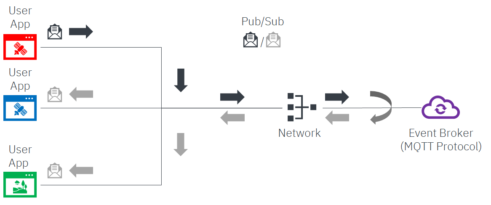
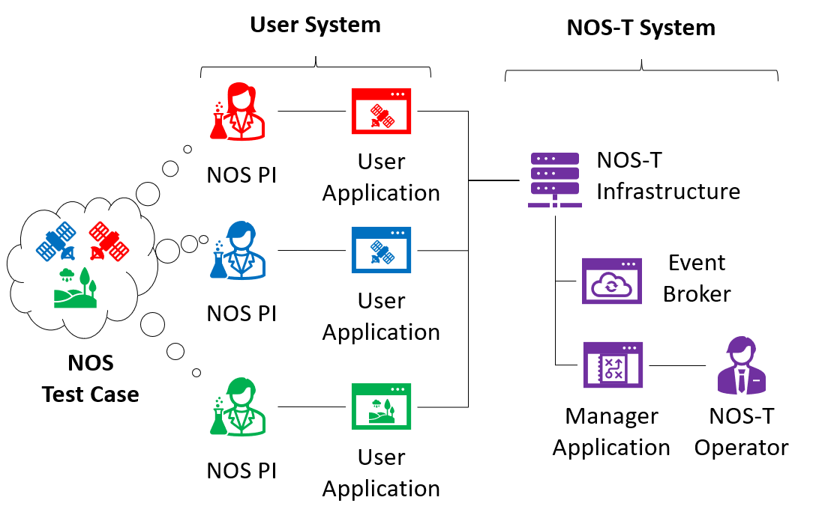
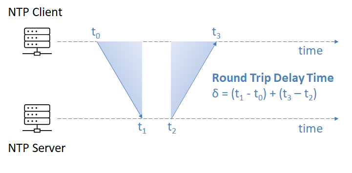

.. _overview:

Overview
========

Introduction to NOS
------------------

The New Observing Strategies (NOS) initiative within the NASA Earth Science Technology Office Advanced Information Systems Technology program envisions future Earth science missions with distributed sensors (nodes) interconnected by a communications fabric that enables dynamic and intelligent operations. Some NOS concepts resemble systems-of-systems or collaborative systems where operational authority is distributed among multiple systems, necessitating new methods for systems engineering and design to cope with more decentralized control over constituent systems.

NOS-T Architecture
-----------------

NOS-T is best suited for conceptual, systems-level design of NOS components and operational concepts. The system architecture follows a loosely-coupled **event-driven architecture (EDA)** where member nodes communicate through events in the form of notification messages sent over a network.

Key characteristics of the NOS-T architecture:

* **Flexible Node Types**: Nodes can be software applications, simulation models, science databases, or hardware
* **Enhanced Scalability**: The EDA provides scalability and reliability by using consistent event-handling functions
* **Modular Design**: Participants can join and leave experiments without reconfiguring the testbed
* **Security**: Maintains protection of proprietary software and data while enabling cross-organizational tests

Event Broker Infrastructure
--------------------------

The NOS-T architecture relies on a centralized infrastructure component called an **event broker** (or message broker) to exchange event notifications between applications. A broker simplifies communication by requiring each application to connect only to the broker, rather than directly to every other application.

NOS-T adopts **RabbitMQ**, an open-source message broker implementing the Advanced Message Queuing Protocol (AMQP). RabbitMQ uses a publish-subscribe messaging pattern with:

* **Publishers**: Applications that produce events
* **Subscribers**: Applications that consume events
* **Topics**: Categories for event types that applications can publish to or subscribe to

.. graphviz::
   :name: EDA_PubSub_Concept
   :caption: Event-Driven Architecture with Centralized Broker
   :align: center

   digraph MQTT_PubSub {
      rankdir=LR;
      
      subgraph cluster0 {
         style=dashed;
         label="User Apps";
         fontsize=16
         fontname="Helvetica-Bold";
         
         UserApp1 [label="User App", shape=rect, style=filled, fillcolor=red, fontsize=16];
         UserApp2 [label="User App", shape=rect, style=filled, fillcolor=blue, fontsize=16];
         UserApp3 [label="User App", shape=rect, style=filled, fillcolor=green, fontsize=16];
      }
      
      subgraph cluster1{
         style=invis
         Network [label="Network", shape=diamond, style=filled, fillcolor=gray, fontsize=16];
      }
      
      UserApp1 -> Network [label="Publish", fontsize=12, fontcolor=red, color=red];
      UserApp2 -> Network [style=invis]
      UserApp3 -> Network [style=invis]
      

      Network -> UserApp1 [style=invis]
      Network -> UserApp2 [label="Subscribe", fontsize=12, fontcolor=blue, color=blue, style=dashed];
      Network -> UserApp3 [label="Subscribe", fontsize=12, fontcolor=blue, color=blue, style=dashed];
      
      subgraph cluster2 {
         style=invis
         EventBroker [label="Event Broker\n(AMQP Protocol)", shape=cloud, style=filled, fillcolor=darkorange1, fontsize=16];
      }
      
      Network -> EventBroker [label="Publish", fontsize=12, fontcolor=red, color=red];
      Network -> EventBroker [label="", color=red, style=invis];
      EventBroker -> Network [label="Subscribe", fontsize=12, fontcolor=blue, color=blue, style=dashed];

   }

   
   Event-Driven Architecture with Centralized Broker

System Components
----------------

NOS-T consists of two top-level system components:

1. **NOS-T System** (fixed for all test cases)
   * Managed by an NOS-T operator
   * Includes the event broker infrastructure
   * Contains a manager application that orchestrates test runs
   * Ensures proper application synchronization, topic configuration, and consistent message structure

2. **User System** (tailored to each test case)
   * Consists of user applications developed by test participants
   * Applications run on separate hosts controlled by each participant
   * Can model entire observing systems or individual components (sensors, communication links, algorithms, etc.)
   * Must meet basic NOS-T interface requirements for orchestration

.. graphviz::
   :name: nos_t_concept
   :caption: NOS-T Graphical Concept: Visual representation of the testbed architecture and operational flow
   :align: center

   digraph NOST_concept {
      rankdir=LR;
      
      subgraph cluster0 {
         style=dashed;
         label="User System";
         labeljust="l";
         fontsize=18;
         fontname="Helvetica-Bold";
         
         PI1 [label="NOS PI", shape=rect, style=filled, fillcolor=red];
         PI2 [label="NOS PI", shape=rect, style=filled, fillcolor=blue];
         PI3 [label="NOS PI", shape=rect, style=filled, fillcolor=green];
         
         UserApp1 [label="User App", shape=rect, style=filled, fillcolor=red];
         UserApp2 [label="User App", shape=rect, style=filled, fillcolor=blue];
         UserApp3 [label="User App", shape=rect, style=filled, fillcolor=green];
      }
      
      TestCase [label="NOS Test Case", shape=oval];
      TestCase -> PI1;
      TestCase -> PI2;
      TestCase -> PI3;
      
      PI1 -> UserApp1;
      PI2 -> UserApp2;
      PI3 -> UserApp3;
      
      subgraph cluster1 {
         style=dashed;
         label="NOS-T System";
         // labeljust="l";
         fontsize=18;
         fontname="Helvetica-Bold";
         
         // Fill [style=invis]
         NOSTInfrastructure [label="NOS-T Infrastructure", shape=oval, style=filled, fillcolor=orange];
         
         subgraph cluster2 {
               style=dashed;
               color=grey;
               labeljust="l";
               fontsize=10;
               label="NOS-T Operator";
               
               EventBroker [label="Event Broker\n(AMQP Protocol)"];
               // Fill [style=invis];
               ManagerApplication [label="Manager Application"];
         }
      }
      
      UserApp1 -> NOSTInfrastructure;
      UserApp2 -> NOSTInfrastructure;
      UserApp3 -> NOSTInfrastructure;
      
      NOSTInfrastructure -> EventBroker;
      // NOSTInfrastructure -> Fill [style=invis];
      NOSTInfrastructure -> ManagerApplication;
   }

   
   NOS-T Graphical Concept

Development Tools
---------------

To aid in application development, the open-source [*]_ NOS-T tools library provides templates for implementing basic NOS-T functionality:

* **Manager application template**: Orchestrates test execution
* **Network Time Protocol (NTP) capabilities**: Synchronizes applications across distributed systems
* **Observer templates**: For implementing sensor applications
* **Observable templates**: For science applications
* **Publisher templates**: For regular messaging (e.g., "heartbeat" messages)
* **Broker connection utilities**: For connecting to the message broker

   
   Network Time Protocol (NTP) Round Trip Time Delay

Language Compatibility
--------------------

While the NOS-T tools and most example applications are coded in Python, the system supports multiple programming languages:

* Any language with RabbitMQ interface libraries can be used
* Supported protocols include AMQP and MQTT
* Examples of compatible platforms:

  - JavaScript (used in the "scoreboard" geospatial visualization)
  - MATLAB (via available RabbitMQ libraries)

Applications in a test suite can use different programming languages as long as they maintain a common message structure.
 
.. [*] BSD 3-clause license (Dec. 16, 2021, Reference FY22-005)