.. _ICD:

Interface Control Document
==========================

.. list-table:: Release History
  :widths: 10 20 70
  :header-rows: 1

  * - Release
    - Date
    - Description
  * - v.1.0
    - Feb. 1, 2022
    - Initial release of the ICD and documentation of NOS-T Tools library.

**TABLE OF CONTENTS**

`1 Preface <#preface>`__

`1.1 NOS-T Introduction <#nos-t-introduction>`__

`1.2 Purpose of this Document <#purpose-of-this-document>`__

`1.3 Conventions used in this
Document <#conventions-used-in-this-document>`__

`1.4 Definitions and Glossary of
Terms <#definitions-and-glossary-of-terms>`__

`1.5 Obtaining Documentation, Tools,
and Information <#obtaining-documentation-tools-and-information>`__

`1.6 Disclaimers <#disclaimers>`__

`2 Quickstart Guide <#overview-guide>`__

`2.1 Investigator Journey <#investigator-journey>`__

`2.2 Test Campaign Checklist <#test-campaign-checklist>`__

`3 NOS-T Description <#nos-t-description>`__

`3.1 System Architecture <#system-architecture>`__

`3.2 System Interface <#system-interface>`__

`3.2.1 Message Protocol <#message-protocol>`__

`3.2.2 Message Format <#message-format>`__

`3.2.3 Example MQTT Messaging Client <#example-mqtt-messaging-client>`__

`3.3 Manager Events <#manager-events>`__

`3.3.1 Control Events <#control-events>`__

`3.3.2 Status Events <#status-events>`__

`4 NOS-T Interface <#nos-t-interface>`__

`4.1 Unmanaged Use Case <#unmanaged-use-case>`__

`4.2 Managed Use Case <#managed-use-case>`__

`4.3 Interface Requirements <#interface-requirements>`__

`4.4 Test Case-Specific Execution
Requirements <#test-case-specific-execution-requirements>`__

`5 Detailed User's Guide <#detailed-users-guide>`__

`5.1 Defining Test Campaigns <#defining-test-campaigns>`__

`5.2 Developing Applications <#developing-applications>`__

`5.3 Tools, Templates, and
Techniques <#tools-templates-and-techniques>`__

`5.4 Ensuring NOS-T Compatibility <#ensuring-nos-t-compatibility>`__

`5.5 Executing Test Campaigns <#executing-test-campaigns>`__

`6 References <#references>`__

`7 Appendices <#appendices>`__

Preface
-------

NOS-T Introduction
------------------

The New Observing Strategies (NOS) initiative within the NASA Earth
Science Technology Office (ESTO) Advanced Information Systems Technology
(AIST) program envisions future Earth science missions with distributed
sensors (nodes) interconnected by a communications fabric that enables
dynamic and intelligent operations. Some NOS concepts resemble
systems-of-systems or collaborative systems where operational authority
is distributed among multiple systems, necessitating new methods for
systems engineering and design to cope with more decentralized control
over constituent systems.

The New Observing Strategies Testbed (NOS-T, verbalized as "en oh es
tee") is a computational environment to develop, test, mature, and
socialize new operating concepts and technology for NOS. NOS-T provides
infrastructure to integrate and orchestrate user-contributed
applications for system-of-systems test cases with true distributed
control over constituent elements. The overall concept, illustrated in
Figure 1, interconnects individual user applications and a NOS-T manager
application via common information system infrastructure to coordinate
the execution of virtual Earth science missions. NOS-T enables principal
investigators to conduct test runs in the same environment,
systematically changing variables to assess the overall efficacy of the
proposed new observing strategies. Recorded data and outcomes provide
evidence to advance technology readiness level and improve upon or
innovate existing Earth science measurement techniques.

|figure1|\

Figure 1. New Observing Strategies Testbed Comprised of User Systems and
the NOS-T System.

NASA/ESTO contracted with the Systems Engineering Research Center
(SERC), a University-Affiliated Research Center (UARC) of the United
States Department of Defense, to design and develop a framework for the
NOS-T. The SERC comprises 22 member universities across the country with
deep expertise in systems engineering and is headquartered at Stevens
Institute of Technology in Hoboken, New Jersey. The SERC develops
partnerships between academia, government, and industry with a focus on
solving systems challenges critical to national security through systems
research. As an independent actor, the SERC can identify and develop
systems engineering solutions free from real or perceived conflicts of
interest with existing NASA centers.

Based on input from NASA/ESTO, the NOS-T design and development follows
six top-level guiding principles:

1. *Geographic distribution*: user systems connect using a standard
   network interface (rather than integrating software at a centralized
   site) to allow remote participation from multiple sites.

2. *Multi-party participation*: user systems interact with other systems
   by sending and receiving information using standard network protocols
   (rather than software source code or compiled executables) to run
   test cases across organizational or institutional boundaries.

3. *Security*: transport layer encryption and access control rules
   restrict information exchange and hosted NOS-T system components
   conform to required information system security policies.

4. *Modularity*: loose coupling provided by a well-defined application
   interface allows individual user applications to be replaced, tested,
   and validated without modifying the rest of the testbed.

5. *Extensibility*: test cases can be updated by adding, removing, or
   changing capabilities of individual user applications which are
   integrated using the generic NOS-T system capabilities.

6. *Usability*: members of the Earth science community can develop new
   test campaigns and user systems by leveraging existing software and
   knowledge without a substantial learning curve.

As a result of these guiding principles, NOS-T adopts a simpler software
architecture than existing distributed simulation standards like
Distributed Interactive Simulation (DIS, IEEE Std. 1278) and High-Level
Architecture (HLA, IEEE Std. 1516). Most frequently used in defense
applications, DIS and HLA provide comprehensive distributed simulation
capabilities but also require substantial resources to learn, develop,
and execute compliant applications. Unlike these architectures, NOS-T
uses a simple event-driven protocol layered over Message Queuing
Telemetry Transport (MQTT), itself a lightweight publish-subscribe
messaging protocol with high-quality open-source implementations
available in most languages, to support real-time and scaled real-time
execution modes using standard computer networks. There are several
advantages but also some disadvantages to pursuing this system
architecture discussed in this document.

This Interface Control Document and User’s Guide provides information
about the NOS-T system architecture, components, and key interfaces
required for users to take full advantage of its capabilities. While
further NOS-T tools and capabilities are still under development, this
brief describes the fully functional features as of version 1.0 in
February 2022.

Purpose of this Document
------------------------

The purpose of this document is to provide potential NOS-T users with a
complete description of the relevant functions and interfaces of the
system along with practical how-to information for preparing for and
executing test campaigns using the system.

Conventions used in this Document
---------------------------------

This document occasionally uses code or pseudo-code blocks offset in
gray boxes, e.g.:

.. code-block:: python3

  print("Hello World!")

Specific code examples are descriptive (not normative) examples of the
NOS-T ICD.

Definitions and Glossary of Terms
---------------------------------

Table 1 provides a list and definition of terms and acronyms as used by
the NOS-T system to standardize the taxonomy of users and operators can
interact.

.. list-table:: Table 1. Definitions and Glossary of Terms
  :widths: 15 85
  :header-rows: 1

  * - Term
    - Definition
  * - AIST
    - Advanced Information Systems Technology
  * - Campaign (or Test Campaign)
    - For purposes of NOS-T a Campaign or Test Campaign will be associated with a top-level science objective. Test Campaigns comprise Test Cases for this objective.
  * - DOE
    - Design of Experiments
  * - ESTO
    - Earth Science Technology Office
  * - Instrument Concept
    - For the purposes of the NOS-T Framework, an instrument concept is contained within the definition of the space element(s) that comprise the Space Mission Architecture.
  * - ITAR
    - International Traffic in Arms Regulations
  * - Message
    - Unit of information exchange using the NOS-T service bus.
  * - Mission
    - For the purposes of the NOS-T Framework, a mission is defined to include all the elements of a Space Mission Architecture (see below).
  * - Mission Concept
    - For the purposes of the NOS-T Framework, a mission concept will be synonymous with a Mission (see above).
  * - NOS
    - New Observing Strategies
  * - NOS-T
    - New Observation Strategies Testbed
  * - Protocol
    - Technical mechanism by which messages are exchanged on the NOS-T service bus.
  * - Scenario
    - For purposes of NOS-T a Scenario will be considered synonymous with Test Case (see below).
  * - Science Concept
    - For the purposes of the NOS-T Framework, the science concept defines the overall scientific objectives of the mission (e.g., detect wildfires, measure snow depth).
  * - SERC
    - Systems Engineering Research Center
  * - Space Mission Architecture
    - According to Space Mission Analysis and Design - Core (Larson et al.) A Space Mission Architecture includes subject, orbit, spacecraft, launch vehicle, ground systems, mission operations systems, and communication architecture.
  * - SRL
    - System Readiness Level
  * - STM
    - Science Traceability Matrix
  * - Study or NOS-T Study
    - For the purposes of the NOS-T Framework, a Study (or NOS-T Study) is synonymous with a Test Campaign.
  * - Test Case
    - For the purposes of NOS-T, a collection of Test Cases comprises a Test Suite. Following a Design of Experiments (DOE) approach, each Test Case defines specific Space Mission Architecture initial conditions (spatial, temporal, natural), individual node behaviors or individual node performance metrics along with any boundary conditions to be managed by the NOS-T for which data will be collected during the Test Case Execution.
  * - Test Case Execution
    - For the purposes of NOS-T, a Test Case Execution completes a Test Case in the NOS-T environment from beginning to end as defined by the Test Case parameters and the boundaries of the Test Suite.
  * - Test Suite
    - For the purposes of NOS-T, a Test Suite is composed of individual Test Cases. The Test Suite is comprised of models that define elements of the Space Mission Architecture including individual nodes within that architecture along with their behavior and performance.
  * - TRL
    - Technology Readiness Level

Obtaining Documentation, Tools, and Information 
------------------------------------------------

To obtain copies of development and verification tools cited in this
document, please contact the principal investigator:

| Paul Grogan, Assistant Professor
| School of Systems and Enterprises
| Stevens Institute of Technology
| Office: Castle Point on Hudson
| Babbio Center 517
| Hoboken, NJ 07030
| Phone: (201) 216-5378
| Email: pgrogan@stevens.edu

Disclaimers
-----------

The Systems Engineering Research Center (SERC) is a federally funded
University Affiliated Research Center managed by Stevens Institute of
Technology.

This material is based upon work supported, in whole or in part, by the
U.S. Department of Defense through the Combat Capabilities Development
Command (CCDC) Armaments Center (AC) and NASA Goddard Space Flight
Center (GSFC) under Contract W15QKN-18-D-0040 (Task Order
W15QKN20F0551).

Any views, opinions, findings and conclusions or recommendations
expressed in this material are those of the author(s) and do not
necessarily reflect the views of the United States Department of Defense
nor CCDC-AC or NASA.

This Stevens Institute of Technology and Systems Engineering Research
Center Material is furnished on an “as-is” basis. Stevens Institute of
Technology makes no warranties of any kind, either expressed or implied,
as to any matter including, but not limited to, warranty of fitness for
purpose or merchantability, exclusivity, or results obtained from use of
the material. Stevens Institute of Technology does not make any warranty
of any kind with respect to freedom from patent, trademark, or copyright
infringement.

The NOS-T development team has made every effort to ensure the accuracy
of the information contained in this document. However, in the dynamic
environment of software development it is possible that some changes do
not get precisely captured. Please refer to the latest version of this
document and all system software and tools.

Overview Guide
--------------

Investigator Journey
--------------------

The purpose of NOS-T is to enable new technology principal investigators
(PIs) and technology program management (PM) to evaluate the efficacy of
newly proposed observation strategies for Earth science missions. Figure
2 illustrates the notional investigator’s journey from concept, to
proposal, to test campaign to analysis and publication.

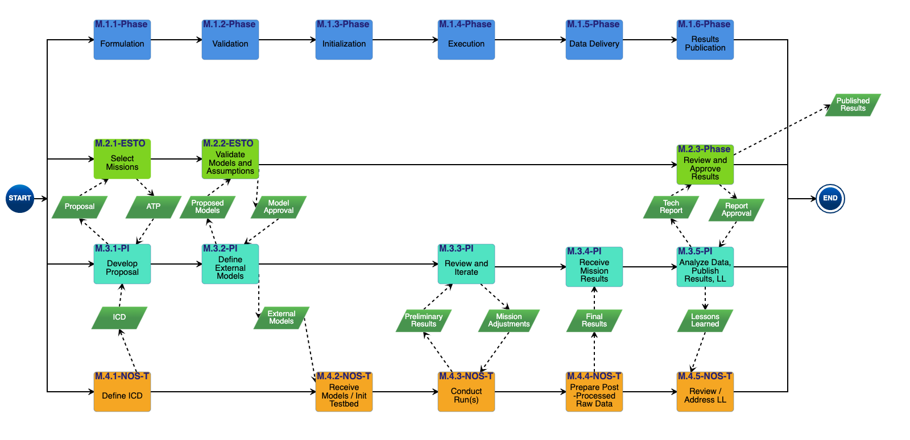

Figure 2. Investigator Journey Map from Concept through Publication
illustrating interaction with NOS-T. (click to enlarge)

The three swim lanes correspond to the NOS-T Operator (orange),
technology PI (teal), and technology PM (green) actors. During the
formulation phase, the NOS-T Operator defines the interface control
document (ICD) for the NOS-T platform. The PI develops a new proposal
for a test campaign to evaluate a new technology responsive to PM
application areas. The PM reviews and selects proposals to provide
authority to proceed (ATP).

Next, during the validation phase, the PI defines and develops the user
applications that will participate in the NOS-T test campaign, which may
be reviewed by the PM. During the initialization phase, the NOS-T
operator receives the user applications and performs a verification test
for ICD compliance.

During the execution phase, the NOS-T Operator conducts a set of test
case executions, comprising the test campaign, to provide preliminary
data products to the PI to review and make any necessary adjustments to
the user application. When ready, the NOS-T Operator executes a final
set of test cases in the test campaign to produce data products to be
delivered to the PI for analysis. Finally, the PI analyzes and reports
results to the PM prior to publishing findings and providing lessons
learned to the NOS-T Operator to continuously improve operations.

Test Campaign Checklist
-----------------------

The following checklist provides an overview of principle investigator
Test Campaign activities from start to finish. The nature of each Test
Campaign, the number and type of applications and their interactions are
essentially limitless. However, because of the flexible NOS-T interface
architecture, the basic approach to leveraging the capabilities of NOS-T
to execute the campaign are virtually identical.

* Pre-Campaign Preparation (see Section 5.1)

  * Define investigation hypothesis(es)
  * Develop test campaign architecture

    * Test campaign(s) to answer broadly-scoped research questions
    * Test suites to answer narrowly-scoped research questions
    * Test cases to evaluate specific configurations

  * Create test campaign plan
  * Develop test campaign application(s)
  * Define test campaign application-to-application interfaces (what data and how)
  * Verify and validate test campaign applications in stand-alone operations
  * Perform pre-campaign NOS-T-to-test campaign application “fit check”

* Test Campaign

  * Set up test campaign environment
  * Perform check-out run
  * Execute test campaign plan
  * Collect test campaign data (test cases and test suite(s))

* Post-Test Campaign

  * Analyze data
  * Publish results with respect to original hypotheses
  * Review test campaign for lessons learned
  * Improve NOS-T process and revise test campaigns as necessary

NOS-T Description
-----------------

This section provides a detailed description of the NOS-T architecture
and how state changes are communicated via messages published and
subscribed to topics.

System Architecture
-------------------

The NOS-T system architecture follows a loosely coupled event-driven
architecture (EDA) where member applications communicate state changes
through events that are embodied as notification messages sent over a
network. EDA provides enhanced scalability and reliability over other
software architectures by replicating event handling functions across
infrastructure instances while maintaining modularity between
applications through a simple event-handling interface. NOS-T can also
be described as a service-oriented architecture (SOA) as applications
trigger services in response to events.

The NOS-T architecture relies on a centralized infrastructure component
called an event broker (synonymous with message broker) to exchange
event notifications between applications. A broker simplifies the
communication structure because each member application (client) only
directly connects to the broker, rather than requiring each application
to directly connect to every other application.

While there are many alternative broker implementation options
available, NOS-T adopts the Solace PubSub+ Standard Edition event broker
[1]_, a proprietary but freely available commercial product supporting up
to 1000 concurrent connections and 10,000 messages per second. PubSub+
supports and interoperates among several protocols and several open
protocols including Message Queuing Telemetry Transport (MQTT), Advanced
Message Queuing Protocol (AMQP), and Representational State Transfer
(REST) [2]_. All protocols share similar messaging constructs but exhibit
some minor differences in implementation and library availability. To
simplify its initial release, NOS-T only uses MQTT.

NOS-T hosts an instance of PubSub+ on a server in the Science Managed
Cloud Environment (SMCE), a managed cloud infrastructure for ESTO
projects [3]_. SMCE both provides the flexibility of cloud services to
customize configuration settings outside of a firewalled network and the
security of required controls for a FISMA Low operating environment. The
PubSub+ platform uses a publish-subscribe messaging pattern which
designates applications (clients) as publishers (producers of events)
and subscribers (consumers of events). Each application can publish or
subscribe to multiple types of events.

The two top-level NOS-T system components include the *NOS-T System*
which is fixed for all test cases and the *User System* which is
tailored to each unique test case. The NOS-T System, administered by an
NOS-T operator, includes the event broker infrastructure and a manager
application that orchestrates test runs. The test operator issues
commands via a manager application, either via console or web-based
graphical user interface (GUI). Figure 3 illustrates how the manager
publishes events to other applications through the event broker. The
manager application publishes messages following the topic and payload
specifications in Section 3.2.1.

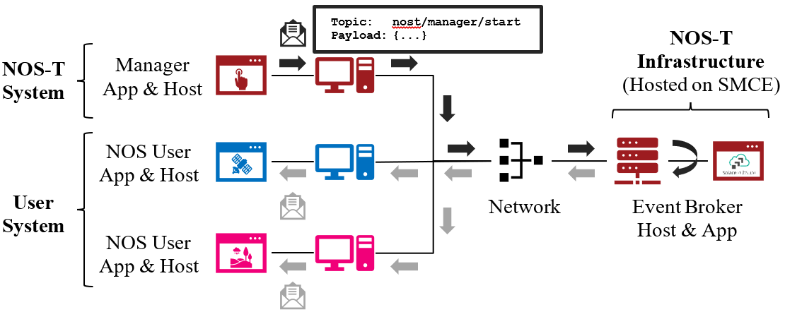

Figure 3. NOS-T System Architecture Illustrating the Route of a Message
from Publisher to Subscribers.

The User System consists of user applications developed and operated by
each test case participant. User applications run on separate hosts
controlled by each participant and can be variably scoped to model an
entire observing system or individual components such as sensors,
communication links, tasking or scheduling algorithms, forecasting
models, or environmental data (e.g., nature run data sets for observing
system simulation experiments). Each user application must meet the
basic NOS-T interface requirements for orchestration (namely,
subscribing to and responding to manager commands) plus any additional
test case-specific interface requirements agreed upon by the
participants. There are no general restrictions on software language,
host platform, physical location, or other implementation details for
user applications.

System Interface
----------------

The broker interconnects applications to allow distributed users to
participate in test case executions. The interface between the User
System and NOS-T System consists of a message protocol to send and
receive information units and a message format to structure their
contents.

Message Protocol
~~~~~~~~~~~~~~~~

All NOS-T events are communicated by sending or receiving messages using
the standard MQTT messaging protocol. Connecting to the MQTT server is
the most important high-level requirement, although other messaging
protocols may be incorporated in the future based on the
interoperability of the Solace PubSub+ event broker. The general steps
for making this connection are shown in Figure 4, where MQTT Server
refers to the event broker. First, a user instantiates an MQTT client
using a language-specific implementation library. Next, the user sets
client credentials (username and password) required for authentication
and authorization and configures Transport Layer Security (TLS)
certificates to encrypt messages. Finally, the user connects the client
to the server to establish communication.

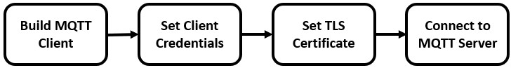

Figure 4. MQTT Connection Process

Each application identifies event topics to which it publishes and
subscribes messages. A topic is a hierarchical addressing scheme written
as forward slash (/) delimited labels (e.g., *nost/manager/start*). The
first topic level (e.g., *nost*) designates a NOS-T namespace (prefix)
unique to each a test case execution, allowing multiple test cases to
run simultaneously on the same broker without conflicts. The second
topic level (e.g., *manager*) designates an application namespace
controlled by a member application. Additional topic levels (e.g.,
*start*) refine the application namespace to differentiate event types,
with up to 128 total topic levels.

Message topics need not be defined in advance; however, the NOS-T
operator can configure access control rules in the PubSub+ application
to grant client-specific subscribe/publish (i.e., read/write) permission
for specific topics. Subscriptions can also use wildcard characters to
receive messages on multiple topics. For example, the # character in
MQTT represents a multi-level wildcard (e.g., *nost/manager/#*) and the
*+* character represents a single-level wildcard (e.g.,
*nost/+/status*).

Overall message routing between publishers and subscribers can be
graphically depicted in several ways. Figure 5(A) depicts a physical
network diagram with topic-specific conduits between applications and
the broker. Application A publishes an event message (of type X) to
topic *nost/A/X* which is routed to two subscribers: B subscribes to the
same topic (*nost/A/X*) and application C subscribes to a wildcard topic
(*nost/A/#*). Figure 5(B) presents a more compact diagram showing at
application A publishes event type X which is consumed by (subscribed to
by) applications B and C. More complex system concepts introduce event
feedback loops between applications to indicate dynamic and responsive
operations.

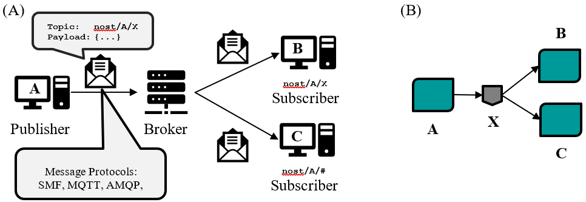

Figure 5. Publish-Subscribe Messaging Pattern in (A) Physical Network
and (B) Event-oriented Diagrams. (click to enlarge)

Message Format
~~~~~~~~~~~~~~

Messages are defined by a topic and payload. Each message must be
published to exactly one topic (no wildcards). The message payload
(body) contains event data structured as either a string (text) or byte
array (raw). PubSub+ can be configured for message payload sizes up to
30 MB.

The NOS-T manager sends messages with payload strings encoded in
JavaScript Object Notation (JSON) which defines data structures that are
easily readable both by computers and humans. JSON encodes string,
numeric, and Boolean data types and list and dictionary data structures
in a text-based notation. Additional encoding allows representation of
more complex data types, like timestamps, using standards like ISO-8601.
For example, the manager-issued start event has the following JSON
structure:

.. code-block:: json

  {
    "taskingParameters": {
      "startTime": "2021-04-15T12:00:00+00:00",
      "simStartTime": "2019-03-15T00:00:00+00:00",
      "simStopTime": "2019-03-19T00:00:00+00:00",
      "timeScalingFactor": 60
      }
  }

Using JSON to encode payload strings is optional but recommended for
user-defined event messages because it allows for simple parsing and
semantically readable data. While the object schemas (specification of
required key names and expected value types) to structure JSON message
payloads for new events depend on each application case, the NOS-T
manager messages are loosely based on standardized object schemas for
the SensorThings Sensing [4]_ and Tasking [5]_ APIs. The start event above
is based on the SensorThings *Task* entity with task-specific parameters
(*startTime*, *simStartTime*, etc.) contained within the
*taskingParameters* dictionary.

Example MQTT Messaging Client
~~~~~~~~~~~~~~~~~~~~~~~~~~~~~

MQTT is the selected messaging protocol for new user applications
because of its simplicity and broad support including high-quality
open-source libraries for most languages. For example, the Eclipse Paho
library (paho-mqtt) is publicly available under an open-source license
for the Python language [6]_.

A simple example below connects a client to the broker (using
placeholders for client username and password and the broker host
address and port), subscribes to the wildcard topic *nost/manager/#*,
sends a plain text message to the topic *nost/example/hello* every
second (receiving messages while calling the *loop()* function), and
prints out received messages to console using a callback function.

.. code-block:: python3

  #!/usr/bin/env python3

  import paho.mqtt.client as mqtt
  import time

  # callback to run when a message is received
  def on_message(client, userdata, msg):
    print(msg.topic + " " + str(msg.payload))

  # instantiate a new client and bind the callback
  client = mqtt.Client()
  client.on_message = on_message

  # connect to the broker and subscribe to a topic
  client.username_pw_set(CLIENT_USERNAME, CLIENT_PASSWORD)
  client.tls_set()
  client.connect(BROKER_ADDR, BROKER_PORT)
  client.subscribe("nost/manager/#")

  # main execution loop
  for i in range(10):
    # publish message to a topic
    client.publish("nost/example/hello", f"Hello {i}")
    # process message events for 1 second
    t = time.time()
    while time.time() - t < 1.0:
      client.loop()

Additional Eclipse Paho features described in the documentation [6]
include background threads to process message events (rather than
calling the *loop()* function directly), per-topic callback functions to
simplify event handling, and additional configuration options to manage
the broker connection.

Manager Events
--------------

The NOS-T manager orchestrates user applications by synchronizing key
scenario points (e.g., start, changes in time scale, and end) and
progressing scenario (simulated) time at a designated pace. During a
test case execution, the manager application publishes several types of
events to issue commands (control events) and communicate state changes
(status events).

All manager events are published to the topic *$PREFIX/manager/TYPE
($PREFIX* is the test case namespace and *TYPE* is the control event
type) and use JSON for message payload encoding. This section briefly
describes the topic and payload for each type of manager event.

.. _controlEvents:

Control Events
~~~~~~~~~~~~~~

The manager issues control events to orchestrate a test case execution.
The test case execution lifecycle follows the activity diagram in Figure
6 with an initialization, start, optional updates, and a stop event.

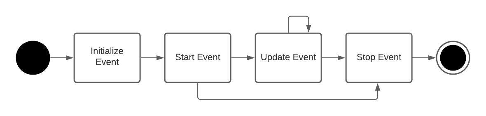

Figure 6. Typical Managed Test Case Execution Lifecycle. (click to enlarge)

The control event message payload builds on the *Task* entity object
schema in the Sensor Things Tasking API [5] with a top-level key
*taskingParameters* to group event-specific parameters. Table 2 lists
the four manager control event types described in the following
sections.

.. list-table:: Table 2. List of NOS-T Manager Control Events
  :widths: 25 25 50
  :header-rows: 1

  * - Event
    - Message Topic
    - Example Message Payload (JSON)
  * - Initialize
    - $PREFIX/manager/init
    - .. code-block:: json

        {
          "taskingParameters": {
            "simStartTime": "2019-03-15T00:00:00+00:00",
            "simStopTime": "2019-03-21T00:00:00+00:00"
            }
        }
  * - Start
    - $PREFIX/manager/start
    - .. code-block:: json

        {
          "taskingParameters": {
            "startTime": "2021-04-15T12:00:00+00:00",
            "simStartTime": "2019-03-15T00:00:00+00:00",
            "simStopTime": "2019-03-19T00:00:00+00:00",
            "timeScalingFactor": 60
            }
        }
  * - Update
    - $PREFIX/manager/update
    - .. code-:: json

        {
          "taskingParameters": {
            "simUpdateTime": "2019-03-17T00:00:00+00:00",
            "timeScalingFactor": 100
            }
        }
  * - Stop
    - $PREFIX/manager/Stop
    - .. code-block:: json

        {
          "taskingParameters": {
            "simStopTime": "2019-03-21T00:00:00+00:00"
            }
        }

Initialize Control Event
^^^^^^^^^^^^^^^^^^^^^^^^

The NOS-T manager publishes an initialize event to topic
*$PREFIX/manager/init* to specify the temporal context for an upcoming
test case execution. It provides bookended timestamps to allow member
applications to prepare requisite data and initialize components before
a test case execution starts.

.. table:: Table 3. Initialize Control Event Properties

  +-----------------+---------------------------+-----------------------------------------------------------------------------+
  | Property        | Type                      | Description                                                                 |
  +=================+===========================+=============================================================================+
  | *simStartTime*  | ISO-8601 datetime string  | The earliest possible scenario start time.                                  |
  +-----------------+---------------------------+-----------------------------------------------------------------------------+
  | *simStopTime*   | ISO-8601 datetime string  | The latest possible scenario end time (shall be later than simStartTime).   |
  +-----------------+---------------------------+-----------------------------------------------------------------------------+

Start Control Event
^^^^^^^^^^^^^^^^^^^

The manager publishes a start event to *$PREFIX/manager/start* to
schedule the start of a test case execution. To coordinate scheduled
times to a common timing source, the manager synchronizes its system
clock via a Network Time Protocol (NTP) request before each test case
execution.

.. list-table:: Table 4. Start Control Event Properties
  :widths: 15 15 70
  :header-rows: 1

  * - Property
    - Type
    - Description
  * - *startTime*
    - ISO-8601 datetime string
    - The earliest wallclock (real-world) time at which to start the test case execution. A test case execution shall start immediately if startTime is undefined or in the past.
  * - *simStartTime*
    - ISO-8601 datetime string
    - The scenario time at which to start the test case execution (shall be within the bounds specified in the initialization event).
  * - *simStopTime*
    - ISO-8601 datetime string
    - The scenario time at which to end the test case execution (shall be within the bounds specified in the initialization event and later than simStartTime).
  * - *timeScalingFactor*
    - Positive integer
    - The constant factor for units of scenario time per wallclock time.

Update Control Event
^^^^^^^^^^^^^^^^^^^^

The manager publishes an update event to *$PREFIX/manager/update* to
schedule a change in time scaling factor for a test case execution. The
manager only considers one pending update at a time such that subsequent
update events override the pending one.

.. list-table:: Table 5. Update Control Event Properties
  :widths: 15 15 70
  :header-rows: 1

  * - Property
    - Type
    - Description
  * - *simUpdateTime*
    - ISO-8601 datetime string
    - The earliest scenario (simulated) time at which to update the time scaling factor.
  * - *timeScalingFactor*
    - Positive integer
    - The scenario time at which to start the test case execution (shall be within the bounds specified in the initialization event).

Stop Control Event
^^^^^^^^^^^^^^^^^^

The manager publishes a stop event to *$PREFIX/manager/stop* to schedule
the end of a test case execution. The most recently published stop event
determines the end of the test case execution.

.. list-table:: Table 6. Stop Control Event Properties
  :widths: 15 15 70
  :header-rows: 1

  * - Property
    - Type
    - Description
  * - *simStopTime*
    - ISO-8601 datetime string
    - The earliest scenario time at which to end the test case execution (shall be within the bounds specified in the initialization event).

Status Events
~~~~~~~~~~~~~

The manager issues status events to communicate state changes in its
local model of the test case execution. The status event message payload
builds on the *Thing* entity object schema in the Sensor Things Sensing
API [4] with top-level keys for *name*, *description*, and *properties*
to group event-specific parameters. Table 7 lists the two manager status
event types described in the following sections.

.. list-table:: Table 7. List of NOS-T Manager Status Events
  :widths: 25 25 50
  :header-rows: 1

  * - Event
    - Message Topic
    - Example Message Payload (JSON)
  * - Time
    - $PREFIX/manager/time
    - .. code-block:: json

        {
          "name": "Manager",
          "description": "Manages a test case execution",
          "properties": {
            "simTime": "2019-03-15T00:00:00+00:00",
            "time": "2021-04-15T12:00:00+00:00"
          }
        }
  * - Mode
    - $PREFIX/manager/mode
    - .. code-block:: json

        {
          "name": "Manager",
          "description": "Manages a test case execution",
          "properties": {
            "mode": "EXECUTING"
          }
        }

Time Status Event
^^^^^^^^^^^^^^^^^

During a test case execution, the manager publishes a time status event
at topic *$PREFIX/manager/time* to periodically notify member
applications of the current scenario time. Time messages are sent at
fixed intervals during a test case execution. Member applications can
use time status events to trigger activities for time-evoked execution
modes or to synchronize scenario clocks more generally.

.. table:: Table 8. Time Status Event Properties

   +--------------+-----------+------------------------------------------+
   | **Property** | **Type**  | **Description**                          |
   +==============+===========+==========================================+
   | *simTime*    | ISO-8601  | The current scenario time.               |
   |              | datetime  |                                          |
   |              | string    |                                          |
   +--------------+-----------+------------------------------------------+
   | *time*       | ISO-8601  | The current wallclock time.              |
   |              | datetime  |                                          |
   |              | string    |                                          |
   +--------------+-----------+------------------------------------------+

Mode Status Event
^^^^^^^^^^^^^^^^^

The manager publishes a mode status event at topic
*$PREFIX/manager/mode* to notify member applications of changes in its
execution mode throughout the execution lifecycle. Mode events provide
an alternative to time events for member applications to trigger
activities. Manager modes include:

-  INITIALIZING: started a test case initialization procedure
-  INITIALIZED: completed a test case initialization procedure
-  EXECUTING: started a test case execution
-  TERMINATING: started a test case termination procedure
-  TERMINATED: completed a test case termination procedure

.. table:: Table 9. Mode Status Event Properties

   +--------------+-----------+------------------------------------------+
   | **Property** | **Type**  | **Description**                          |
   +==============+===========+==========================================+
   | *mode*       | String    | The current execution mode.              |
   +--------------+-----------+------------------------------------------+

NOS-T Interface
---------------

As described above, the User System consists of user-developed
applications as component models of an observing system to be evaluated
in a NOS-T test case. User applications must meet generic NOS-T
execution requirements as well as test case-specific requirements. This
section focuses on how user applications can do that.

To support a diverse set of user applications, NOS-T supports two levels
of execution with differing capabilities and complexity of
implementation:

-  **Unmanaged:** user application(s) run “open-loop” with no
   interaction with the NOS-T Manager Application.

-  **Managed**: user application(s) run “closed-loop,” subscribing to
   and responding to NOS-T Manager Application control events.

As the unmanaged application cases do not take advantage of the full
NOS-T system, they are considered a special case. As a result, they are
only briefly described here. The focus of Section 4 will be on managed
applications.

Generic NOS-T requirements govern the interactions between the manager
and each user application to orchestrate the test case. Test
case-specific requirements govern the interactions between user
applications to model the integrated concept of operations. Following
EDA principles, requirements define an interface protocol (contract)
rather than other implementation details. NOS-T execution requirements
describe how user applications respond to manager events. Figure 7
illustrates the interface between the manager and a managed user
application.

|figure7|\

Figure 7. Event Interface between Manager and Managed User Applications. (click to enlarge)

.. _ICDfireSat:

FireSat+ Example
----------------

To avoid only describing an abstract interface, we will use a specific
example of a managed use case throughout this section. The example is
based on the canonical FireSat mission, a fire-detecting spacecraft
application case commonly used in space systems literature. Firesat+ is
a hypothetical mission to detect and monitor wildfires from low-Earth
Orbit via a constellation of satellites rather than a single observer.
The FireSat+ Test Campaign scenario demonstrates how user applications
can model parts of a fire observation remote sensing system. This simple
scenario assumes interactions between four user applications as shown in
Figure 8.

1. **Fires/Science application:** maintains a table of fire ignition
   times and locations. Publishes messages containing the location of
   these fires immediately after scenario time passes the scheduled
   ignition time. Subscribes to and records first detect and first
   report timestamps.

2. **Constellation/Satellites application:** models spacecraft
   operations with orbit(s) specified by Two-Line Element(s) (TLEs).
   Subscribes to fire status events to determine visibility based on
   propagated orbit location and instrument sensitivity. Publishes a
   fire detection event when in range of a ground station after
   observing a fire. Internally logs detection and report times for
   *each* satellite in the constellation, but only first detects and
   reports are published.

3. **Ground application:** models a communications ground station. At
   beginning of the simulation publishes ground station locations,
   minimum elevation angle constraints, and operational status.

4. **Scoreboard application**: does not model any physical phenomena but
   subscribes to all messages for the purposes of data collection and
   visualization. Only application in the FireSat+ Test Campaign that is
   unmanaged (i.e., does not subscribe to manager control events) and
   does not publish messages.

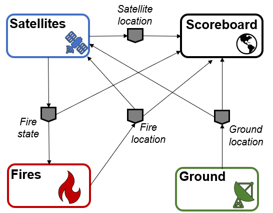

Figure 8. FireSat+ Test Case Event Publishers/Subscribers

.. _unmgdVSmgd:

Unmanaged Use Case
------------------

An unmanaged user application does not need to maintain an internal
representation of time. It does not subscribe to manager control events.
Instead, it triggers behavior in response to status events or events
published by other user applications. For example, the *Ground*
application in the FireSat+ case may not need an internal representation
of time if it only triggers in response to a change in Mode Status
issues as a message published by the *manager* application. Similarly,
the Scoreboard might subscribe to time status message events from the
manager application to display the scenario clock, but it does not need
to subscribe to any of the manager’s control events in order to
function. All the other visualizations on the scoreboard are triggered
by status messages from the other user applications.

Unmanaged user applications do not need to use manager commands to run,
instead they can be controlled solely through user commands. Although
the manager is not necessary to run unmanaged apps, testing has found
that regular heartbeat messages are useful for users to know if their
application is still running over long test cases. Figure 9 illustrates
how user commands, *not* manager application commands, start the user
applications and they will continue executing until a *user*-issued STOP
command, NOT a manager-issued STOP command.

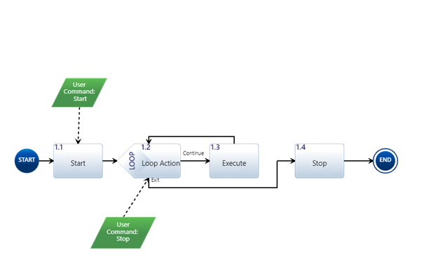

Figure 9. Behavior of Unmanaged User Applications. (click to enlarge)

Managed Use Case
----------------

A managed user application relies on the NOS-T manager application to
control various aspects of the simulation. These include starting the
simulation when all user apps are ready, governing and communicating
scenario time, and finally terminating the simulation. Unlike the
unmanaged use case, in a managed use case the Manager Application
triggers behavior in the user application throughout the test case. This
communication at its most basic level is seen in **Figure 10**. The
manager publishes messages to topics via the message broker. These
topics are subscribed to by user applications. For example, the
*Fires/Science* application in the FireSat+ test case may rely on
periodic time status events (e.g., published every 6 hours of scenario
time) to pull and update fire state information using the corresponding
time stamp before publishing a new *Fire Status* event.

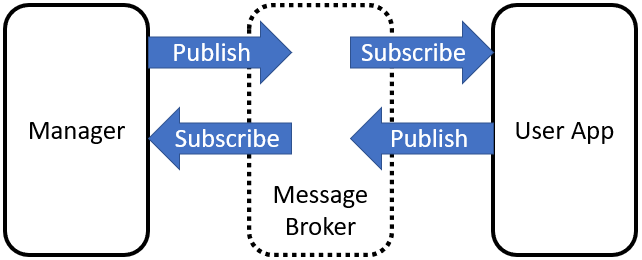

Figure 10. Basic Event Message Flow of Managed User Applications.

Figure 11 provides an overview of the types of messages that pass
between the manager and managed user applications.

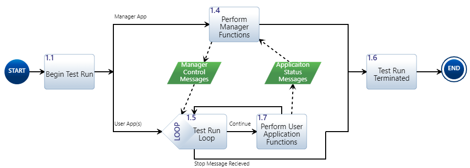

Figure 11. Simplified Behavior of Managed Application. (click to enlarge)

All messages between applications in NOS-T go through the message broker
via a publish/subscribe method. To begin a test case execution,
applications must subscribe to the manager's initialize command event to
initialize, mode status event to enable/disable behavior, and time
status event(s) to trigger temporal behaviors during a test case
execution. The choice of manager time status interval should be
coordinated in advance to align with a managed application's concept of
operations. Figure 12 illustrates how the initialize event triggers an
initialization activity, the EXECUTING mode status event triggers the
start of a main execution loop, the time status event triggers response
behavior, and the TERMINATING mode status event ends a test case
execution.

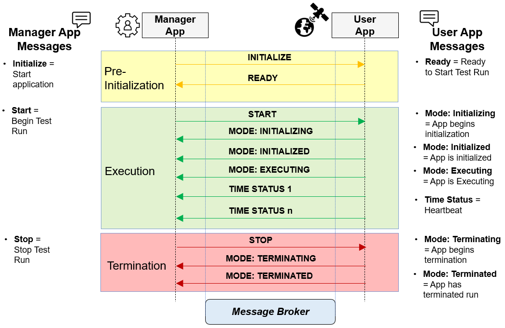

Figure 12. Detailed Message Flow for a Generic Managed Application. (click to enlarge)

Table 10 contains the necessary events, seen in Figure 12, that are
published for a managed application test case along with their publisher
and a description of the message payload.

.. table:: Table 10. Managed Application Messages and Descriptions

   +---------------+---------+--------------------------------------------+
   | **Message**   | **Publ  | **Message Contents Description**           |
   |               | isher** |                                            |
   +===============+=========+============================================+
   | Initialize    | Manager | Start and stop scenario times for a test   |
   |               |         | case execution                             |
   +---------------+---------+--------------------------------------------+
   | Ready         | User    | Indicates this application is prepared to  |
   |               | App     | enter the simulation.                      |
   +---------------+---------+--------------------------------------------+
   | Start         | Manager | Gives wallclock and scenario start times,  |
   |               |         | scenario stop times, and simulation time   |
   |               |         | scaling factor.                            |
   +---------------+---------+--------------------------------------------+
   | Mode:         | User    | Tells manager app that the user app is in  |
   | Initializing  | App     | the process of connecting to the broker    |
   |               |         | and establishing simulation variables      |
   +---------------+---------+--------------------------------------------+
   | Mode:         | User    | Tells manager app that user app is ready   |
   | Initialized   | App     | to begin test case execution.              |
   +---------------+---------+--------------------------------------------+
   | Mode:         | User    | Tells manager app that the simulation is   |
   | Executing     | App     | running with provided parameters.          |
   +---------------+---------+--------------------------------------------+
   | Time Status   | User    | Publishes time status messages at a        |
   |               | App     | regular interval (scenario time). The      |
   |               |         | interval is provided by the scenario start |
   |               |         | message and will begin at the time         |
   |               |         | indicated by the scenario.                 |
   +---------------+---------+--------------------------------------------+
   | Stop          | Manager | Command to stop a test case execution by   |
   |               |         | updating the execution end time.           |
   +---------------+---------+--------------------------------------------+
   | Mode:         | User    | Tells manager app that the simulation is   |
   | Terminating   | App     | in the process of disconnecting from the   |
   |               |         | broker.                                    |
   +---------------+---------+--------------------------------------------+
   | Mode:         | User    | Tells manager that this user app has       |
   | Terminated    | App     | disconnected from the broker.              |
   +---------------+---------+--------------------------------------------+

Interface Requirements
----------------------

The basic interfaces between the NOS-T system and user applications are
illustrated in Figure 13. Since NOS-T is a defined system with
established interfaces it *will* publish, subscribe, support, and
provide the items shown. For the purposes of this ICD, these interfaces
are a given and cannot be changed. To be compatible with the existing
NOS-T interfaces *shall* subscribe, publish, support, and provide the
items shown. These are shown as *shall* statements as they are mandatory
interface requirements. Specific interface requirements with acceptance
criteria are shown in Table 11.

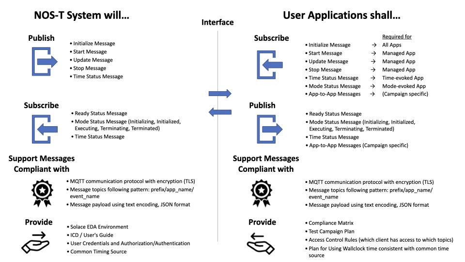

Figure 13. Basic interface between NOS-T system and User Applications. (click to enlarge)

.. list-table:: Table 11. User Application Interface Requirements
  :widths: 10 20 20 50
  :header-rows: 1
  :align: left

  * - Number
    - Name
    - Description
    - Rationale
  * - IR.1.0
    - Pub/Sub Messages
    - User applications shall publish/subscribe to the following NOS-T Manager messages.
    - User apps must be able to receive and send manager messages a test campaign to be orchestrated.
  * - IR.1.1
    - Sub Messages
    - User applications shall subscribe to the following NOS-T Manager messages.
    - User apps must be able to receive manager messages a test campaign to be orchestrated.
  * - IR.1.1.1
    - INITIALIZE Message
    - User applications shall subscribe to the manager INITIALIZE message.
    - The INITIALIZE message tells user application to prepare for the test case.
  * - IR.1.1.2
    - START Message
    - User applications shall subscribe to the manager START message.
    - The START message tells user application to prepare for the test case.
  * - IR.1.1.3
    - STOP Message
    - User applications shall subscribe to the manager STOP message.
    - The STOP message tells user application to prepare for the test case.
  * - IR.1.2
    - Pub Messages
    - User applications shall publish the following messages to the NOS-T system.
    - User apps must be able to receive manager messages a test campaign to be orchestrated.
  * - IR.1.2.1
    - INITIALIZED Message
    - User applications shall publish an INITIALIZED message to indicate application are ready to execute.
    - The INITIAILIZED message tells the manager that an application ready for execution.
  * - IR.1.2.3
    - EXECUTING Message
    - User applications shall publish an EXECUTING message to indicate application have started to execute the test case.
    - The EXECUTING message tells the manager that an application executing the test case.
  * - IR.1.2.4
    - TERMINATING Message
    - User applications shall publish a TERMINATING message to indicate application is preparing to terminate the test case.
    - The TERMINATING message tells the manager that it has received the STOP message and is preparing to terminate the test case.
  * - IR.1.2.5
    - TERMINATED Message
    - User applications shall publish a TERMINATED message to indicate application has ended the test case execution.
    - The TERMINATED message tells the manager that it has ended the test case execution.
  * - IR.2.0
    - Message protocols
    - User application messages shall comply with standardized protocols.
    - Standard protocols and encoding ensure interoperability with the NOS-T System and other user applications.
  * - IR.2.1
    - MQTT
    - User application messages shall use MQTT communication protocol with the pattern: prefix/app/event (TBC)
    - The event broker users the MQTT messaging protocol to publish and subscribe to event topics.
  * - IR.2.2
    - JSON
    - User application messages shall use JSON formatting for payload information.
    - The JSON encoding format is human-readable and easily serialized and de-serialized.
  * - IR.2.3
    - Encryption
    - User application messages shall use TLS encryption technique.
    - Encryption protects the contents of messages during transport from the client to the server.

Test Case-Specific Execution Requirements
-----------------------------------------

In addition to generic NOS-T interface requirements, each test case
establishes specific requirements for its user applications. The test
case-specific requirements include, but are not limited to:

-  Event topics, including which applications are publishers or
   subscribers.

-  Event message payload syntax and semantics.

-  Application behavior, e.g., response to specific events.

All user applications must subscribe to the manager application
following their execution mode (managed or unmanaged) but can freely
subscribe and publish to other user topics subject to access control
rules set by the NOS-T operator. Publishing and subscribing to user
applications should follow the topic hierarchy outlined in Section
3.2.1.

In general, user applications are recommended to use text message
payloads encoded in JSON. Some existing standards such as the
SensorThings API can provide guidance on object schema structure.
SensorThings data event entities include a *name* field, *description*
field, and *properties* sub-object in the JSON data. For example, the
payload for a *Fire Status* event in the FireSat+ test case (published
by the *Fires/Science* application and subscribed to by the
*Constellation/Satellites* application) can be structured as:

.. code-block:: JSON

  {
    "name": "fire",
    "description": "Models the spread of a fire.",
    "properties": {
      "timestamp": "2019-03-13T04:11:40+00:00",
        "intensity": 35398693.13517181,
        "latitude": 42.49602475523592,
        "longitude": -103.69767511612058,
        "windSpeed": 5,
        "growRate": 1.705270367448615,
        "fireStart": "2019-03-13T00:00:00+00:00"
    }
  }

Some test cases may require alternate communication protocols to
overcome broker limitations. For example, some test cases may consider
large data products that exceed the 30 MB maximum message payload. To
exchange large data products, applications may establish an alternate
hosting service (e.g., web server, repository, or network drive) and
simply send an URI to the data in the message payload.

Detailed User's Guide
---------------------

Defining Test Campaigns
-----------------------

For purposes of NOS-T system use, we have defined a test campaign to be
an organized collection of test suites designed to collect data to
accept or reject an observation strategy hypothesis (or hypotheses) as
shown in Figure 14. Test suites are logical collections of test cases
that differ from each one by ideally no more than one variable. A test
suite considers different scenarios beyond the designer's control (such
as different fire ignition scenarios in the FireSat+ example), whereas
the test cases each represent distinct design choices for the
observation strategy in question. We envision that this collection of
test suites and test cases comprises a test matrix developed using a
rigorous application of Design of Experiments methods.

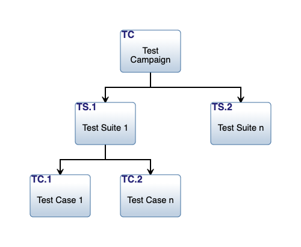

Figure 14. Hierarchical organization of test planning terminology used by
NOS-T.

One approach to developing a test matrix for a user's test campaign is
to start by creating a variation of the traditional NASA Science
Traceability Matrix (STM) that is focused on leveraging the NOS-T system
to answer specific questions about observation strategies. A
representative example for a NOS-T STM is shown in Table 12. This
example includes two related but distinct objectives/test campaigns for
the FireSat+ use-case. The STM is designed to help a principal
investigator map out the metrics, user applications/nodes, their
functional requirements, and test structure design. An example of a test
campaign with results for Objective 1 in the table can be found in the
appendix.

While use of this matrix is not mandatory from the NOS-T system
perspective, it is suggested that any principal investigator should
approach a test campaign with this level of rigor and that the questions
and implementation approach highlighted by this matrix need to be
defined well in advance of the campaign. A blank template for an STM is
included in the appendix.

Table 12. NOS-T System Science Traceability Matrix (click to enlarge)

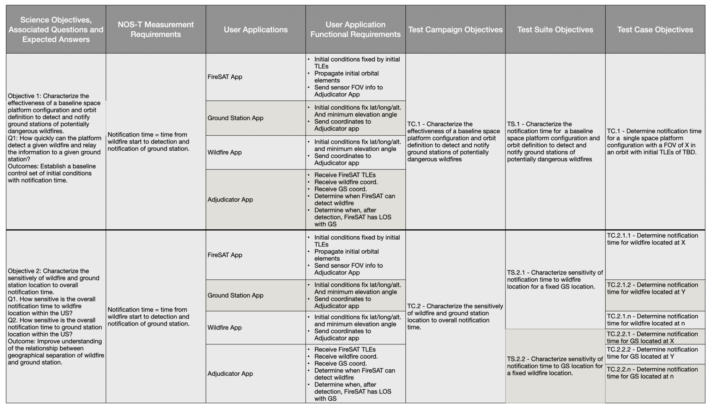

Each test campaign may comprise multiple test suites, each representing
a different scenario beyond the designer's control. In this example, the
test suites are distinguished by the science application. Test suite
*TS.1.1* uses historic VIIRS fire data for the conterminous United
States during the first five days of 2020, whereas *TS.1.2* uses
randomized global fire locations but with similar ignition schedules.
Each test suite may comprise multiple *test cases* to evaluate different
design choices for the observation strategy.

As any test campaign depends on the applications that will be employed,
two other useful thinking tools to aid in user app coordination are
suggested. The first is a Design Structure Matrix (DSM), which provides
a method to represent dependencies among system modules as a square
binary (0/1) matrix. The example in Table 13 shows the coupling between
applications in the FireSat+ test campaign. It is read clockwise. So, in
this example, data goes from the Satellite App to all the other three
apps. However, the satellite app only receives inputs from the ground
station and wildfire apps (not the scoreboard app).

The DSM is useful for initial app-to-app interface planning. To examine
the interfaces in more detail a second tool, a variation on the
traditional NxN matrix, can be used. An example for the FireSat+ test
campaign apps is shown in Table 14. The NxN is set up with the apps on
the diagonal and interfaces, from and to, are again read clockwise. The
items in the off-diagonal boxes represent messages being sent between
user applications and are labeled with the message topics.

Table 13. NOS-T Design Structure Matrix for FireSat+ Test Campaign User Applications.

.. image:: media/table13.png\

Table 14. NOS-T NxN Matrix for FireSat+ Test Campaign User Applications

.. image:: media/nxn.png\

Developing Applications
-----------------------

The NOS-T system serves as the airport, but the user applications are
the airplanes that take principal investigators on their scientific
journeys. The goal of NOS-T is to provide a universal interface and
“flight control” infrastructure that can support any type of application
that conforms to the basic interfaces described in this document. For
that reason, it is outside the scope of this document to describe the
internal functions of user applications. Users should apply their own
internal systems engineering and software development processes and
standards to ensure their applications meet their requirements
(verification) as well as fulfill intended purpose (validation) of
modeling real world observation strategy phenomena.

Tools, Templates, and Techniques
--------------------------------

Table 15 and Table 16 below list tools and templates found in the NOS-T
tools folder. The table gives a brief description of each as well as
their object classes. The object classes are given in the order they are
found in each .py file.

.. table:: Table 15. NOS-T Templates for Developing User Applications

   +-------------------+-------------------------+------------------------+
   | **Tool**          | **Description**         | **Object Classes**     |
   +===================+=========================+========================+
   | logger.py         | Records all messages    | N/A                    |
   |                   | published to a given    |                        |
   |                   | topic in a .txt file    |                        |
   +-------------------+-------------------------+------------------------+
   | manager.py        | Defines a manager       | TimeScaleUpdate        |
   |                   | application (inherits   |                        |
   |                   | Application class from  | Manager                |
   |                   | application.py) to      |                        |
   |                   | orchestrate test case   |                        |
   |                   | executions              |                        |
   +-------------------+-------------------------+------------------------+

.. list-table:: Table 16. NOS-T Templates for Developing User Applications
  :widths: 15 15 70
  :header-rows: 1
  :align: left

  * - Property
    - Description
    - Object Classes
  * - application.py
    - Contains functions to set up a user application and add/remove message callbacks.
    - Application
  * - application_utils.py
    - Contains helper classes for connecting an application to a message broker, shutting down the application on some event, and publishing time and/or mode status changes.
    - ConnectionConfig

      ShutDownObserver

      TimeStatusPublisher

      ModeStatusObserver
  * - entity.py
    - Contains the Entity class, which inherits properties of Observables (see observer.py) and maintains its own scenario clock.
    - Entity
  * - managed_application.py
    - Contains functions for a user application (inherits Application class from application.py) to handle external commands from a manager (see manager.py).
    - ManagedApplication
  * - observer.py
    - Defines classes for registering and notifying observers of property changes.
    - Observer

      Observable
  * - publisher.py
    - Defines classes (inherits Observer class from observer.py) for publishing status messages at regular scenario or wallclock time intervals.
    - ScenarioTimeIntervalPublisher

      WallclockTimeIntervalPublisher
  * - schemas.py
    - Contains Pydantic templates used for typical NOS-T Tasking Parameters and Commands.
    - InitTaskingParameters

      InitCommand

      StartTaskingParameters

      StartCommand

      StopTaskingParameters

      StopCommand

      UpdateTaskingParameters

      UpdateCommand

      TimeStatusProperties

      TimeStatus

      ModeStatusProperties

      ModeStatus

      ReadyStatusProperties

      ReadyStatus

  * - simulator.py
    - Defines Simulator class (inherits Observable class from oberserver.py) and its modes. Contains functions for adding and removing entities to Simulator.
    - Mode

      Simulator

Ensuring NOS-T Compatibility
----------------------------

Prior to participation in a test campaign, it is incumbent on users to
ensure the compatibility of their applications with the NOS-T
environment. At the most basic level, the only requirements for any
application are the ability to send and receive messages to a message
broker using the MQTT publish-subscribe network protocol and adhering to
JSON standard format. A basic MQTT compliance test shall be developed
and included with the NOS-T Tools so that users can test in advance
whether their application can properly send and receive messages.

Additional compatibility checks are required if the application in
question is intended to be a time-managed application, as this requires
the application be able to receive and respond to commands from the
manager. Most applications will likely need to be managed applications,
and thus an additional managed app compliance test shall be developed
and included with the NOS-T Tools so that users can test in advance
whether their application responds correctly to the manager commands.
The subscriptions to manager commands and the published responses
required include:

1. Initialize

   -  *Subscribe:* Initialize command from the manager on topic
      “{prefix}/manager/init” and update simulation start and end times
      accordingly

   -  *Publish:* Send “ready” message to topic
      “{prefix}/status/{app}/ready when the application’s MODE changes
      from INITIALIZE to INITIALIZED

2. Start

   -  *Subscribe:* Start command from the manager on topic
      “{prefix}/manager/start”

   -  *Publish:* Change application’s MODE from INITIALIZED to EXECUTING
      and begin to publish periodic heartbeat messages to topic
      “{prefix}/{app}/status/time”
3. Update

   -  *Subscribe:* Update command from the manager on topic
      “{prefix}/manager/update”

   -  *Publish:* Set the time scale factor to the new value at the
      simulation time specified by the manager and accordingly update
      the frequency of periodic heartbeat messages to topic
      “{prefix}/{app}/status/time”
4. Stop

   -  *Subscribe:* Stop command from the manager on topic
      “{prefix}/manager/stop}

   -  *Publish:* Update the end time of the simulation (possibly
      overwriting original simulation end time) and change mode from
      EXECUTING to TERMINATING and then TERMINATED.

The managed app compliance test will run a pre-set manager with a simple
simulation scenario to ensure the application can respond to these
manager commands.

Executing Test Campaigns
------------------------

During development of a new user application, the application developer
should orchestrate various test campaigns to verify compliance with the
NOS-T ICD and verify proper operation. The following timeline describes
a notional “day in the life” example for executing a test campaign.

* Write test script in compliance with user request. Check for:

  * Init time (UTC) (if requested differently than start time)
  * Start time (UTC)
  * Stop time (UTC)
  * Time publish step (in seconds)
  * Time scale rate
* Use prewritten test script to ensure manager functionality on a testing
  topic (i.e., lc-testing)
* Before simulation start, make sure manager is logged in and connected
  to the user-requested topic
* Send out prewritten script several minutes before start time,
  allowing all applications to receive the command – simulation will
  begin at the indicated start time
* Ensure on manager dashboard that messages are being received and
  simulation clock has begun.
* Keep close watch on user requests – a need to stop/restart the
  simulation may be sent at any time, as well as debugging help

  *  To stop simulation immediately, enter a time in the past (UTC)
  *  To restart simulation, use same script with adjusted start time

References
----------

.. [1]
  Solace Corporation (2021). " PubSub+ Event Broker: Software,"
  URL:  https://solace.com/products/event-broker/software/. Accessed
  2021-04-07.

.. [2]
  Solace Corporation (2021). "Open APIs & Protocols,"
  URL:  https://docs.solace.com/Open-APIs-Protocols/Open-APIs-Protocols.htm.
  Accessed 2021-04-07.

.. [3]
   NASA Center for Climate Simulation, (2021). "SMCE System Overview."
   URL: https://www.nccs.nasa.gov/systems/SMCE. Accessed 2021-04-07.

.. [4]
   OGC (2016). "SensorThings API Part 1: Sensing," Version 1.0, Open
   Geospatial Consortium.
   URL: http://www.opengis.net/doc/is/sensorthings/1.0

.. [5]
   OGC (2019). "SensorThings API Part 2: Tasking Core," Version 1.0,
   Open Geospatial Consortium.
   URL: http://www.opengis.net/doc/IS/sensorthings-part2-TaskingCore/1.0

.. [6]
   Eclipse Foundation (2021). "Eclipse Paho Python Client," URL:
   https://www.eclipse.org/paho/index.php?page=clients/python/index.php.
   Accessed 2021-12-20.

Appendices
----------

Sample test campaign - Firesat+ - Objective 1
---------------------------------------------

This test campaign corresponds to Objective 1 in the Science
Traceability Matrix in Table 12.

For this test campaign, the metric of interest is the time between a
fire's ignition and when it is first detected by a satellite in the
constellation or reported by that satellite to a ground station.
Detection and downlink events are assumed to occur instantaneously once
the satellite is within range. Consideration of data volumes, downlink
rates, and time within range of ground station are reserved for future
test campaigns. Summary statistics of center and spread for detect time
and report time distributions were recorded for each test case. Initial
tests of the integrated FireSat+ applications showed multi-modal detect
time distributions because a single satellite will detect several fires
in close proximity during the same time step given its instrument field
of view. The report time distributions were even more biased towards
multi-modality given that previously detected fires would *all* be
reported simultaneously once the satellite comes into view of a ground
station. For this reason, center and spread for these test cases are
summarized by median and interquartile percentiles (25\ :sup:`th` and
75\ :sup:`th`) rather than normal distribution descriptive statistics
(mean and variance).

Test case *TC.1.1.1* represents a verification test conducted during
application development using the historic TLE for the Suomi National
Polar-Orbiting Partnership (NPP) platform that carries the VIIRS
instrument, with the expectation that the fires would be “detected”
*immediately* after ignition since the test used VIIRS detection times
as historic *ignition* times. The subsequent test case used the same
fire ignition schedule but with *current* TLEs queried from CelesTrak
for fire-observing satellites Aqua (MODIS), Terra (MODIS), and Suomi NPP
(VIIRS) considered as a constellation.

Test suite *TS.1.2* is more representative of the comparative trade
studies facilitated by NOS-T. Test case *TC.1.2.1* uses the same TLEs as
*TC.1.1.2* to evaluate global coverage. Test case *TC.1.2.2* considers
an alternative architecture that replaces the Suomi NPP satellite with
Sentinel-2A (MSI) and Sentinel-2B (MSI) which share the same orbit with
a 180° phase difference. The VIIRS instrument has a much wider FOR
(112.56°) compared to MSI (20.6°), so this test suite investigates
tradeoffs between the number of spacecrafts in a constellation and
instrument view angle constraints.

The four test cases defined in Table 12 were executed in two scenarios.
The first scenario is limited to the first 100 fires from January 1,
1.    The second scenario considers a longer duration from January 1 –
5, 2020 that increases the sample size to 298 fires. Summary statistics
for detect and report times were recorded for both scenarios, with the
results from the longer scenario displayed in Table 17. Most of the test
cases in the short scenario had matching median and 25\ :sup:`th`
percentile measures, suggesting this sample size is not large enough for
a well-defined distribution. Results for the five-day scenario show more
spread, as can be visually confirmed by *TS.1.2* report time
distributions plotted in Figure 15 and Figure 16.

Table 17. FireSat+ Summary Statistics: First 5 Days

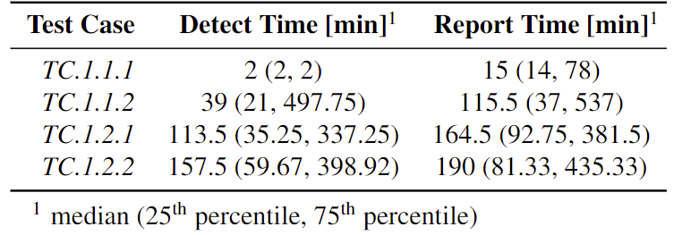

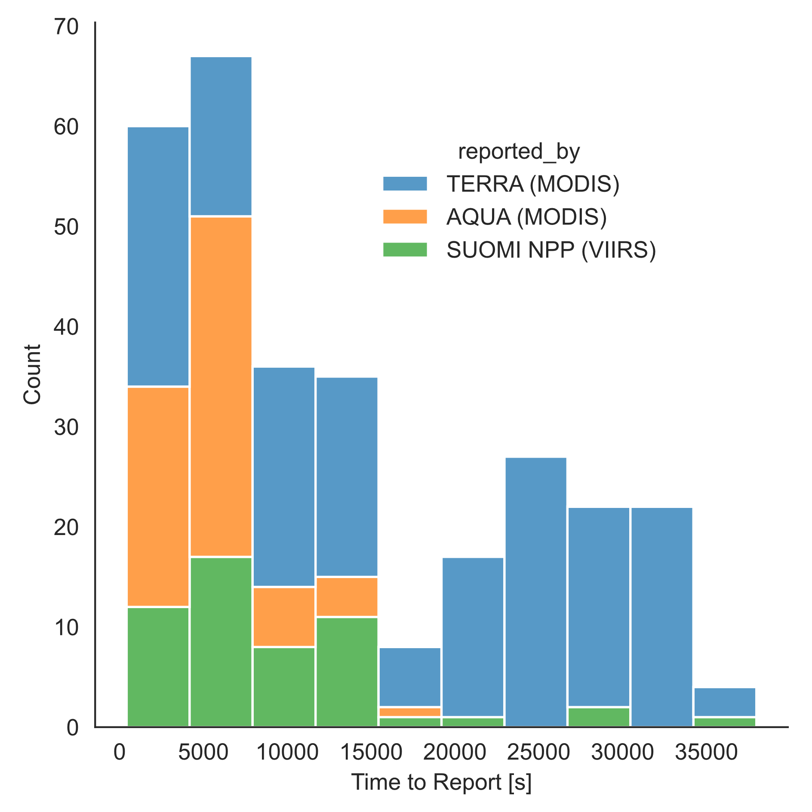

Figure 15. TC.1.2.1 Report time distribution coded by reporting satellite

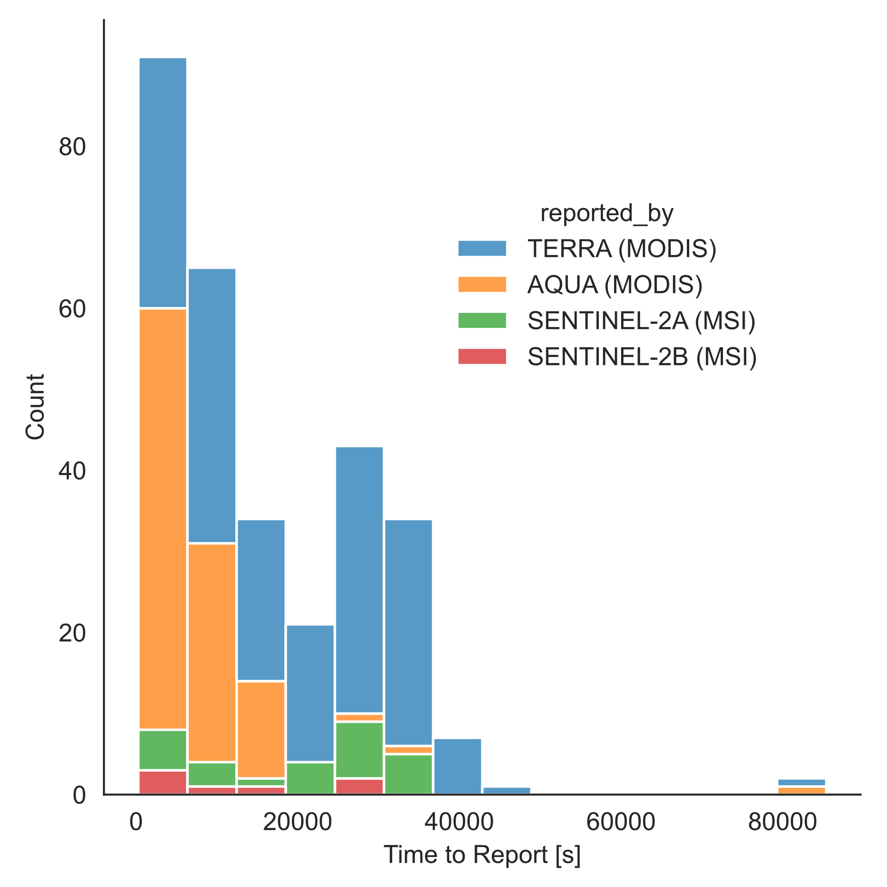

Figure 16. TC.1.2.2 Report time distribution coded by reporting satellite

Results are coded by reporting satellite for the stacked bar charts in
Figure 15 and Figure 16 to show the relative contributions of each
satellite in the constellation. These tests show that FOR constraints on
the Sentinel spacecraft limit their contributions to the constellation
performance relative to Suomi NPP.

Blank Science Traceability Matrix Template
------------------------------------------

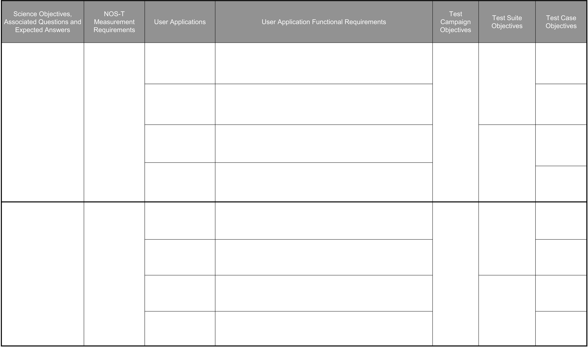

Download a blank STM :download:`here </release_docs/icd/media/blankSTM.xlsx>`

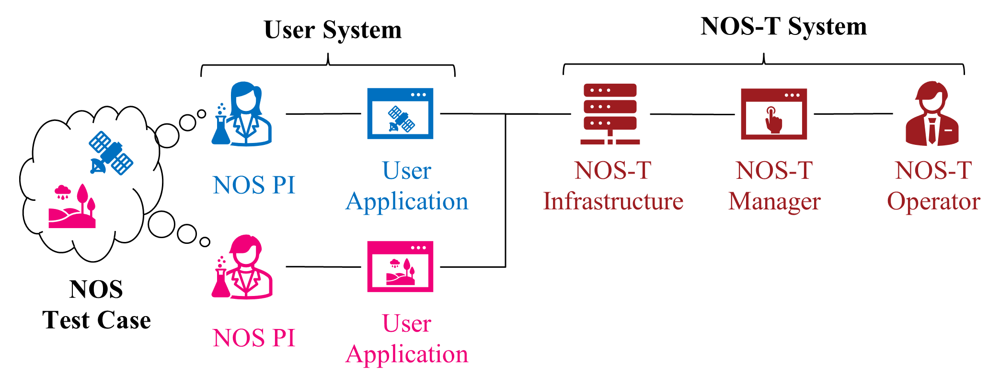

