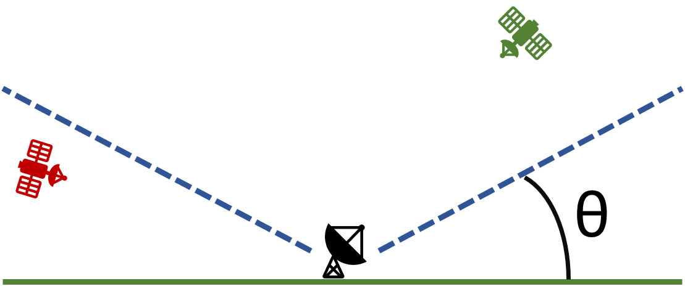

.. _groundTemplateConfig:

template.yaml
=============

The ground station application reads its connection and execution settings from a YAML configuration file, so a scenario can be changed without editing any Python.

Under ``servers``, the ``rabbitmq`` block identifies the broker and how to authenticate against it. Under ``execution``, the ``general`` block sets the :obj:`prefix` for the channel this application publishes to, which must match the prefix used by every other application in the test case.

The station locations live under :obj:`configuration_parameters`, and are reached in Python through ``config.rc.application_configuration`` once the configuration is loaded with an ``app_name``. Each entry gives the ground station's latitude and longitude, and its elevation angle. The definition of elevation angle isn't completely consistent across fields; here it means the angle between the ground and a cone above the ground station where the satellite is visible. In the figure below, the green satellite is visible and the red one is not. The elevation angle is denoted by :math:`{\theta}`.

|

You have the ability to use this template to represent any number of ground stations. The :obj:`stations` list below contains a single entry; add further entries with their own :obj:`groundId` to model a network of stations.

.. literalinclude:: /../../examples/application_templates/ground_station_template/template.yaml
  :language: yaml
