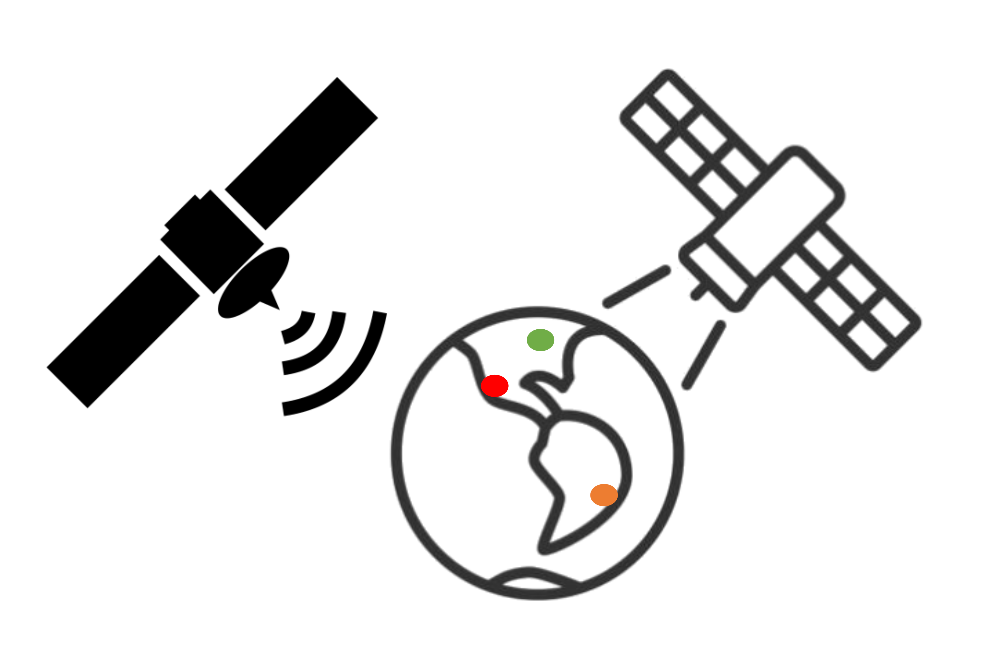

.. _randomEventTemplate:

Random Global Events
====================

This template provides functionality for modeling randomly-timed triggers at random geographic locations. Events are referred to generically, but this template can be adapted to represent any geospatiotemporal phenomena. You can find these files within the *nost-tools/examples/random_global_events* folder after you :ref:`clone the GitHub repository <installation>`.

   
   Areas of Interest Triggered at Random Times
   
Please note that this template is built as a *managed* application - meaning that it responds to control events from the NOS-T :ref:`manager application <manager_template>`. An in-depth description of the Manager and these control events is :ref:`found here <icdManager>`. 

.. toctree::
  :maxdepth: 1

  main_RandEvents
  config
  schemas