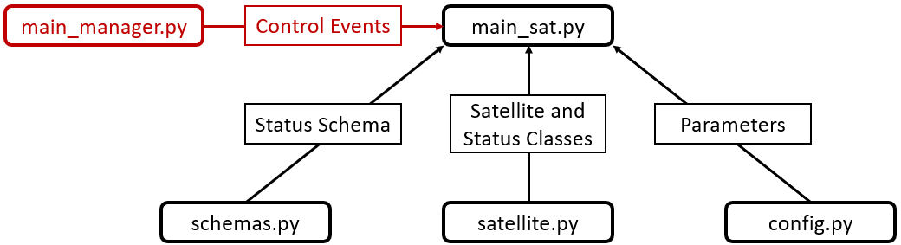

.. _basic_satellite:

Basic Satellite
===============

This set of four Python scripts model a basic satellite. Its main functions are to propagate an orbit from Two-Line Elements, check if a point on Earth is within a set field of regard, and see if a ground station is viewable. You can find these files within the nost-tools/examples/satBaseClass folder after you :ref:`clone the GitHub repository <installation>`. 

You need all four of the following files in the same folder: :ref:`satBaseMain`, :ref:`satBaseSchemas`, :ref:`satBaseSatellite`, and :ref:`satBaseConfig`. This architecture (seen in a diagram below) is *not* the only way to model a satellite in NOS-T, but has worked well for the development team. The black boxes with sharp edges denote the data being pulled in by the main_sat.py entry point code. 

  
Simplified Architecture Diagram of the Basic Satellite Template

Please note that this template is built as a *managed* application - meaning that it responds to control events (red box with sharp edges in the above figure) from the included NOS-T :ref:`Manager <satBaseManager>` application. These include initialization, startup, and timing commands - an in-depth description is :ref:`found here <icdManager>` It does not matter if main_manager.py is in the same folder as the other files or not.

.. toctree::
  :maxdepth: 1

  main_sat
  satellite
  schemas
  satConfig
  main_manager