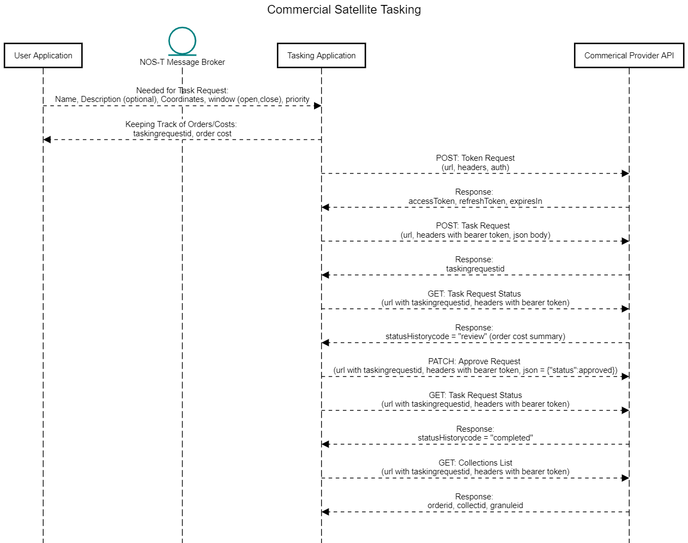

Common Interactions Library
===========================

Here you will find descriptions and schema for interactions which are common for NOS-T test suites.

Connecting to the Solace Broker
-------------------------------

Publishing Status Messages
--------------------------

When handling scenarios with multiple applications and scaled time, ensuring that each application is staying true to the internal timescale is critical
to receive accurate results. To accomplish this, a heartbeat message can be used to report the internal application time, as well as state updates, to a channel
solely for aggregating these statuses. Heartbeat messages can also be used to display the status of broker connectivity, which can be useful for the debugging process.

.. image:: media/HeartbeatMessage.jpg
   :width: 600
   :align: center

There are three significant phases of communication between the manager and the user application. The initialization block contains a simple initalized message, responsed to by a ready
status message. In the Start phase, status modes are updated and time status messages are published for the duration of the scenario. In the final stage, the stop phase, the application alerts the manager
 of it's termination and halts the time status messages. Example schemas are shown below for each of the messaging examples. 

This is an example schema for an initialize message, where the application base stats are reported to the manager upon connection. 

.. literalinclude:: /schemaexamples.txt
	:lines: 1-10

This schema shows an instance of a heartbeat message, reporting time and state updates to the manager.

.. literalinclude:: /schemaexamples.txt
	:lines: 12-24

Tasking a Commercial Satellite Observation
------------------------------------------

With the pool of commerical satellite providers growing, there is an oppurtunity to leverage the data accesible by these satellites through tasking.
However, understanding which satellites to task and how to task them can be difficult. This sequence diagram breaks down the general messaging process for 
taskign a commerical provider, and understanding what data needs to be exchanged by RESTful messaging sequences.

This example schema shows the initial tasking request from a user to the tasking application responsible for submitting to the API.

.. literalinclude:: /schemaexamples.txt
	:lines: 26-37

This schema shows an example of a return message, where the response received by the commerical API may be reported back to the scenario. 

.. literalinclude:: /schemaexamples.txt
	:lines: 26-37   

Transferring Data from a Third-Party Source
-------------------------------------------

When using large or protected data sets, it may not be possible to store all data internally. When this is the case, a scenario may require
access to a third party data storage option, like an S3 bucket. This sequence diagram details the interactions necessary to support this third party connection,
and how large data sets may be integrated for use into the testbed.

.. image:: media/ExternalDataExchange.jpg
   :width: 600
   :align: center
