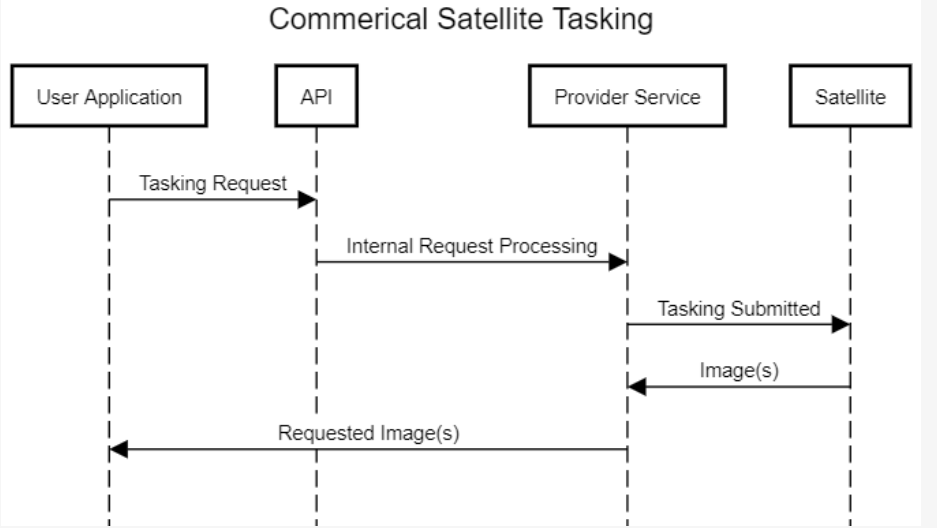
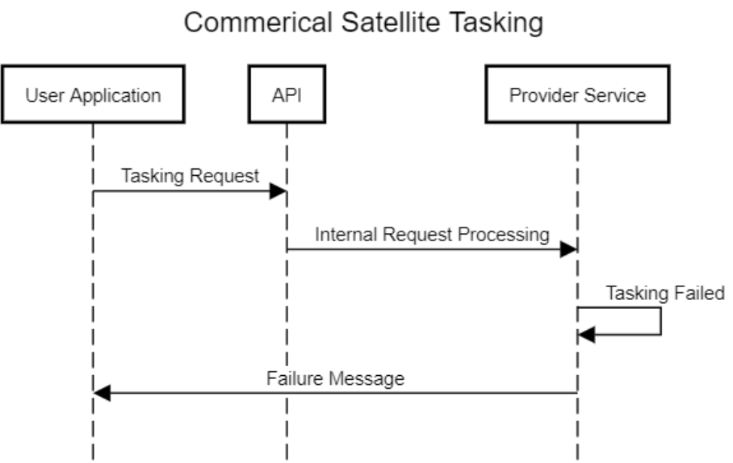
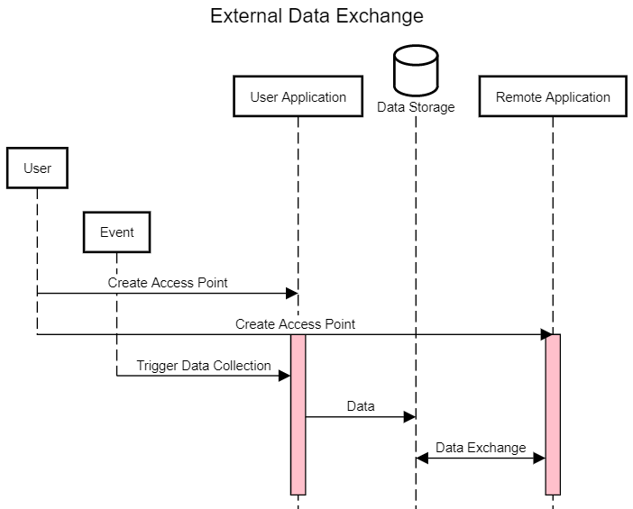

Common Interactions Library
===========================

Here you will find descriptions and schema for interactions which are common for NOS-T test suites.

Connecting to the Solace Broker
-------------------------------

Publishing Status Messages
--------------------------

In large managed applications, it is critical to keep track of an individual application's internal tiem and connection. To accomplish this,
a heartbeat message can be used to publish internal timestep and state information to monitor application behavior. This is also critical to 
manage disconnects, as the ceasing of the heartbeat message without proper termination, or termination before simulation end can help to troubleshoot.

.. image:: media/Heartbeat_message.png
    :width: 600
    :align: center

!!! INSERT SCHEMA !!!

Tasking a Commercial Satellite Observation
------------------------------------------

As the availibility of commerical satellite imaging providers grows, the oppurtunity to leverage 3rd party data sets is growing.
The process of submitting a tasking request and using the image in a testbed format, and is defined in the sequence diagram below. 

.. image:: media/APITaskingRequest.png
    :width: 600
    :align: center

!!! INSERT SCHEMA !!!

Paying for a Commercial Satellite Observation
---------------------------------------------

In a scenario similar to the tasking request, automating the payment process alongside the tasking request in critical is ensuring smooth mission operation.
The following sequence diagrams represent potnetial models for interaction, where the request and payment was successful or failed. 

!!! INSERT SCHEMA !!!

!!! INSERT SCHEMA !!!

Transferring Data from a Third-Party Source
-------------------------------------------

!!! INSERT SCHEMA !!!

