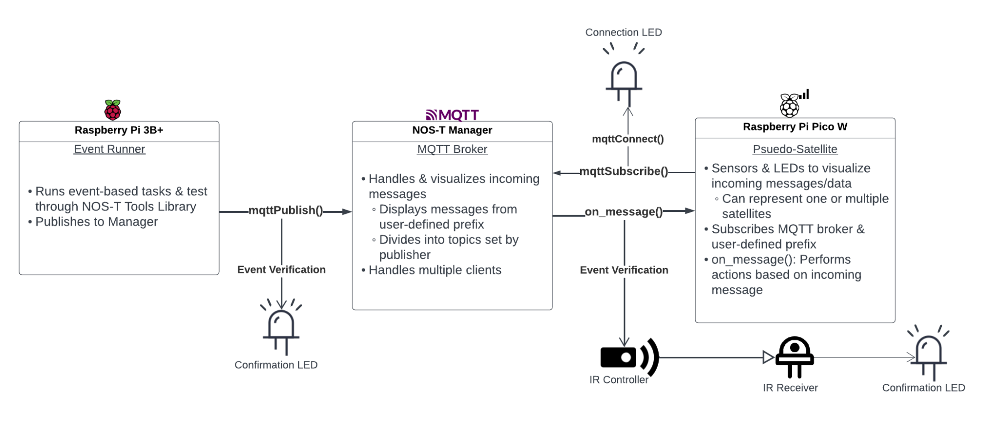
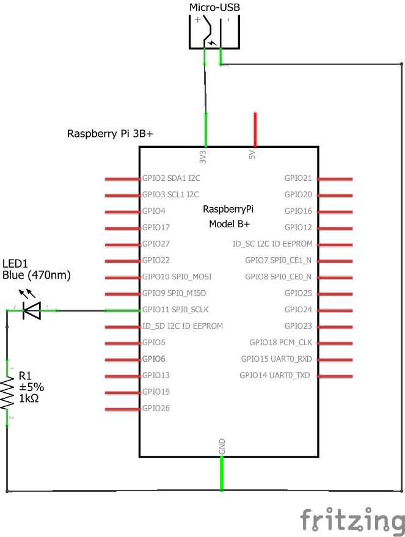
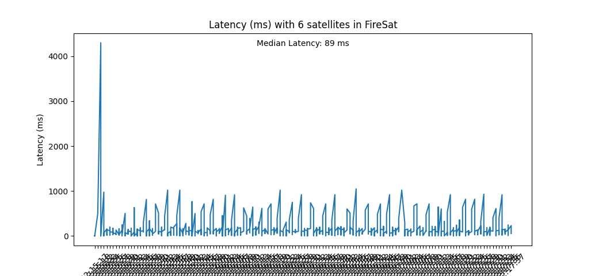
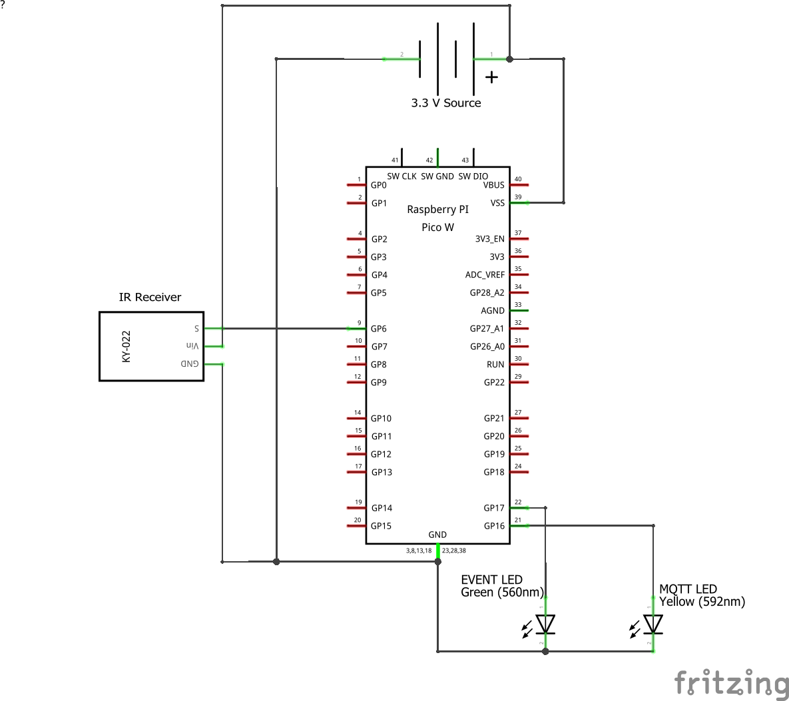

Implementing Hardware with NOS-T
================================

Introduction
------------

In order to further test the capabilities NOS-T, single-board
computers (SBCs) will be implemented to perform event-based tasks to
provide visual indication of system imaging and downlinking for example,
and to demonstrate how real-time events can change when coexisting with
physical modules.

The hardware testbed focuses primarily on exploring how MQTT connection,
message payloads, and its publish-subscribe protocol behave when run on
an SBC and multiple microcontrollers. The hardware testbed utilizes
pre-existing NOS-T test cases such as FireSat+ to promote better
understanding of NOS-T in an isolated environment where more physical
variables such power consumption, runtime, and message latency are more
prevalent.

A link to hardware testbed's GitHub repository can be found `here <https://github.com/hteele/nost-hardware-testbed>`_. It includes all of the code that will be referenced in this document, as well as necessary WiFi initialization and MicroPython libraries.

Methodology
-----------

The NOS-T hardware implementation begins by installing the libraries
necessary to connect various SBCs and microcontrollers to the NOS-T
manager. It is also recommended to install the Eclipse Mosquitto and
paho-mqtt libraries for preliminary and local MQTT testing and
connection.

The hardware module is built around a Raspberry Pi 3B+ with Python 3.10,
and four Raspberry Pi Pico Ws loaded with MicroPython 1.20.0. Though the
Picos utilize the same libraries, it is important to note that each Pico
has a unique client ID in order to properly establish connection to the
manager. The four Picos had male header pins soldered in so they could
be properly connected to a breadboard. A module was devised out of six
400-pin breadboards, where the Picos were installed on the outermost
four boards, allowing DC power and other connections to be made through
the two central breadboards. The module was powered by a 9 V battery
connected to a breadboard power supply module with a step-down voltage
regulator to 3.3 V to meet Pico voltage requirements. For purposes of
experimentation and demonstration however, only one Pico was used to
allow the testbed’s foundations to be built in a smaller, more isolated
scope.

For further reference, the Pi 3B+ will execute all event-based tasks
(e.g. FireSat+ applications), and will publish necessary messages to the
NOS-T manager (MQTT broker). Here, messages are seen and divided into
their respective MQTT topics through a defined prefix (referred to as
{PREFIX}). The Pico module will subscribe to the broker and act as a
pseudo-satellite, having the ability to represent one or more satellites
by subscribing to topics containing information about the respective
satellite(s). The Pico will handle the sensor and LED integration
through MQTT’s ‘on\_message’ callback function.

|image1|

Establishing Wireless Connection
^^^^^^^^^^^^^^^^^^^^^^^^^^^^^^^^

To connect the Pico module to the MQTT broker, the lightweight library
umqtt.robust was used to handle the connection, topic subscription, and
payload handling. This was an excellent library to utilize due to its
simplicity and similarities to paho-mqtt (unavailable in MicroPython).
MicroPython’s native network library was also essential to establishing
connection to a wireless network. Below is a simple example of two
functions that establish WiFi and MQTT connection.

.. code-block:: python3

   import network
   from wificonfig import *
   from umqtt.robust import MQTTClient

   def wifi_connect():
      wlan = network.WLAN(network.STA_IF)
      print('Connecting to WiFi...')
      wlan.active(True)
      wlan.connect(ssid, password)
      print('Connected to WiFi:', ssid)

   def mqtt_connect():
      try:
         CLIENT.set_callback(on_message)
         CLIENT.connect()
         print('MQTT: Connected to', HOST)
         CLIENT.subscribe(TPC)
      except Exception as e:
         print('MQTT: Error connecting to MQTT:', e)

It is important to note that a wificonfig.py file is utilized and
strongly recommended for consistency of methodology between existing
NOS-T examples and hardware connectivity. The wificonfig.py file houses
a user’s SMCE login, ssid and password for wireless connection, an MQTT
prefix and client identification, and any necessary topics.

An error handler is implemented within the ‘mqtt\_connect()’ function.
Due to the nature of a microcontroller, sometimes wireless connection
will not be the most stable. Adding in this extra layer is especially
helpful when distinguishing coding errors or broker-wide connection
issues. When operating without a console, a user can add a visual aid
when experiencing MQTT connection errors within the “try-except” loop.
It is recommended to blink the onboard LED when a connectivity error
occurs. This implementation can be seen in the full-scale IR test case.

Below is the definition of the callback function ‘on\_message’ as seen
in the previous code block. This function handles incoming messages and
executes desired logic written in the function definition. This is
essential if a user would like some sort of hardware activation due to
an incoming message (LED blink, display a message on a screen, etc).

.. code-block:: python3

   def on_message(topic, msg):
    print('Received message on topic:', topic)
    print('Message:', msg)
    # Logic will follow ... do xyz upon message reception
    
   while True:
      CLIENT.check_msg()

The ‘check\_msg()’ function is also called within what can be considered
the “main loop” of the script. This function invokes ‘on\_message’, and
while in a “while True” loop, will continuously invoke ‘on\_message’. It
is important to keep in mind the periodicity of the function call, as
constantly calling it will draw ambient and unnecessary current draw. To
prevent unnecessary power consumption, consider a time delay or invoking
the function only when a condition is met such as a Boolean flag.

Power Conservation Modes
^^^^^^^^^^^^^^^^^^^^^^^^

Space systems must be sure to draw the necessary amount of power to
ensure power sources are not drained or components are not overloaded.
This requirement was explored in the hardware testbed, as if it were to
be truly isolated, it would require an external power source and utilize
power-saving methods.

Research into low-power modes on a Pi Pico led to a user-created
MicroPython library that implements various power-saving functions. User
tomjorquera’s lowpower library provided two promising methods, dormant
and light sleep mode. Dormant mode was experimented with but proven to
be too unstable, as the Pico would constantly get stuck in the dormant
state. Thus, lightsleep() was chosen. It works very simply, by calling
ARM’s wfi() instruction, which induces the processor into a low-power
state until a pin interrupt is received.

To test how much power is conserved, a Pico was set to enter
lightsleep() and once an infrared signal was received on GPIO6, exit
lightsleep() and establish connection to WiFi and MQTT.

+------------------------+---------------+----------------+------------------+
|                        | Voltage (V)   | Current (mA)   | Power (mW)       |
+------------------------+---------------+----------------+------------------+
| lightsleep()           | 3.3 V         | 32.7 mA        | 107.91 mW        |
+------------------------+---------------+----------------+------------------+
| WiFi/MQTT Connection   | 3.3 V         | 41 - 60 mA     | 135.3 - 198 mW   |
+------------------------+---------------+----------------+------------------+

This experiment proved consistent with tomjorquera’s benchmarks. It is
important to note there is a slight deviation in the ambient low-power
current draw due to two peripherals, a DS1302 real-time clock and an IR
receiver, being connected and powered by the Pico.

Module Components 
^^^^^^^^^^^^^^^^^

The use of multiple breadboards and microcontrollers naturally invites
modular expansion within the testbed. Many components were considered
throughout the development of the testbed such as photosensors,
gyro-accelerometers, and an I2C LCD display. The final testbed consists
of three LEDs, an IR receiver, and an IR remote control.

*Event Confirmation LEDs*

Two event confirmation LEDs were implemented to visualize important
steps in the process of an event-based task in the absence of a console.
Using FireSat+, a confirmation LED connected to the Pi 3B+ provides a
user visual confirmation that a satellite (for now, we will use SUOMI
NPP) is within an acceptable range of communication of a ground station.
FireSat+ already provides us the ‘commRange’ boolean, allowing us to
parse the JSON data in an ‘on\_message’ function to light up the LED.

.. code-block:: python3

   import RPi.GPIO as GPIO
   ...
   confirmLED = 11

   def setup():
      GPIO.setmode(GPIO.BOARD)
      GPIO.setup(confirmLED, GPIO.OUT)
      GPIO.output(confirmLED, GPIO.LOW)
      
   def on_message(CLIENT, userdata, msg):
      global json_data, confirmLED
      json_data = json.loads(msg.payload)
      comm_range = json_data.get("commRange")
      
      if comm_range:
         GPIO.output(confirmLED, GPIO.HIGH)
         print("Satellite within range of a station.")
      else:
         GPIO.output(confirmLED, GPIO.LOW)

Since we are using the Pi 3B+, we must import the native GPIO library to
give us access to the pins. Demonstrated is the aforementioned
‘on\_message’ function, where the hardware logic can be executed once a
message is received.

The second confirmation LED is implemented in the Pico module. The
function is quite similar, however relies on the reporting of a fire as
its primary trigger. Aside from being a visualization of an event
trigger, this confirmation LED can be representative of a downlink
signal from a satellite to the respective ground station, as the LED
will only trigger a) once in range of a ground station and b) upon the
reporting of a fire.

.. code-block:: python3

   from machine import Pin
   from wificonfig import *
   from umqtt.robust import MQTTClient
   import network

   CONFIRM_PIN = 17
   confirmLED = Pin(CONFIRM_PIN, Pin.OUT)
   ...
   def on_message(topic, msg):
      print("Received message on topic:", topic)
      confirmLED.on()
   ...
   while True:
   ...
      wifi_connect()
      mqtt_connect()
      try:
         CLIENT.check_msg()
      except Exception as e:
         print('MQTT: ERROR checking messages:', e)

The implementation of the Pico’s confirmation LED is similar to how it
is done on the 3B+. A pin initialization is set using the machine
library, allowing us to access the GPIO pins. Since the topic
“{PREFIX}/constellation/reported” is only utilized upon a fire report,
one can simply turn the LED on once a message arrives to that topic.

*MQTT & Standby LEDs*

Verifying a successful WiFi and MQTT connection on the Pico is as simple
as making the necessary functions and checking the console for
successful print statements. However, how would one know if their
connections are successful when running the testbed through an
independent power source (that is, not connected to a laptop and IDE)?
These two LEDs provide visual aid upon the Pico’s connection to WiFi and
an MQTT broker.

.. code-block:: python3

   ...
   mqttLED_PIN = 16
   ...
   mqttLED = Pin(mqttLED_PIN, Pin.OUT)
   standby = Pin("LED", Pin.OUT)
   ...
   def wifi_connect():
      wlan = network.WLAN(network.STA_IF)
      print("Connecting to WiFi...")
      wlan.active(True)
      wlan.connect(ssid, password)
      print("Connected to WiFi:", ssid)
      standby.on()

   def mqtt_connect():
      try:
         CLIENT.set_callback(on_message)
         CLIENT.connect()
         print('MQTT: Connected to', HOST)
         CLIENT.subscribe(SAT_TPC4)
         mqttLED.on()
      except Exception as e:
         print('MQTT: Error connecting to MQTT:', e)

When each function is called, their respective LED will be triggered,
providing the user confirmation that both wireless and MQTT connections
were successful. It is recommended that a ‘blink()’ function is
implemented and called upon an error in connection to provide further
debugging.

*IR Receiver & Controller*

In addition to LEDs, an infrared receiver and controller was chosen to
test the performance of the testbed when presented with a physical
signal. The IR receiver can be viewed as a pull-up resistor, maintaining
a HIGH state until an IR signal is received. Upon reception, the
receiver pulls the SIG pin to a LOW state (referred to as the ‘falling
edge’). The detection of the falling edge is the event that will trigger
the function ‘ir\_handler’ to be called, allowing the Pico to wake up
from a low-power mode.

.. code-block:: python3

   from machine import Pin
   import utime

   IR_PIN = 6
   DEBOUNCE_MS = 200

   last_ir_time = 0

   def ir_handler(pin):
      global in_low_power_mode, ir_received, last_ir_time

      # Grab current time
      current_time = utime.ticks_ms()

      # Check if the IR signal occurred within the debounce window
      if current_time - last_ir_time >= DEBOUNCE_MS:
         last_ir_time = current_time

         # Set the IR received flag and exit low-power mode
         ir_received = True
         in_low_power_mode = False

   ir = Pin(IR_PIN, Pin.IN, Pin.PULL_UP)
   ir.irq(handler=ir_handler, trigger=Pin.IRQ_FALLING)

As seen above, a debouncing method (using a window of 200ms) had to be
implemented to ensure that one IR signal triggered only one request.
Without a debounce function, one IR trigger from the controller could
signal up to twenty requests on the receiver. An interrupt was then
defined after the IR pin definition, allowing the Pico to call the
‘ir\_handler’ function once a falling edge is detected. Once the handler
executes, two Boolean flags are set, allowing the board to exit the
low-power mode and execute the necessary connections. The IR receiver
should be triggered upon the activation of the 3B+’s confirmation LED to
ensure the board is awake and awaiting messages on the MQTT topic.

Test Cases
----------

As development of the hardware testbed progressed, the need for
small-scale test cases became apparent in order to test hardware
subsystems, functionality, and overall structure. These test cases
utilize many of the same libraries used in NOS-T examples such as
paho-mqtt and Skyfield.

Sunlit Test Case
^^^^^^^^^^^^^^^^

To begin the development of the hardware-in-the-loop testbed, the first
test case was developed to demonstrate how the MQTT protocol will
function with microcomputers, microcontrollers, and simple peripherals.
An initial setup phase was conducted where the nost-tools library was
installed onto a local machine and a Raspberry Pi 3B+. From there, a
simple MQTT protocol was established locally using Eclipse Mosquitto.

Using Mosquitto to locally host a message broker, a Python script was
created using Skyfield to load two-line element (TLE) data and determine
when the satellite was in sunlight or in shadow. From here, an LED
connected to the Pi 3B+ would light up accordingly.

Sunlit Publisher

.. code-block:: python3

   while True:
    now = datetime.utcnow()
    timeS = ts.utc(now.year, now.month, now.day, now.hour,
   now.minute, now.second)
      sunstat = satellite.at(timeS).is_sunlit(eph)

      if sunstat:
         transit_status = "sunlit"
      else:
         transit_status = "in shadow"

      print(timeS.astimezone(utc))

      print("Satellite is", transit_status)
      client.publish(MQTT_TPC2, transit_status)
      print("Updating in 5 minutes...")
      time.sleep(300)

Sunlit Subscriber

.. code-block:: python3

   def on_message(CLIENT, userdata, msg):
    print(msg.topics" "+str(msg.payload))
    message = msg.payload.decode("utf-8")
    if msg.topic == TPC and message == "sunlit":
        GPIO.output(11, GPIO.HIGH)
        print("ISS is sunlit")
    else:
        GPIO.output(11, GPIO.LOW)
        print("ISS is in shadow")

|image2|

Latency Test Case
^^^^^^^^^^^^^^^^^

The addition of the Raspberry Pi Pico W brought forth several
interesting concerns to the hardware testbed. One concern was the
latency of messages, and if an established connection between a broker
and a physical circuit would have any worthwhile capabilities. The next
concern was that of power consumption, an issue highlighted earlier.
This next test case aims to address both of these concerns within the
context of FireSat+.

FireSat+ was used in this test case due to its reliability and constant
message-publishing to the MQTT broker. The MicroPython library utime was
used to obtain accurate measurements for time delays between messages
published to the MQTT broker.

The first latency test was done by establishing one satellite in
FireSat+ (fewer messages published to {PREFIX}/constellation/location).
A multimeter was connected to VSYS and 3.3 V on a Pico and a test script
was executed to measure the delay between the current time and the time
a message was received.

.. code-block:: python3
   
   def on_message(topic, msg):
    received_time = utime.ticks_ms()  # Grab current time (ms)
    latency = received_time - start_time  # Calculate latency (ms)

    offset = -4 # Set offset for UTC-4 (EST)
    current_time = utime.localtime()
    current_time_adj = list(current_time)
    current_time_adj[3] += offset
    current_time_adj = tuple(current_time_adj)

    print("Latency for message: {} ms".format(latency))
    print("Current time: %02d:%02d:%02d" % current_time_adj[3:6])

    # Calculate payload size
    payload_size = len(msg)  # Calculate the size of string (bytes)
    print("Payload Size: {} bytes".format(payload_size))
   ...
   start_time = utime.ticks_ms()  # Read the start time (ms)

When a message was received on any topic (using {PREFIX}/# as per MQTT
standards), the latency, payload size, and current time was published to
a console and then graphed using the matplotlib.pyplot library.

|image3|

Current Draw: 42 - 58 mA +/- 5%

The results were quite interesting to analyze, and there are a few
takeaways from having one satellite client as opposed to six. The
messages nearing 1000 ms were those published to the topic
“{PREFIX}/constellation/location”, and those messages seemed to always
have a latency between 950 ms and 1018 ms. Messages with little response
time typically seemed to contain smaller payloads, usually being
messages relating to the manager or fire reports. The entirety of
FireSat+ drew between 42 - 58 mA of current, with noticeable spikes
occurring during larger message payloads such as the location of a
satellite.

The next test was done with six satellites initialized in FireSat+, the
default number found in the test suite. The setup procedure was the same
as the last latency test, with a multimeter being connected to the Pico
and running the same latency calculations.

|image4|

Current Draw: 56 - 70 mA +/- 5%

There are a few things to highlight in this example. There was a large
response time upwards of 4000 ms at the initialization of the test
suite. This has either been attributed to the manager’s synchronized
execution start that is built into FireSat+’s manager application, or
general MQTT traffic that occurred on the broker. A message response
time of ~1000 ms is consistently found in both test cases, which is
attributed to the messages published to
“{PREFIX}/constellation/location”. Disregarding the extraneous response
of ~4000 ms, the median latency did seem to increase with the addition
of five more satellites, dramatically increasing the amount of messages
published to the location topic. The current draw seemed to increase as
well, actively drawing between 56 - 70 mA.

Infrared Test Case
^^^^^^^^^^^^^^^^^^

The implementation of physical signals and sensors was explored to
research further compatibility within the isolated testbed. An IR
receiver and accompanying remote control was decided on, which came
included in a Sunfounder Sensor Kit that was made for the Pi B+, but
works just as well on a Pi Pico. The purpose of these sensors was to
study how well an isolated system reacted to the reception of a physical
signal, and how that could be used in tandem with the aforementioned
lightsleep() mode.

The receiver was grounded and connected to 3.3 V, with the SIG pin
connected to GPIO6. As mentioned in ‘Module Components’, the receiver
can be viewed as a pull-up resistor with a pin interrupt being triggered
upon detecting a falling edge on GPIO6. With debouncing implemented, the
Pico will enter lightsleep() mode to optimize power consumption, and
will wake up and connect to WiFi and to the MQTT broker upon reception
of an IR signal (initiated from a remote control operated by a user).

The lightsleep() function proved to be effective, reducing power
consumption by around 45%. Establishing a wireless connection after
exiting a low-power mode was also found to be effective, as there were
no significant differences in how a connection was established regularly
versus after exiting a low-power state.

|image5|

Lessons Learned & Moving Forward
--------------------------------

The hardware-in-the-loop implementation to the NOS testbed provided many
useful lessons and insights as to how microcontrollers and sensors
interact with the NOS-T environment. In an isolated hardware
environment, power consumption is essential to long-term performance of
the system, and power-saving methods such as lightsleep() were crucial
to maintaining an isolated environment safely and efficiently.

It should be noted that powering multiple Pico’s requires a high-quality
power supply with necessary voltage requirements (min. 1.8 V - max. 5.5
V, 3.3 V recommended). Certifying the quality of your power source is an
important step to avoid burning out your circuit and sensors.

For users who wish to implement similar infrared methodologies, it is
pertinent to verify the performance and quality of the IR receiver.
Ensuring that the receiver is not susceptible to extraneous noise or
lingering signals will drastically improve the performance of the
system.

If one wishes to achieve lower current consumption, there are functions
in the Pico’s machine library such as machine.deepsleep() or DORMANT
modes, where the system’s clocks and oscillators are completely shut off
until triggered by an external GPIO event. Caution should be used with
these methods however, as if not implemented correctly, it will ‘brick’
your Pico and force it to be in an eternal state of dormancy.
Fortunately, Raspberry Pi offers a flash\_nuke.uf2 file that resets the
board’s flash memory. This process wipes all files from the board
however.

References
----------

`*https://ghubcoder.github.io/posts/deep-sleeping-the-pico-micropython/* <https://ghubcoder.github.io/posts/deep-sleeping-the-pico-micropython/>`__

`*https://github.com/tomjorquera/pico-micropython-lowpower-workaround* <https://github.com/tomjorquera/pico-micropython-lowpower-workaround>`__

`*https://developer.arm.com/documentation/ka001283/latest/* <https://developer.arm.com/documentation/ka001283/latest/>`__

`*https://datasheets.raspberrypi.com/picow/pico-w-datasheet.pdf* <https://datasheets.raspberrypi.com/picow/pico-w-datasheet.pdf>`__

`*https://datasheets.raspberrypi.com/rp2040/rp2040-datasheet.pdf* <https://datasheets.raspberrypi.com/rp2040/rp2040-datasheet.pdf>`__

`*https://www.raspberrypi.com/documentation/microcontrollers/raspberry-pi-pico.html* <https://www.raspberrypi.com/documentation/microcontrollers/raspberry-pi-pico.html>`__

`*https://learn.sunfounder.com/category/sensor-kit-v2-0-for-raspberry-pi-b-plus/* <https://learn.sunfounder.com/category/sensor-kit-v2-0-for-raspberry-pi-b-plus/>`__

`*https://projects.raspberrypi.org/en/projects/get-started-pico-w* <https://projects.raspberrypi.org/en/projects/get-started-pico-w>`__

.. |image3| image:: media/HT4.png
   :width: 6.50000in
   :height: 2.40579in

