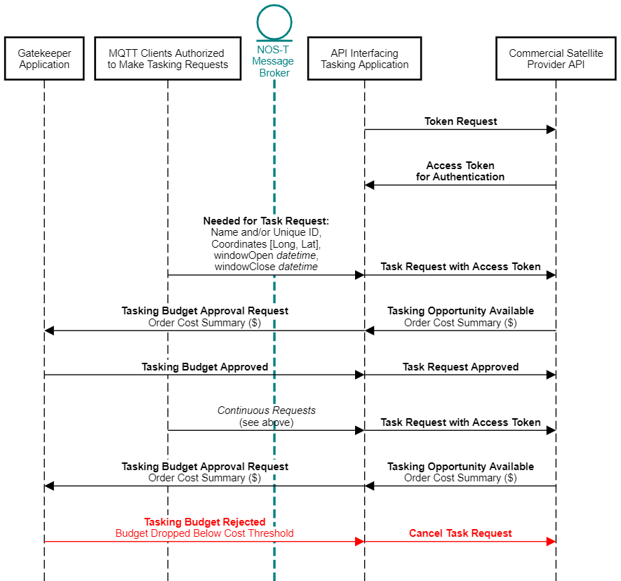

API driven Tasking-Receiving of Data
====================================

With the increasing remote sensing capabilities and availabilities of commercial satellite constellations, there are great opportunities for researchers to leverage these commercial assets. Much like what is occurring in other areas of the new space economy, services that were traditionally done by NASA or other government agencies are being outsourced to commercial enterprises. Rather than needing to design an entire space mission architecture, a project investigator (PI) can save considerable life-cycle time and costs by using these commercial providers as a customer.

Many of these commercial satellite imagery providers enable access to mission awareness, tasking, and data retrieval via an application programming interface (API). While these providers typically offer the same services via graphical user interface (GUI), the advantage of the API is that it enables programming and automation of tasking and data retrieval functions, which can be crucial when minimizing data latency is a priority. Within the New Observing Strategies Testbed (NOS-T) framework, this is accomplished by designing an MQTT client application that authenticates with the API. The API is not connected to the NOS-T message broker, but it is in communication with an active MQTT client that is able to subscribe to topics and have tasking requests triggered by messages from other MQTT clients on the testbed publishing to those topics. The tasking MQTT client properly formats the request and submits it, then periodically requests the status of the tasking request from the API, continuing to monitor the status through approval and completion of the tasking request.

One concern that PIs might have about automated tasking is the ability to keep track of and control cost expenditures. Each commercial provider may have a unique cost structure for their products, but these costs are usually predictable and typically accrued discretely with each task request completion. Without a proper gatekeeper, an automated process may continue submitting tasks to the API indefinitely and rack up an exorbitant bill. A human-in-the-loop gatekeeper, however, risks slowing down the approval of each task and thus increasing the latency between a time-urgent request and the actual tasking of the satellite. For example, if the task request is intended to catch the peak of a transient event such as an expected flood, any delay from the gatekeeper potentially reduces the science value returned from tasking the constellation.

It is common for these APIs to report a cost and an estimated time of retrieval for a given request but wait for approval from the customer before proceeding. Some also allow tasks to be pre-approved in the original request, thus bypassing this wait for cost approval. The required approval for a request is the commercial provider`s own gatekeeping mechanism, but the goal is to provide a gatekeeper that is controlled by the customer/user and not the commercial API. Within NOS-T, this problem can be handled by designing a gatekeeper application that defines a budget ceiling and floor and monitors costs as they are incurred. Every time the tasking MQTT client officially submits a task with pre-approval, a message is published to an appropriately named topic which includes the cost reported for the task. The assumption is that at this point the cost is officially incurred and should be deducted from the remaining budget. Once the remaining budget drops below the pre-defined budget floor, a message would be triggered by the gatekeeper. This message is a flag to the other MQTT clients to cease task submissions. Each of the MQTT clients might handle this in different ways. For example, the tasking MQTT client could switch the format of its task so that pre-approval is false, or it could unsubscribe from all topics where it was receiving requests. Other MQTT clients making task requests might choose to disconnect from the broker on receipt of that message.

   Generic Sequence Diagram with Cost-Monitoring Gatekeeper Application for Automated API Tasking

Once a task has been completed and the data product is delivered to a ground station, the commercial provider must deliver the data product to the customer. These data products feature high resolution imagery with prohibitively large file sizes, and the best means of delivery is by a secure third-party file-sharing service. A common challenge in interorganizational cooperation is the issue of security and passing files through firewalls, which prevents automated pushing of data products from the commercial satellite imagery provider to the customer. In the automated workflows that could be facilitated by NOS-T, a brief sequence of actions need to be communicated to deliver the data product and circumvent the firewall. 

   Generic Sequence Diagram for Automated Retrieval of Commercial Satellite Provider Data Products

The customer/user's MQTT client must either be continuously monitoring the file-sharing endpoint for any new activity, or subscribing to a topic where another monitoring application would publish a message to indicate the availability of a new data product to retrieve. The message payload should include the name of the new file and an https endpoint from where the file can be retrieved. This message would trigger the customer/user MQTT client to initiate a pull of the data product from behind the firewall.
