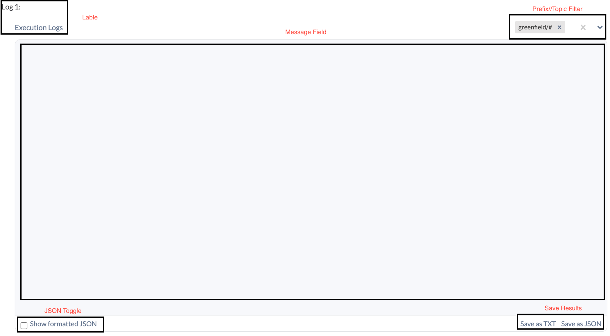
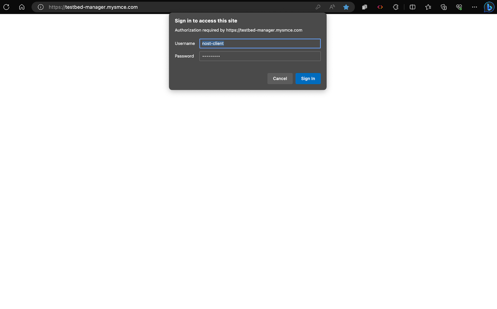
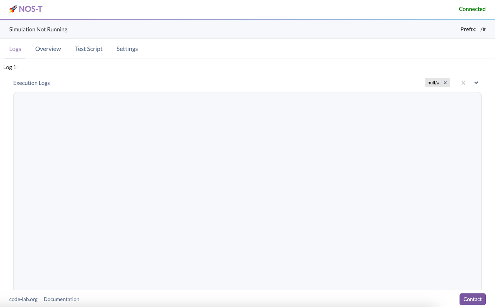
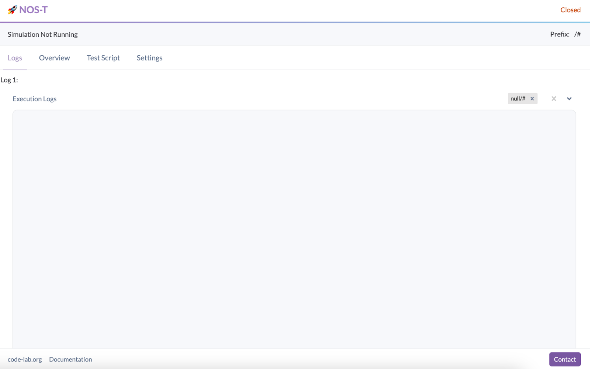
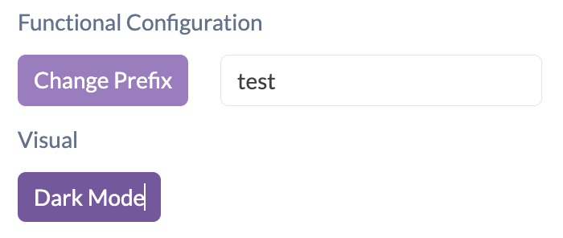

.. _webMonitor:

NOS-T Web-based Monitor For Broker
==================================

Introduction
------------

The heart of NOS-T is the event broker, a centralized system facilitating the 
exchange of messages between various applications. As the development of a web-based monitor for NOS-T, our
primary goal is to provide a real-time visual interface that allows
users to effortlessly view and analyze the broker's messages. This
monitor will not only ensure that stakeholders can instantly understand
the flow and volume of communications but also pinpoint areas of
inefficiencies, if any. In doing so, we aim to enhance transparency,
diagnose potential issues at an early stage, and subsequently, optimize
the overall performance of the NOS-T system.

Testbed Overview
-----------------

The testbed serves as a pivotal component of the project, crafted to
streamline testing, monitoring, and data analysis. It encompasses
objectives such as offering customization, ensuring user flexibility,
and optimizing the workspace for various testing scenarios. Here are its
principal features:

Logs Page Overview
------------------

The Logs page stands as the hub for viewing and accessing multiple
logs simultaneously. It not only presents the logs but also equips
users with the tools to modify how they interact with and view these
logs.

Log Count
^^^^^^^^^

This feature offers users the liberty to dictate the number of logs
they wish to view at once, ensuring adaptability to different test
cases.

Log View Options
^^^^^^^^^^^^^^^^

    Users can opt between multiple viewing formats:

-  .. rubric:: Infinite Scroll:
      :name: infinite-scroll

   -  Enlarges a log to occupy the entire screen, presenting it in a 1x1
      grid view.

-  .. rubric:: Grid:
      :name: grid

   -  Organizes logs in a 2 X infinity layout, maximizing screen real
      estate for observing multiple logs concurrently.

Logs
^^^^

Exclusively engineered to showcase real-time messages from the
broker, the Log page encapsulates the following functionalities:

|image1|

Figure 1: Log Component Isolated *Click to enlarge*

Label
"""""

Every log gets an identifier or name, assisting users in
distinguishing among various log feeds.

Message Field
"""""""""""""

Acts as the viewport for live broker messages corresponding to each
log.

Prefix/Topic Filter
"""""""""""""""""""

Empowers users to establish filters for individual logs. By default,
logs are set to "/#", indicating they'll capture all messages within
that prefix.

JSON Toggle
"""""""""""

An intuitive switch allowing the transition between standard text
and JSON views, simplifying the reading of structured data.

Save Results
""""""""""""

A function to export received log messages either as a TXT or JSON
file, indispensable for deeper analysis, troubleshooting, or data
dissemination among team members.

Settings Page Overview
----------------------

Set Prefix
^^^^^^^^^^

Enter the desired prefix to shape system configurations.

Visual Preferences
^^^^^^^^^^^^^^^^^^

Facilitates the switching between dark and light themes for optimal
user comfort.

Logs Configuration
^^^^^^^^^^^^^^^^^^

Log Count
"""""""""

Define the number of logs you wish to view.

Log View Options
""""""""""""""""

Infinite Scroll
""""""""""""""""

A vertical layout stacking logs atop each other.

Grid View 
"""""""""

    A 2X inf. layout offering a coherent display of multiple logs.

    In conclusion, the testbed has been meticulously designed to bolster
    the development and tuning of the project components, ensuring
    they're primed for the ultimate deployment.

Getting Started 
---------------

    This section elucidates the different test cases undertaken during
    the project, emphasizing their importance and highlighting key
    findings and results.

Consumer Instructions
^^^^^^^^^^^^^^^^^^^^^

Step 1: Prerequisites
"""""""""""""""""""""

Before initiating the process, ensure that the following
prerequisites are met:

**Chromium Browser:**
^^^^^^^^^^^^^^^^^^^^^

The code has dependencies best suited for Chromium-based browsers.
Preferred browsers include Chrome, but others like Edge are also
supported.

`*Google Chrome Web
Browser* <https://www.google.com/chrome/bsem/download/en_us/?brand=RXQR&ds_kid=43700052787082406&gclid=4f4197f0dfc011b3d40bf33560479beb&gclsrc=3p.ds&utm_source=bing&utm_medium=cpc&utm_campaign=1605158%20%7C%20Chrome%20Win11%20%7C%20DR%20%7C%20ESS01%20%7C%20NA%20%7C%20US%20%7C%20en%20%7C%20Desk%20%7C%20SEM%20%7C%20BKWS%20-%20EXA%20%7C%20Txt%20%7C%20Bing&utm_term=download%20chrome&utm_content=Desk%20%7C%20BKWS%20-%20EXA%20%7C%20Txt_Download&gclid=4f4197f0dfc011b3d40bf33560479beb&gclsrc=3p.ds>`__

Step 2: Logging into the NOS-T Manager
""""""""""""""""""""""""""""""""""""""

Navigate to Testbed-manager.mysmce.com

Use the credentials below:

**Username:** *nost-client*

**Password:** *nost-2021*

After successful login, the main page will be displayed and say
connected in green in the upper right corner. If "Closed" appears in
the upper right corner, this indicates a network connection issue.
In many instances, the IP address might not be registered with the
broker. Contact the system administrator for further support.

|image2|

Figure 2: Log In fields *Click to enlarge*

|image3|

Figure 3: Successful Login With Connection to Broker *Click to enlarge*

|image4|

Figure 4: Successful Login Without Connection to Broker *Click to enlarge*

Setting Your Prefix
"""""""""""""""""""

Navigate to the "Settings" tab.

Proceed to "Functional Configuration" and adjust the prefix
according to your Test Case. For instance, for the 'fire sat' test
case, set the prefix to 'greenfield'.

|image5|

Figure 5: Controls in Setting

Developer Instructions to Load the Docker Images
""""""""""""""""""""""""""""""""""""""""""""""""

**Step 1:** Prerequisites
^^^^^^^^^^^^^^^^^^^^^^^^^

    Ensure the following are installed on your system:

**Docker Desktop**
^^^^^^^^^^^^^^^^^^

This is vital for running containerized applications. Download from
the official Docker website and follow the setup instructions based
on your operating system.

`*Install Docker Desktop on Mac \| Docker
Documentation* <https://docs.docker.com/desktop/install/mac-install/>`__

`*Install Docker Desktop on Windows \| Docker
Documentation* <https://docs.docker.com/desktop/install/windows-install/>`__

**VS Code**
^^^^^^^^^^^

This project utilized the VS Code IDE. It's recommended for
executing the system.

`*Visual Studio Code - Code Editing.
Redefined* <https://code.visualstudio.com/>`__

Chromium Browser
""""""""""""""""

The code has dependencies best suited for Chromium-based browsers.
Preferred browsers include Chrome, but others like Edge are also
supported.

`*Google Chrome Web
Browser* <https://www.google.com/chrome/bsem/download/en_us/?brand=RXQR&ds_kid=43700052787082406&gclid=4f4197f0dfc011b3d40bf33560479beb&gclsrc=3p.ds&utm_source=bing&utm_medium=cpc&utm_campaign=1605158%20%7C%20Chrome%20Win11%20%7C%20DR%20%7C%20ESS01%20%7C%20NA%20%7C%20US%20%7C%20en%20%7C%20Desk%20%7C%20SEM%20%7C%20BKWS%20-%20EXA%20%7C%20Txt%20%7C%20Bing&utm_term=download%20chrome&utm_content=Desk%20%7C%20BKWS%20-%20EXA%20%7C%20Txt_Download&gclid=4f4197f0dfc011b3d40bf33560479beb&gclsrc=3p.ds>`__

Step 2: Download the Software
^^^^^^^^^^^^^^^^^^^^^^^^^^^^^

    Acquire the NOS-T Manager software from the provided source, which
    should bundle the essential Docker files and code.

    Should be on a git repository

Step 3: Environment Setup
^^^^^^^^^^^^^^^^^^^^^^^^^

    Launch your preferred code editor (Visual Studio Code is
    recommended) and import the acquired software files.

Step 4: Application Configuration
^^^^^^^^^^^^^^^^^^^^^^^^^^^^^^^^^

    If the application necessitates any specific configurations, ensure
    they're correctly set up. Consult the software's documentation or
    README for specific details.

Step 5: Initiate Docker Compose
^^^^^^^^^^^^^^^^^^^^^^^^^^^^^^^

    Open a terminal or command prompt within the software's root
    directory (where the docker-compose.yml file is located).

Step 6: Build and Launch the Application
^^^^^^^^^^^^^^^^^^^^^^^^^^^^^^^^^^^^^^^^

Execute the following command in your terminal:

``docker-compose up --build``

This command instructs Docker Compose to fetch the necessary images,
build the app (if required), and initiate the containers.

Step 7: Access the Software
^^^^^^^^^^^^^^^^^^^^^^^^^^^

After a successful start, the application can be accessed via your
web browser at https://localhost/ for the NOS-T Manager Interface

Step 8: Engage with the Software
^^^^^^^^^^^^^^^^^^^^^^^^^^^^^^^^

With the application operational, begin exploring its
functionalities using the NOS-T Manager Interface or consult
available documentation for guidance.

Step 9: Halting the Application
^^^^^^^^^^^^^^^^^^^^^^^^^^^^^^^

    To terminate the application, return to the running Docker Compose
    terminal and press Ctrl + C. This action will halt and remove the
    active containers.

Step 10: Cleanup (Optional)
^^^^^^^^^^^^^^^^^^^^^^^^^^^

To purge the environment, execute the following in your terminal:

``docker-compose down``

This action stops and erases the containers, networks, and volumes.
It's useful for system resets, especially in the presence of errors.

Step 11: Execute the Fire Sat Test Case (Optional)
^^^^^^^^^^^^^^^^^^^^^^^^^^^^^^^^^^^^^^^^^^^^^^^^^^

Adjust the prefix in the "Functional Configuration" to align with
your Test Case. For the 'fire sat' test case, use 'greenfield' as
your prefix.

In conclusion, you've successfully deployed and engaged with the
NOS-T Manager software. As you explore, remember to refer to
documentation or user guides for insights on specific features and
operational commands.

Conclusion
----------

In conclusion, the development of the web-based monitor for the New
Observing Strategies Testbed (NOS-T) has been a significant achievement
in advancing the goals of NASA's Earth Science Technology Office
Advanced Information Systems Technology program. The monitor provides a
real-time visual interface that allows users to efficiently view and
analyze the broker's messages in the event-driven system of NOS-T. This
has several important implications:

Enhanced Transparency
^^^^^^^^^^^^^^^^^^^^^

    The web-based monitor offers stakeholders an unprecedented level of
    transparency into the flow and volume of communications within the
    NOS-T system. This transparency is crucial for understanding the
    system's behavior and ensuring that all components function
    optimally.

Early Issue Detection
^^^^^^^^^^^^^^^^^^^^^

    By providing a real-time view of the broker's messages, the monitor
    enables users to identify potential issues and inefficiencies at an
    early stage. This early detection can lead to timely interventions
    and improvements, enhancing the overall performance and reliability
    of the NOS-T system.

Optimization Opportunities
^^^^^^^^^^^^^^^^^^^^^^^^^^

    The ability to analyze and export log messages for deeper analysis
    and troubleshooting allows teams to optimize the performance of
    NOS-T. By pinpointing areas that require improvement, developers and
    stakeholders can fine-tune the system for better efficiency.

User Flexibility
^^^^^^^^^^^^^^^^

    The monitor's customizable features, such as the ability to choose
    log count and view options, ensure that users can adapt the
    interface to suit their specific testing scenarios and requirements.

Future
^^^^^^

Future work in this area could focus on refining the Manager UI
Controller's features and usability based on user feedback and
evolving needs. The goal is to continually enhance the user
experience, making it easier and more intuitive for users to
interact with the simulation system. Streamlining the UI, improving
settings organization, and enhancing interface responsiveness are
areas that can be explored.

Expanding the Manager UI Controller's capabilities by incorporating
additional functionalities to meet specific simulation requirements
is also important. For example, integrating real-time parameter
adjustments during simulations and implementing a user-friendly
system for managing simulation presets are potential areas for
development.

To ensure inclusivity, accessibility features will be prioritized in
future enhancements to make the Manager UI Controller more
user-friendly for individuals with diverse needs. Although not
essential for current use cases, these features hold the potential
to add significant value to new users as the product scales.

To validate these advancements, extensive testing with more NOS
systems and a broader user base will be crucial. Gathering feedback
from diverse users will help assess the impact and benefits of the
new features and ensure they align with the evolving needs of the
growing user community.

Regarding Test Scripts, the focus will be on continuous improvement
and expansion to meet the demands of complex simulation scenarios.
Enhancing the flexibility of Test Scripts will enable users to
define and set a broader range of variables, constraints, and
simulation conditions.

Future development will involve integrating version control and
collaboration tools directly into Test Scripts, enabling teams to
work more efficiently, share and manage multiple simulation
configurations seamlessly, and foster collaborative contributions to
the simulation setup.

To empower users in analyzing and understanding their simulations
better, integration with advanced data visualization and analytical
tools will be explored. This integration aims to provide users with
deeper insights into simulation results and facilitate data-driven
decision-making.

Expanding the documentation and community support for Test Scripts
will be a focus to encourage users to share their custom scripts and
best practices. This collaborative approach will enable the
simulation community to grow and benefit from each other's
experiences.

While these features may not be essential for existing use cases,
they hold immense potential in scaling the product and attracting
new users. Rigorous testing with more NOS systems and diverse
simulation scenarios will be conducted to validate their value and
refine the features based on real-world use cases.

Regarding the monitor, future work could focus on refining its
features and usability based on user feedback and evolving needs.
Integrating more advanced analytical tools and visualization
techniques will provide deeper insights into the NOS-T system's
behavior.

