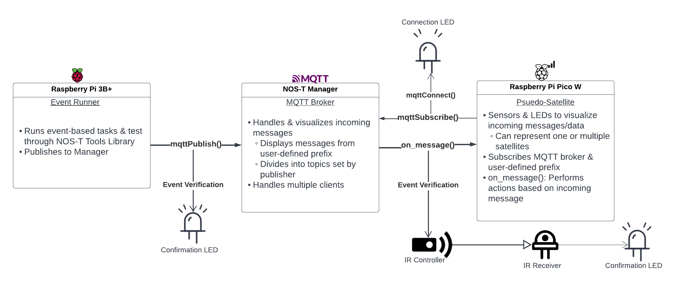

# NOS-T Hardware Testbed

This is a repository for the hardware implementation for the New Observing Strategies Testbed (NOS-T).

Information about NOS-T can be found [here](https://nost-tools.readthedocs.io/en/latest/) or through the project's [Git repository](https://github.com/code-lab-org/nost-tools)

## Roadmap

The hardware aspect of NOS-T aims to incorporate the existing digital environment and the various test cases along with physical sensors to determine the general effectiveness and merit of the simulation. While the hardware testbed is modular and can incorporate various sensors, below is an example block diagram to illustrate the addition of an infrared receiver and controller.

The official write-up of the hardware-in-the-loop implementation can be found [here](https://nost-tools.readthedocs.io/en/52-hardware-testbed-documentation/resources_library/white_papers/hardwareTestbed.html). This repo consists of the three mentioned test scenarios, along with an in-progress test case to simulated signal strength between a Pico psuedo-satellite. 

## Contact

Principal Investigator: Paul T. Grogan pgrogan@stevens.edu

## Acknowledgements

This material is based on work supported, in whole or in part, by the U.S. Department of Defense and National Aeronautics and Space Administration Earth Science Technology Office (NASA ESTO) through the Systems Engineering Research Center (SERC) under Contract No. W15QKN-18-D-0040. SERC is a federally funded University Affiliated Research Center managed by Stevens Institute of Technology. Any opinions, findings, and conclusions or recommendations expressed in this material are those of the authors and do not necessarily reflect the views of the United States Department of Defense.

Current project team:
 * PI: Paul T. Grogan <pgrogan@stevens.edu>
 * Brian Chell
 * Matthew LeVine
 * Cameron Conway
 * Harrison Teele (Hardware Author)

Project alumni:
 * Hayden Daly
 * Matthew Brand
 * Jerry Sellers
 * Leigha Capra
 * Theodore Sherman
 * Alex Yucra Castaneda
